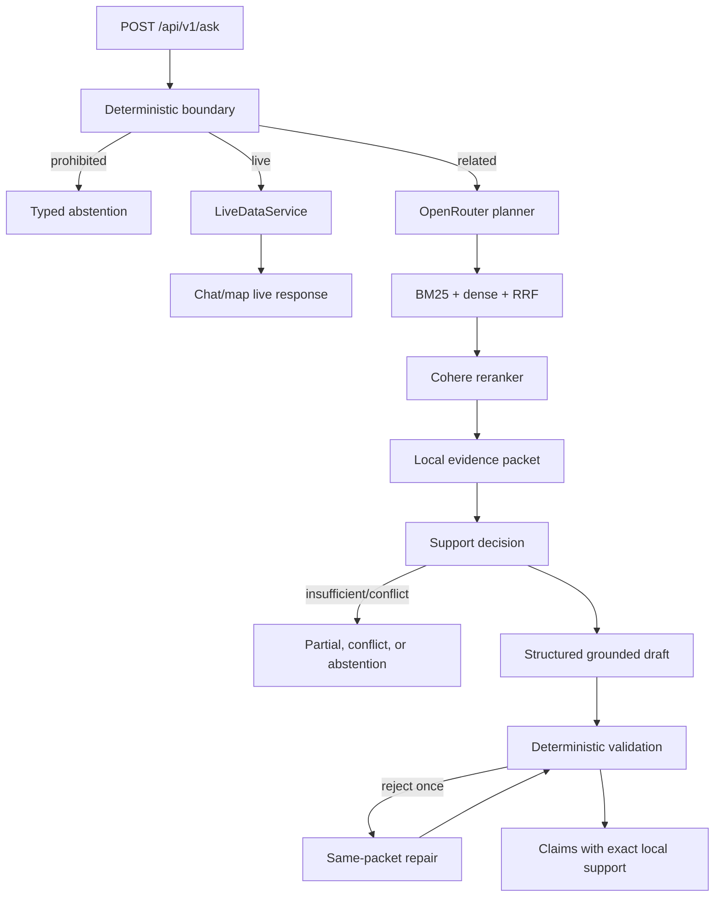

# Architecture and data flow

Use this as a trace map, then verify the current source. The system has two deliberately separate paths: stable reviewed evidence and current official live records.

## High-level flow

**OBSERVED** — The same boundary is summarized in `README.md:15-44`.

## Startup

1. `app.py:1-10` creates `FireLensConfig` and calls `create_app`.
2. `src/firelens/api.py:55-95` creates middleware, request guards, live service, and a lifespan hook.
3. On lifespan startup, `runtime.load_runtime` is called (`api.py:71-81`).
4. `src/firelens/runtime.py:60-180` verifies manifests, chunk provenance, repair admission, vector row order, and provider readiness, then assembles `RetrievalPipeline` and `StaticRAGService`.
5. `Runtime.health` (`runtime.py:24-52`) reports corpus/index/provider readiness, release version, build identity, and problems.

## Normal grounded question

Trace `POST /api/v1/ask` through:

1. `api.py:334-383` receives a typed `QueryRequest`, applies the public deadline, and calls the service.
2. `answering/service.py:434-544` runs deterministic `plan_query`, invokes the bounded planner for related requests, supplies bounded BM25 corpus candidates as untrusted discovery text, and applies deterministic mixed-scope/identifier safeguards.
3. `retrieval/pipeline.py:135-300` performs local BM25, OpenRouter embeddings, vector search, reciprocal-rank fusion, then OpenRouter reranking. It records stage rankings, models, attempts, usage, and timings.
4. `answering/context.py:269-421` selects aspect/source-diverse hits, adds bounded neighbor context, creates evidence spans and exact quote candidates, and detects conflicts.
5. `answering/context.py:423-560` decides whether evidence is sufficient, conflict-free, authoritative, and aspect-complete.
6. `answering/grounded.py:95-357` requests a strict structured draft, validates it, allows one same-packet repair, salvages only independently valid claims, and constructs public claims/evidence from local records.
7. `answering/service.py:720-900` records observations and returns the typed `AskResponse`.

## Current-data question

1. `answering/intent.py:250-330` identifies supported live layers and location requirements before static RAG.
2. `api.py:257-333` serves map requests; `live_answering.py` composes live chat/mixed responses.
3. `live.py:145-580` resolves a coarse location, fetches typed ArcGIS layers, bounds pagination, validates required fields and geometry, caches fresh data, and exposes stale/partial state explicitly.
4. The same `LiveDataService` instance supplies chat and map records; do not infer that the map is a separate source of truth.

## Rejected, unsafe, unsupported, or low-evidence request

- Deterministic prohibited requests become typed abstentions (`answering/context.py:423-451`, `contracts.py` reason/status enums).
- Supported current-data requests require live data rather than static citations.
- Tangent requests become `scope_redirect`; adjacent low-risk requests become labelled `background`.
- Missing, conflicting, wrong-temporal, wrong-authority, or incomplete evidence becomes a partial/conflict/abstention path.
- Provider failures are typed and fail closed; public deadlines and request limits live in `api.py:118-188`.

## Frontend return path

`prototype/firelens-rag-ui/src/api.ts:20-44` posts JSON to `/api/v1/ask` and returns typed responses generated from `docs/openapi.v1.json`. `App.tsx:229-580` stores query/history/location state, submits requests, renders mode/status/limitations, maps claims to evidence, and lazy-loads `LiveMap.tsx` for live results.

## Authority boundary

**OBSERVED** — Local code owns policy, routing, source metadata, evidence construction, validation, and public responses (`README.md:38-44`). Models propose planning or drafts; they do not supply authoritative URLs, publishers, locators, hashes, page numbers, or acceptance decisions (`README.md:144-146`, `providers/openrouter.py`).
