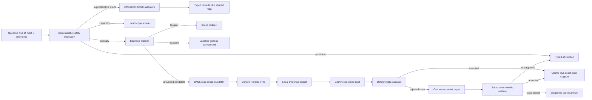

# FireLens BC V1.5 release candidate

FireLens BC is a local, evidence-first conversational assistant for reviewed
British Columbia wildfire-preparedness guidance. V1.5 adds bounded official
incident, perimeter, and evacuation records plus a restrained map. Stable RAG
claims still require exact local evidence; current records remain visibly
separate and never authorize a personal safety decision.

**Release status:** `principal-remediation candidate; owner qualification deferred`.
`main` still contains the earlier review candidate. The complete paid probe
rerun and owner retrieval and semantic reviews remain deferred; this README
does not claim that the remediated branch or current production deployment has
been qualified as V1.5.



Local Python code owns policy, routing, retrieval, source metadata, evidence
construction, validation, and public responses. OpenRouter supplies bounded
planning, embeddings, reranking, and generation. There is no hidden model
substitution, retrieval fallback, provider fallback, or model-memory fallback.
A rejected grounded draft may receive exactly one same-evidence repair;
deterministic validation still owns acceptance, partial salvage, and abstention.
See [ADR 0009](docs/adr/0009-bounded-grounded-answer-repair.md).

## Quick start

Python 3.11–3.14 and Node/npm are supported. Dependencies are locked in
`requirements.lock` and `package-lock.json`.

```bash
make setup
cp .env.example .env
# Put a rotated OPENROUTER_API_KEY in the ignored .env file.
make verify
make run
```

Open [http://127.0.0.1:8000](http://127.0.0.1:8000). `make run` builds the
React frontend, then serves the frontend and `/api/v1` from one FastAPI origin.

If the corpus or index is absent:

```bash
.venv/bin/firelens bootstrap-corpus
.venv/bin/firelens build-index
.venv/bin/firelens doctor
```

Source changes fail hash verification and require explicit review. Never edit a
manifest merely to force readiness.

## Response modes

| Mode | When it is used | Evidence behavior |
|---|---|---|
| `capability` | Greetings and “what can I ask?” | Deterministic local answer; no paid call |
| `grounded` | Directly supported stable guidance | Every claim has an exact quote and local source record |
| `background` | Related low-risk explanation outside direct corpus support | Clearly labelled; no corpus citation is allowed |
| `scope_redirect` | Completely tangent request | Redirects to FireLens topics |
| `partial` | Only some requested stable aspects have evidence | Returns supported claims and names missing aspects |
| `live` | Supported current incident, perimeter, or evacuation question | Official metadata, source/retrieval times, and GeoJSON |
| `mixed` | Supported live records plus supported stable guidance | Separates current records from exact-cited guidance |
| `abstention` | Unsupported live source, predictive, personalized, unsafe, or unvalidated request | No factual evidence claim is returned |

The background mode is intentionally separated from grounded RAG: it improves
conversation breadth without making unverified material look document-backed.

## Commands

```bash
make verify                 # secrets, OpenAPI, lint, types, tests, builds, browsers
make benchmark              # zero-cost V1 red-team plus V1.1 offline suite
make benchmark-v1-1-paid    # cost-capped 50-case live conversation benchmark
make benchmark-contextual   # development-only A/B/C retrieval-text experiment
make benchmark-retrieval    # four locked V1 retrieval configurations
make benchmark-retrieval-v1-5 # development comparison with hash-bound addendum
.venv/bin/python scripts/run_hard_probe.py --mode offline
.venv/bin/python scripts/run_hard_probe.py --mode qualified --max-cost-usd 0.25
make canary                 # 30 repeated live calls
make model-bakeoff          # identical-evidence Gemini comparison
make live-smoke             # opt-in OpenRouter endpoint smoke tests
```

The permanent hard probe is public regression data, not a sealed release
holdout. Offline mode uses controlled provider and live-data doubles. Qualified
mode uses the production OpenRouter boundary and refuses to start without an
explicit positive cost ceiling. Each report binds the commit, dataset, corpus,
retrieval strategy, provider stages, attempts, tokens, cost, and latency.

CLI equivalents:

```bash
.venv/bin/firelens search "What belongs in a grab-and-go bag?"
.venv/bin/firelens ask "What does an evacuation alert mean?"
.venv/bin/firelens corpus-audit
```

## API

`POST /api/v1/ask` accepts a question, up to six bounded prior turns, and an
optional coarse location for supported live questions:

```json
{
  "question": "Why does that matter?",
  "history": [
    {"role": "user", "content": "What belongs in a grab-and-go bag?"},
    {"role": "assistant", "content": "The reviewed guide lists household supplies."}
  ],
  "location": {"label": "Kelowna", "radius_km": 50}
}
```

Other routes:

- `GET /api/v1/health/live`: process liveness.
- `GET /api/v1/health/ready`: corpus, index, and provider readiness.
- `GET /api/v1/live/map?bbox=...&layers=incidents,perimeters,evacuations`:
  official validated GeoJSON using the same adapters and cache as chat.
- `POST /api/v1/search` and `GET /api/v1/debug/chunks/{chunk_id}`: development
  only when `FIRELENS_DEBUG=true`.

Strict contracts reject unknown fields. Public source metadata is always
reconstructed from local corpus records; the model cannot supply publishers,
URLs, locators, hashes, or page numbers.

The current V1.5 corpus contains 170 native or human-verified chunks across
eight approved sources and a 170 × 1,536 vector index. Ten chunks derived from
a FireSmart page repair are quarantined until that replacement text receives
human approval. Runtime startup verifies the repair registry, chunk provenance,
corpus hash, vector row order, and matrix hash together.

## Historical V1.1 checkpoint

| Area | Result |
|---|---:|
| Governed corpus | 8 sources, 180 chunks |
| Main vector index | 180 × 1,536, `metadata_context_v1` |
| Final verification | 99 Python passed, 3 paid skipped, 22 Python subtests; frontend 11 unit, 4 Sites, 12 browser flows |
| V1.1 offline suite | 50/50 complete; all control metrics 100% |
| Context A/B/C winner | 100% Recall@5, 81.25% MRR@5 on 8 grounded dev cases |
| Locked V1 retrieval sweep | 96% Recall@5, 86.17% MRR@5; current 20/20/60/5 retained |
| 30-call canary | no status/reason variance; p95 2.565 s |
| Final V1.1 live run | 50/50 complete; all control metrics and Recall@5 100%; p95 2.572 s |
| Legacy V1 compatibility run | 92.42% Recall@5; below the 95% release gate |

One immediately preceding V1.1 repeat hit a transient 429 on one of 50 cases
after all three bounded attempts. The final retained rerun is clean. The pair is
evidence of provider variability, while the final artifact remains the
authoritative scored result.

Automated checks establish routing, structural traceability, exact quote
identity, and policy invariants. They do **not** establish semantic entailment or
claim completeness. The exact owner-review action and artifact hashes are in
[`docs/releases/V1_EVIDENCE.md`](docs/releases/V1_EVIDENCE.md).

Further reading:

- [`docs/reports/V1_5_PRINCIPAL_REMEDIATION.md`](docs/reports/V1_5_PRINCIPAL_REMEDIATION.md):
  current finding ledger, fixes, evidence, and remaining release blockers.
- [`docs/TECHNICAL_HANDBOOK.md`](docs/TECHNICAL_HANDBOOK.md): authoritative
  architecture, contracts, operations, and code-reading guide.
- [`docs/reports/FIRELENS_V1_1_TECHNICAL_REPORT.md`](docs/reports/FIRELENS_V1_1_TECHNICAL_REPORT.md):
  detailed layer-by-layer report and result visualizations.
- [`docs/adr/`](docs/adr/): immutable architecture decisions.
- [`docs/learning/`](docs/learning/): textbook-style subsystem explanations.
- [`docs/releases/V1_5_RUNBOOK.md`](docs/releases/V1_5_RUNBOOK.md): preview,
  public verification, rate-limit boundary, and rollback procedure.

## Public-operation boundary

The application enforces a 64 KiB body limit and a privacy-preserving
30-request-per-minute guard for `/api/v1/ask` and `/api/v1/live/map`. Client
addresses are HMAC-hashed with an ephemeral process secret and are not logged or
persisted. Forwarded client IPs are ignored unless the deployment is explicitly
identified as Vercel, where only Vercel's platform-owned forwarding header is
accepted. A public answer also has a 45-second total deadline. The health
contract labels the in-process guard `instance_local`: a serverless instance
cannot provide a globally durable quota. Production must retain Vercel Firewall
or equivalent platform rate limiting as the outer distributed control.

Readiness returns HTTP 503 when the corpus, index, or required provider
configuration is unavailable. Debug routes are never registered in production,
even if the debug flag is set.

Live location is optional, coarse, and request-scoped. Coordinates are rounded
to two decimals. Exact-address labels are rejected, and location is not written
to traces or ordinary application storage.
