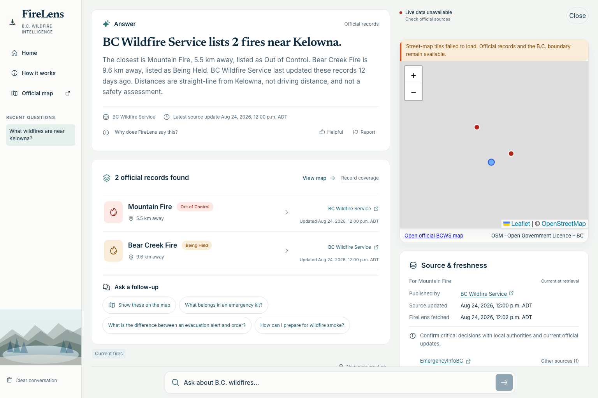
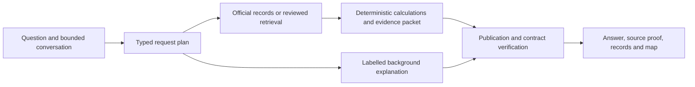

# FireLens

**Evidence-bound wildfire intelligence for British Columbia.**

Explore official wildfire records, ask preparedness questions, and inspect the
sources behind an answer. FireLens keeps official records, reviewed guidance,
and general background distinct, including when a conversation moves between them.

[Open FireLens](https://firelens-bc.vercel.app/) ·
[Architecture Book](docs/architecture/README.md) ·
[System Card](docs/system-card/FIRELENS_SYSTEM_CARD.md) ·
[Evaluation guide](docs/eval/README.md)

**Production verification is incomplete.** The linked PreparedBC wildfire guide
has changed since the admitted corpus was reviewed. Grab-and-go quotations in
FireLens do not exactly match the current PDF; the current checklist also adds
insurance/important papers. Read the [release findings](docs/releases/firelens-final-ship.md)
and consult the current official guide for that guidance.



_Synthetic demonstration data in the Pacific Operations interface. Names,
locations, distances and timestamps are fixtures; map tiles are intentionally
unavailable. This is a local interface demonstration, not a production capture
or current wildfire information._

## Try three tasks

- **Find nearby records:** “What official wildfire records are near Kelowna?”
  Select a returned record to explore it on the map or ask a follow-up. Distances
  are straight-line calculations from the stated location, not travel times.
- **Read preparedness guidance:** “What belongs in a grab-and-go bag?”
  Open the source proof to inspect the supporting passage and publisher.
- **Explore a bounded snapshot:** “How many listed fires are in each fire centre?”
  Inspect the answer's coverage, retrieval time and unavailable layers before
  comparing the returned records. A partial sample cannot establish a total.

The bottom composer accepts your own questions. Guided questions and suggested
follow-ups submit when selected; Home starts a fresh conversation and clears
retained location and selection. A record list remains useful when map tiles fail.

## Three information lanes

| Lane | What it provides | How it is presented |
| --- | --- | --- |
| Official records | Integrated BC Wildfire Service incidents/perimeters and fire-related EmergencyInfoBC records | Typed identities, source links, geometry, timestamps and availability |
| Reviewed guidance | Admitted reference passages and reviewed high-risk claims | Bound wording, exact supporting excerpts and inspectable proof |
| General background | Model explanations within the supported topic boundary | Explicit background labels without official or reviewed status |

Source publication time and retrieval time are different facts. Stale,
partial, empty and unavailable results remain distinct across answers, lists and
maps. A successful HTTP request does not make an old record newly issued.

## From question to evidence



The plan fixes tools, sources, geography and selected-record identity before
execution. Deterministic code owns official counts, status, size, distance and
ranking. Models can explain bound information; they cannot grant themselves
additional authority or turn generated prose into an official fact.

This makes failures inspectable. Source attribution follows the evidence packet;
follow-ups retain typed record identity; and failed tasks can be localized to
understanding, retrieval, computation, publication or presentation. The reusable
**EvalLab** harness records application, evaluator, dataset and configuration
identities alongside outcomes and failure records. Its diagnostic value does not
establish benchmark leadership or universal answer quality.

## What the evidence establishes

| Evidence | Result and scope |
| --- | --- |
| Qualified backend | 12 fresh and nine retained external observations, independently accepted within a fixed scope; see the [System Card](docs/system-card/FIRELENS_SYSTEM_CARD.md) |
| Final local verification | Reviewed candidate `fc5731e`: 2,581 backend tests, 13 skips, 709 subtests and 198 frontend tests passed; runtime remains equivalent to `37de779` |
| Final browser checks | 45 mocked passes, one skip and 22 built-stack passes; fixture checks at 1536px, 390px, 320px and native 200% zoom remain distinct from production |
| Historical evaluation | Core remains **FAIL 565/574**, with frozen failures and dispositions preserved in the [evaluation guide](docs/eval/README.md) |
| Current CI | Main build `c06474d` failed source-aware conversation verification; local reproduction passed 105/106. Candidate evidence was refused at the legacy J01 invariant |
| Actual production | Eight public Ask requests exercised live records, state, guidance and generation. Browser/assets/provider checks passed; current-source passage verification failed. See the [release record](docs/releases/firelens-final-ship.md) |

Captured official feeds are dated evidence, not today's incident count. Fixture
browser checks establish controlled behavior; production integration requires
real public API, provider and frontend observations. Independent AI examination
is not human certification. Human usability and screen-reader assessment,
sealed generalization, sustained availability and latency SLOs remain unestablished.

## Run locally

Use Python 3.12–3.14, Node.js and the checked-in dependency locks:

```bash
make setup
PYTHONPATH=src:tests make verify
PYTHONPATH=src:tests make verify-candidate-browser
make docs-check
```

Setup downloads dependencies and Chromium. These verification commands use local
fixtures and do not require inference credentials or paid provider calls.
The built-stack browser gate is separate from the mocked browser lane.

For the application, copy `.env.example` to ignored `.env`, configure an approved
`OPENROUTER_API_KEY`, and run `make run`. Open `http://127.0.0.1:8000`;
FastAPI serves the React client and `/api/v1` on the same origin. Questions may
incur generation, embedding and reranking charges. Keep existing corpus/index
manifests intact; credential availability alone does not qualify the provider route.

```bash
PYTHONPATH=src:tests .venv/bin/python -m firelens_eval inventory
PYTHONPATH=src:tests .venv/bin/python -m firelens_eval run --suite core
PYTHONPATH=src:tests .venv/bin/python -m firelens_eval diagnose CASE_ID
```

The historical core has known failures; its exit status is diagnostic. Consult the
[evaluation guide](docs/eval/README.md) before provider-backed evaluation, which
requires an explicit spending ceiling. [Current state](docs/firelens-current-state/README.md)
and the [engineering map](docs/firelens-map/README.md) locate maintained contracts.

## Limits and authority

FireLens is an independent public beta, unaffiliated with emergency authorities.
It cannot decide whether you are safe or should stay, return or evacuate. Missing
records never prove absence of danger. Follow the issuing authority's current
instructions; call 9-1-1 for emergencies. Citations support inspection and do not,
by themselves, prove every interpretation correct.
