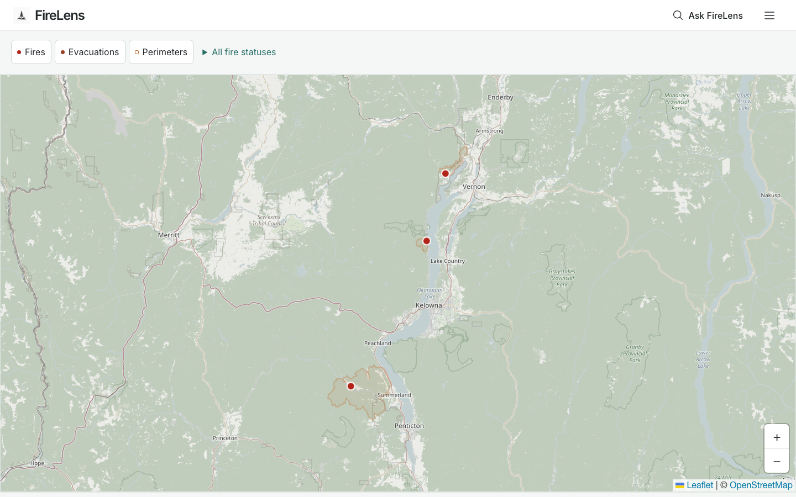
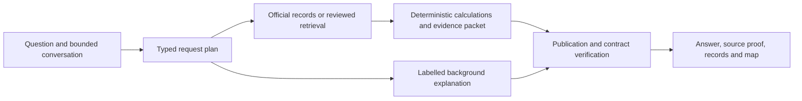

# FireLens

**Evidence-bound wildfire intelligence for British Columbia.**

Explore official wildfire records, ask preparedness questions, and inspect the
sources behind an answer. FireLens keeps official records, reviewed guidance,
and general background distinct, including when a conversation moves between them.

[Open FireLens](https://firelens-bc.vercel.app/) ·
[Architecture Book](docs/architecture/README.md) ·
[System Card](docs/system-card/FIRELENS_SYSTEM_CARD.md) ·
[Evaluation guide](docs/eval/README.md)

The deployed release uses the adopted PreparedBC guide and a real 178-chunk index.
Map and nearby evacuation lookups preserve validated official records when other
boundaries fail validation, with explicit partial-coverage labels and unknown
complete totals. Order-only requests exclude alerts before geometry admission.
Incomplete coverage, including zero validated matches, is never an all-clear.
See the [partial coverage repair record](docs/releases/partial-coverage-repair.md)
for review, qualification status and remaining upstream limitations.
Exact source quotations, reviewed paraphrases and partial guidance are labelled
separately. See the [dated release evidence](docs/releases/firelens-polish.md) for
qualification, deployment status and retained limitations.



_Map-first local candidate, captured 2026-09-23 with offline official-record fixtures.
These records are dated observations, not current wildfire information. The release
is being validated in [PR #83](https://github.com/yusenrong46-afk/firelens-bc/pull/83);
this screenshot does not establish production deployment._

[Mobile Ask screenshot](docs/product/screenshots/map-first-ask-mobile-2026-09-23.png) ·
[Three-minute demo](docs/portfolio/MAP_FIRST_DEMO.md) ·
[Release scope and runbook](docs/product/map-first-release-v2.md)

## Try three tasks

- **Find nearby records:** “What official wildfire records are near Kelowna?”
  Select a returned record to explore it on the map or ask a follow-up. Distances
  are straight-line calculations from the stated location, not travel times.
- **Read preparedness guidance:** “What belongs in a grab-and-go bag?”
  Open the source proof to inspect the supporting passage and publisher.
- **Explore a bounded snapshot:** “How many listed fires are in each fire centre?”
  Inspect the answer's coverage, retrieval time and unavailable layers before
  comparing the returned records. A partial sample cannot establish a total.

The map opens first, without an AI-provider call. **Ask FireLens** opens a compact
composer; **Near me** accepts a B.C. community or optional approximate location
with a 50 km default. Preparedness fills a question for explicit submission.
Examples, recent questions and methodology are in the menu. After an answer,
Back to map preserves the conversation; the FireLens brand starts a fresh one
and clears retained location and selection. Lists remain usable when tiles fail.

## Three information lanes

| Lane | What it provides | How it is presented |
| --- | --- | --- |
| Official records | Integrated BC Wildfire Service incidents/perimeters and fire-related EmergencyInfoBC records | Typed identities, source links, geometry, timestamps and availability |
| Reviewed guidance | Admitted reference passages and reviewed high-risk claims | Bound wording, exact supporting excerpts and inspectable proof |
| General background | Model explanations within the supported topic boundary | Explicit background labels without official or reviewed status |

Source publication time and retrieval time are different facts. Stale,
partial, empty and unavailable results remain distinct across answers, lists and
maps. A successful HTTP request does not make an old record newly issued.

## From question to evidence



The plan fixes tools, sources, geography and selected-record identity before
execution. Deterministic code owns official counts, status, size, distance and
ranking. Models can explain bound information; they cannot grant themselves
additional authority or turn generated prose into an official fact.

This makes failures inspectable. Source attribution follows the evidence packet;
follow-ups retain typed record identity; and failed tasks can be localized to
understanding, retrieval, computation, publication or presentation. The reusable
**EvalLab** harness records application, evaluator, dataset and configuration
identities alongside outcomes and failure records. Its diagnostic value does not
establish benchmark leadership or universal answer quality.

## What the evidence establishes

| Evidence | Result and scope |
| --- | --- |
| Map-first integration | UI implementation commit `ef98bfe`; context repair commit `6a1559c`. Final release gates and deployment identity belong to the PR's candidate-bound evidence, not this implementation snapshot. |
| Targeted context comparison | Frozen 24-case offline bank: original main `ed2a7af` and starting candidate `f103afd` each 15/24; repaired implementation 24/24. Nine paired wins, no losses. Real-provider closure is a separate release gate. |
| Review controls | 32 context tests and 328 frontend unit tests passed during implementation; includes independent pet-packing topics, pending map selection, preserved history and location-denial feedback. |
| Historical evaluation | Core remains **FAIL 565/574** in raw historical results. Accepted historical dispositions and CI engineering gates are separate; see the [evaluation guide](docs/eval/README.md). |
| Production | Existing backend release remains the baseline until the new preview, CI and public-domain verification complete. See [PR #83](https://github.com/yusenrong46-afk/firelens-bc/pull/83) for the bound release status. |

The targeted comparison is regression evidence for two context failures, not a
general accuracy score. The approved 178-chunk corpus, configured models, Python
dependencies and public API contracts remain unchanged. Source migration and broad
backend qualification remain deferred.

Historical evidence remains available: [dated release evidence](docs/releases/firelens-polish.md)
and [prior production record](docs/releases/firelens-final-ship.md).
Production snapshot captured 2026-09-07: [before-polish screenshot](docs/product/screenshots/production-idle-2026-09-07.png),
before the polish candidate. These historical snapshots are not current UI proof.

Captured official feeds are dated evidence, not today's incident count. Fixture
browser checks establish controlled behavior; production integration requires
real public API, provider and frontend observations. Independent AI examination
is not human certification. Human usability and screen-reader assessment,
sealed generalization, sustained availability and latency SLOs remain unestablished.

## Run locally

Use Python 3.12–3.14, Node.js and the checked-in dependency locks:

```bash
make setup
PYTHONPATH=src:tests make verify
PYTHONPATH=src:tests make verify-candidate-browser
make docs-check
```

Setup downloads dependencies and Chromium. These verification commands use local
fixtures and do not require inference credentials or paid provider calls.
The built-stack browser gate is separate from the mocked browser lane.

For the application, copy `.env.example` to ignored `.env`, configure an approved
`OPENROUTER_API_KEY`, and run `make run`. Open `http://127.0.0.1:8000`;
FastAPI serves the React client and `/api/v1` on the same origin. Questions may
incur generation, embedding and reranking charges. Keep existing corpus/index
manifests intact; credential availability alone does not qualify the provider route.

```bash
PYTHONPATH=src:tests .venv/bin/python -m firelens_eval inventory
PYTHONPATH=src:tests .venv/bin/python -m firelens_eval run --suite core
PYTHONPATH=src:tests .venv/bin/python -m firelens_eval diagnose CASE_ID
```

The historical core has known failures; its exit status is diagnostic. Consult the
[evaluation guide](docs/eval/README.md) before provider-backed evaluation, which
uses its documented spending policy. The separately authorized release browser
campaign uses observation-only cost tracking, including explicitly unknown charges. [Current state](docs/firelens-current-state/README.md)
and the [engineering map](docs/firelens-map/README.md) locate maintained contracts.

## Limits and authority

FireLens is an independent public beta, unaffiliated with emergency authorities.
It cannot decide whether you are safe or should stay, return or evacuate. Missing
records never prove absence of danger. Follow the issuing authority's current
instructions; call 9-1-1 for emergencies. Citations support inspection and do not,
by themselves, prove every interpretation correct.


## Engineering and implementation case studies

FireLens is an evidence-aware wildfire information application combining official
geospatial records, retrieval-grounded guidance, and evaluated conversational
workflows for B.C. residents.

- [AI engineer case study](docs/portfolio/MAP_FIRST_ENGINEERING_CASE_STUDY.md)
- [AI implementation / solutions brief](docs/portfolio/MAP_FIRST_SOLUTIONS_BRIEF.md)
- [Career evidence, résumé bullets and interview explanation](docs/portfolio/MAP_FIRST_CAREER_EVIDENCE.md)
- [Applying Chip Huyen's AI Engineering ideas](docs/portfolio/AI_ENGINEERING_LESSONS.md)

The project owner directed requirements, constraints, investigation and review;
OpenAI Codex assisted implementation and testing. The evidence supports the
specified engineering work, without claims of adoption, business savings,
independent domain approval or enterprise implementation experience.
