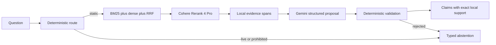

# FireLens BC Static RAG V1

FireLens BC answers single-turn questions from reviewed, stable British
Columbia wildfire-preparedness guidance. It does not report current fires,
select evacuation routes, predict conditions, or make personalized safety
decisions.



Local code owns policy, retrieval, evidence, source metadata, validation, and
public responses. All paid AI calls use OpenRouter. There is no hidden model or
retrieval fallback.

## Quick start

Python 3.11–3.14 and Node/npm are supported. Dependencies are deterministically
locked in `requirements.lock` and `package-lock.json`.

```bash
make setup
cp .env.example .env
# Add a rotated OPENROUTER_API_KEY to the ignored .env file.
make verify
make run
```

Open [http://127.0.0.1:8000](http://127.0.0.1:8000). The production local
process serves both the built Source Lens frontend and `/api/v1` from one
origin. During frontend development, Vite proxies `/api` to the backend.

## Commands

```bash
make verify              # lint, type checks, offline tests, UI build and browser tests
make benchmark           # zero-cost 20-case safety/red-team run
make benchmark-retrieval # four locked development retrieval configurations
make benchmark-live      # cost-capped complete 100-case run
make canary              # 30 repeated live generations
make model-bakeoff       # identical-evidence Gemini comparison
make live-smoke          # opt-in OpenRouter endpoint smoke tests
```

Corpus/index operations:

```bash
.venv/bin/firelens bootstrap-corpus
.venv/bin/firelens build-index
.venv/bin/firelens corpus-audit
.venv/bin/firelens doctor
```

CLI equivalents of the service are also available:

```bash
.venv/bin/firelens search "What belongs in a grab-and-go bag?"
.venv/bin/firelens ask "What does an evacuation alert mean?"
```

## API

- `POST /api/v1/ask` accepts only `{"question":"..."}` and returns a typed
  answer, abstention, unavailable state, or error.
- `GET /api/v1/health/live` reports process liveness.
- `GET /api/v1/health/ready` validates corpus, index, and provider setup.
- `/api/v1/search` and chunk inspection are development-only with
  `FIRELENS_DEBUG=true`.

Accepted claims include exact quote support and local evidence metadata. The
model cannot provide URLs, publishers, locators, page numbers, or hashes.

## Current measured checkpoint

- governed corpus: 8 sources, 180 chunks;
- vector index: 180 × 1,536;
- offline Python suite: 69 passed, 3 paid smoke tests skipped;
- safety/red-team route and status accuracy: 100%;
- citation ID and exact-quote validity: 100% on accepted claims;
- complete live benchmark cost: $0.2444; answer p95: 3.14 seconds;
- 30-call canary: no status variance; $0.1284;
- reranker Recall@5: 81.82%, below the 95% release gate.

This is a fully implemented V1 candidate, not a release-qualified product.
Semantic owner review and retrieval-quality improvement remain open. Read
[`docs/TECHNICAL_HANDBOOK.md`](docs/TECHNICAL_HANDBOOK.md) for the architecture,
operations, measured evidence, limitations, recovery steps, and code-reading
guide. Exact release evidence and artifact hashes are in
[`docs/releases/V1_EVIDENCE.md`](docs/releases/V1_EVIDENCE.md).
