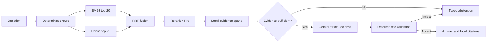

# FireLens BC Static RAG v1

FireLens BC answers questions about stable, approved British Columbia wildfire
preparedness guidance. It does **not** report current fires, determine whether a
location is safe, choose an evacuation route, or replace current official
instructions.

The v1 backend is deliberately small: local code owns retrieval, source
metadata, policy, and validation; models only create embeddings, rank local
passages, and propose a structured draft.



## Install

Python 3.11–3.14 is supported. Dependencies are pinned in `pyproject.toml`.

```bash
cd /path/to/firelens-bc
python3 -m venv .venv
.venv/bin/python -m pip install -e '.[dev]'
.venv/bin/python -m pytest -q
```

The normal test suite is offline and uses a deterministic fake provider. Real
provider smoke tests are opt-in so tests cannot spend credits accidentally.

## Configure OpenRouter safely

Copy `.env.example` to `.env`, store a newly rotated key there, and never commit
the file. The project ignores `.env`, vector artifacts, and request traces.

```bash
cp .env.example .env
# Edit .env and set OPENROUTER_API_KEY to the rotated key.
```

Configured model IDs:

- embeddings: `openai/text-embedding-3-small`
- reranking: `cohere/rerank-4-pro`
- generation: `google/gemini-3.5-flash-lite`

Every provider request denies data-collecting endpoints, requires supported
parameters, disables model/provider fallback, and optionally requires ZDR with
`FIRELENS_REQUIRE_ZDR=true`.

After rotating the key:

```bash
FIRELENS_RUN_OPENROUTER_SMOKE=1 .venv/bin/python -m pytest \
  tests/test_openrouter_smoke.py -q
.venv/bin/firelens build-index
.venv/bin/firelens doctor
```

## Use the backend

```bash
.venv/bin/firelens search "What belongs in a grab-and-go bag?"
.venv/bin/firelens ask "How often should I review my emergency plan?"
.venv/bin/firelens serve --host 127.0.0.1 --port 8000
```

HTTP endpoints:

- `POST /search` exposes the plan, all four rankings, evidence spans, errors,
  and timings.
- `POST /ask` returns a validated answer or typed abstention.
- `GET /health` reports corpus, index, and provider-configuration readiness.
- `GET /debug/chunks/{chunk_id}` exists only with `FIRELENS_DEBUG=true`.

Run the 20 existing questions as a diagnostic after the real pipeline works:

```bash
.venv/bin/firelens evaluate \
  --gold data/evaluation/gold_questions.yaml \
  --output data/evaluation/rag_v1_diagnostic.json
```

That report records system behavior but intentionally sets
`semantic_correctness_scored=false`. Human review is still required before it
can become a release benchmark.

## Current acceptance checkpoint

- production index: 175 chunks, 1,536 dimensions;
- offline suite: 48 passing tests, with 3 paid smoke tests skipped by default;
- live OpenRouter smoke suite: embeddings, Rerank 4 Pro, and Gemini all pass;
- real API path: `/search` exposes all four retrieval stages and `/ask` returns
  a deterministically validated cited answer;
- 20-question diagnostic: 17 validated answers, 3 expected live-data
  abstentions, and 0 provider errors.

The diagnostic remains unscored for semantic correctness. These counts prove
execution, routing, traceability, and structural validation—not release-level
answer quality.

## Understand the code

Start with [`docs/static_rag_v1.md`](docs/static_rag_v1.md). The main execution
path is intentionally linear:

1. `answering/intent.py` routes before any paid call.
2. `retrieval/pipeline.py` runs BM25, dense retrieval, RRF, and reranking.
3. `answering/context.py` reconstructs bounded same-parent evidence.
4. `answering/service.py` decides support and orchestrates generation.
5. `answering/validate.py` checks traceability and policy without pretending to
   prove semantic entailment.
6. `api.py` and `cli.py` expose the same service.

The governed eight-source, 175-chunk JSONL corpus remains the canonical source
for retrieval text and public source metadata.
