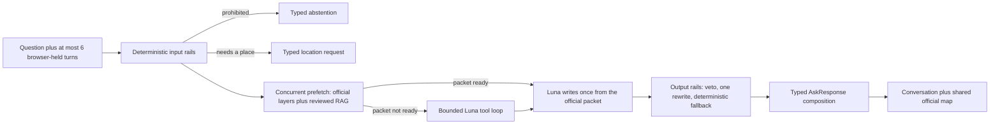

# FireLens BC

FireLens BC is a map-first wildfire assistant for British Columbia. One
conversation answers three kinds of questions with three different standards
of evidence: what official BC sources currently report (active fires,
perimeters, and fire-related evacuation orders and alerts), what reviewed
preparedness guidance says (grab-and-go kits, FireSmart, smoke, evacuation
definitions), and ordinary questions that deserve a plainly labelled general
answer. A language model chooses tools and writes prose. It is never the
authority for what is true.

**Repository status:** V1.6 RC2 repair worktree. RC1 reports are historical
snapshots of their recorded commits and trees; they are not evidence for this
checkout. A release candidate is qualified only from its exact Git commit and
tree plus the matching CI evidence artifact. It is not paid-qualified,
release-approved, or deployment proof. The existing site at
[firelens-bc.vercel.app](https://firelens-bc.vercel.app) must not be assumed to
match this checkout until a commit-bound deployment is separately verified.
Archived RC1 evidence remains available in
[`docs/reports/V1_6_RC1_LOCAL_QUALIFICATION.md`](docs/reports/V1_6_RC1_LOCAL_QUALIFICATION.md).

## Why this design matters

Conversational AI fails worst exactly where it sounds best. A fluent model
will happily invent a fire name, an evacuation status, or a reassuring
"no fires near you" — and in an emergency domain a confident wrong answer is
worse than no answer. FireLens is built around one organizing idea:

> **Models propose language. Source contracts, deterministic validation, and
> humans decide.**

Everything notable in this codebase is a consequence of taking that boundary
seriously:

1. **A deterministic authority boundary.** Luna (the LLM) proposes tool calls
   and wording. The application owns the tool schemas, dispatch, official
   source adapters, geodesic distance math, freshness labeling, output rails,
   and final publication. If the model's prose asserts something the fetched
   records do not support, rails veto it and a deterministic composer writes
   the answer instead.
2. **Two evidence lanes, never blended silently.** Current facts come only
   from official BC Wildfire Service and EmergencyInfoBC records, stamped with
   source and retrieval times. Stable guidance comes only from a reviewed
   corpus through hybrid retrieval (BM25 + embeddings + reciprocal-rank
   fusion + Cohere rerank) where every claim must carry an exact local quote
   that a validator re-checks. Mixed answers keep the two lanes in separate,
   labelled sections.
3. **Honesty as a typed contract.** Every response declares its mode —
   `live`, `grounded`, `partial`, `mixed`, `background`, `scope_redirect`,
   `requires_input`, `abstention` — so honesty is machine-checkable, not a
   tone. Cached-stale records are never called "current". An empty result is
   never presented as an all-clear. Out-of-scope questions get fixed,
   deterministic copy rather than free model prose.
4. **Fail-closed inputs.** The BC Geocoder is only trusted at a minimum match
   score and community-level precision inside BC bounds, so "Calgary" or a
   typo can never silently become a BC coordinate; out-of-province and
   Canada-wide questions are redirected to the right jurisdiction instead of
   being fuzzy-matched. Official-layer outages surface as typed limitations,
   not crashes or silence.
5. **Privacy by construction.** Embedding and generation require OpenRouter
   zero-data-retention endpoints, every request sends `data_collection=deny`,
   provider fallback is disabled, and the service persists no questions,
   answers, query hashes, or precise locations. Conversation memory is six
   bounded turns that live in the browser and are re-sent per request; the
   server is stateless.
6. **Evaluation as a gate, not a demo.** Frozen benchmark catalogs with
   hash-bound identity, hard adversarial probe sheets run against deployed
   previews, an accessibility surface gate (zero axe WCAG A/AA findings,
   minimum text sizes, 44px touch targets), and architecture tests that
   enforce module line limits. Checks report what was actually executed;
   passing local evidence is never presented as human or deployed evidence.

## How a question flows



When deterministic heuristics are confident about intent, the official layers
and the reviewed-guidance retrieval run concurrently before the model is ever
consulted, so a ready evidence packet costs exactly one model call. Distance,
size, count, and comparison questions are answered by application-owned
analysis over the fetched records — the model never does safety-relevant
arithmetic. See [ADR 0011](docs/adr/0011-luna-brain-thin-app.md) for the
agent-loop decision and [ADR 0009](docs/adr/0009-bounded-grounded-answer-repair.md)
for bounded grounded repair.

## Quick start

Python 3.12–3.14 and Node/npm are supported. Dependencies are locked in
`requirements.lock` and `package-lock.json`.

```bash
make setup
cp .env.example .env
# Put a rotated OPENROUTER_API_KEY in the ignored .env file.
make verify
make run
```

Open [http://127.0.0.1:8000](http://127.0.0.1:8000). `make run` builds the
React frontend, then serves the frontend and `/api/v1` from one FastAPI origin.

If the corpus or index is absent:

```bash
.venv/bin/firelens bootstrap-corpus
.venv/bin/firelens build-index
.venv/bin/firelens doctor
```

Source changes fail hash verification and require explicit review. Never edit a
manifest merely to force readiness.

## Response modes

| Mode | When it is used | Evidence behavior |
|---|---|---|
| `capability` | Greetings and “what can I ask?” | Deterministic local answer; no paid call |
| `grounded` | Directly supported stable guidance | Every claim has an exact quote and local source record |
| `background` | Related low-risk explanation outside direct corpus support | Clearly labelled; no corpus citation is allowed |
| `scope_redirect` | A current source is not integrated or a request needs an official handoff | Links the relevant official service without claiming its current value |
| `partial` | Only some requested stable aspects have evidence | Returns supported claims and names missing aspects |
| `live` | Supported current incident, perimeter, or evacuation question | Official metadata, source/retrieval times, and GeoJSON |
| `mixed` | Supported live records plus reviewed guidance, labelled background, or an official handoff | Separates each section by authority and evidence status |
| `abstention` | Personalized safety/medical decisions, prompt manipulation, or an unsafe unvalidated request | Explains the boundary and returns no factual evidence claim |

The background mode is intentionally separated from grounded RAG: it improves
conversation breadth without making unverified material look document-backed.

## Commands

```bash
make verify                 # secrets, OpenAPI, lint, types, tests, builds, browsers
make benchmark              # zero-cost V1 red-team plus V1.1 offline suite
make benchmark-v1-1-paid    # cost-capped 50-case live conversation benchmark
make benchmark-contextual   # development-only A/B/C retrieval-text experiment
make benchmark-retrieval    # four locked V1 retrieval configurations
make benchmark-retrieval-v1-5 # development comparison with hash-bound addendum
.venv/bin/python scripts/run_hard_probe.py --mode offline
.venv/bin/python scripts/run_hard_probe.py --mode qualified --max-cost-usd 0.25
make canary                 # 30 repeated live calls
make model-bakeoff          # identical-evidence model comparison
make live-smoke             # opt-in OpenRouter endpoint smoke tests
.venv/bin/python scripts/run_product_question_probe.py --suite v3-regression --max-cost-usd 0.75
```

The permanent hard probe is public regression data, not a sealed release
holdout. Offline mode uses controlled provider and live-data doubles. Qualified
mode uses the production OpenRouter boundary and refuses to start without an
explicit positive cost ceiling. Each report binds the commit, dataset, corpus,
retrieval strategy, provider stages, attempts, tokens, cost, and latency.

The product-question probe at
`data/evaluation/product_question_probe.v1.json` is also exploratory development
data, not a sealed qualification set. V3 structural regressions are maintained as
a separate case family in
`build_product_question_regression_cases()`; they check typed capabilities such as
map focus, live-result kinds, static claims/evidence, and required input. These
checks do not establish semantic entailment or replace human review.
The `--suite combined` option replays the frozen V1 catalog and V3 structural
regressions together without modifying the frozen catalog artifact. Location-based
V3 cases explicitly allow an empty official result set: a no-match response must
retain map focus and uncertainty, while deterministic intent tests verify the
requested layer. If records are returned, their required kinds are still checked.

CLI equivalents:

```bash
.venv/bin/firelens search "What belongs in a grab-and-go bag?"
.venv/bin/firelens ask "What does an evacuation alert mean?"
.venv/bin/firelens corpus-audit
```

## API

`POST /api/v1/ask` accepts a question, up to six bounded prior turns, and an
optional coarse location for supported live questions:

```json
{
  "question": "Why does that matter?",
  "history": [
    {"role": "user", "content": "What belongs in a grab-and-go bag?"},
    {"role": "assistant", "content": "The reviewed guide lists household supplies."}
  ],
  "location": {"label": "Kelowna", "radius_km": 50}
}
```

Other routes:

- `GET /api/v1/health/live`: process liveness.
- `GET /api/v1/health/ready`: corpus, index, and provider readiness.
- `GET /api/v1/live/map?bbox=...&layers=incidents,perimeters,evacuations`:
  official validated GeoJSON using the same adapters and cache as chat.
- `POST /api/v1/search` and `GET /api/v1/debug/chunks/{chunk_id}`: development
  only when `FIRELENS_DEBUG=true`.

Strict contracts reject unknown fields. Public source metadata is always
reconstructed from local corpus records; the model cannot supply publishers,
URLs, locators, hashes, or page numbers.

The V1.6 candidate retains the admitted 170-chunk corpus and 170 × 1,536 vector
index across eight approved sources. Ten chunks derived from a FireSmart page
repair remain quarantined until that replacement text receives human approval.
Runtime startup verifies the repair registry, chunk provenance, corpus hash,
vector row order, and matrix hash together. High-risk structured publication
adds a separate 26-record, hash-bound typed-claim inventory; it does not make
quarantined corpus material compilable. High-risk structured publication is
deterministic and uses zero generation. Eligible lower-risk ready packets may
use one generation only after deterministic validation. Uncovered high-risk
material falls back to an exact-source quote-only, partial, or handoff response;
it is never presented as a reviewed structured claim.

## Historical V1.1 checkpoint

| Area | Result |
|---|---:|
| Governed corpus | 8 sources, 180 chunks |
| Main vector index | 180 × 1,536, `metadata_context_v1` |
| Final verification | 99 Python passed, 3 paid skipped, 22 Python subtests; frontend 11 unit, 4 Sites, 12 browser flows |
| V1.1 offline suite | 50/50 complete; all control metrics 100% |
| Context A/B/C winner | 100% Recall@5, 81.25% MRR@5 on 8 grounded dev cases |
| Locked V1 retrieval sweep | 96% Recall@5, 86.17% MRR@5; current 20/20/60/5 retained |
| 30-call canary | no status/reason variance; p95 2.565 s |
| Final V1.1 live run | 50/50 complete; all control metrics and Recall@5 100%; p95 2.572 s |
| Legacy V1 compatibility run | 92.42% Recall@5; below the 95% release gate |

One immediately preceding V1.1 repeat hit a transient 429 on one of 50 cases
after all three bounded attempts. The final retained rerun is clean. The pair is
evidence of provider variability, while the final artifact remains the
authoritative scored result.

Automated checks establish routing, structural traceability, exact quote
identity, and policy invariants. They do **not** establish semantic entailment or
claim completeness. The exact owner-review action and artifact hashes are in
[`docs/releases/V1_EVIDENCE.md`](docs/releases/V1_EVIDENCE.md).

Further reading:

- [`docs/ARCHITECTURE_V1_6.md`](docs/ARCHITECTURE_V1_6.md): current public Ask,
  structured-publication, proof, and authority boundaries.
- [`docs/releases/V1_6_RUNBOOK.md`](docs/releases/V1_6_RUNBOOK.md): current
  candidate gates and independent-examination handoff.
- [`docs/reports/V1_5_PRINCIPAL_REMEDIATION.md`](docs/reports/V1_5_PRINCIPAL_REMEDIATION.md):
  historical V1.5 finding ledger, fixes, evidence, and release blockers.
- [`docs/TECHNICAL_HANDBOOK.md`](docs/TECHNICAL_HANDBOOK.md): historical V1.5
  architecture and code-reading snapshot; it is not current runtime authority.
- [`docs/reports/FIRELENS_V1_1_TECHNICAL_REPORT.md`](docs/reports/FIRELENS_V1_1_TECHNICAL_REPORT.md):
  detailed layer-by-layer report and result visualizations.
- [`docs/adr/`](docs/adr/): immutable architecture decisions.
- [`docs/learning/`](docs/learning/): textbook-style subsystem explanations.
- [`docs/releases/V1_5_RUNBOOK.md`](docs/releases/V1_5_RUNBOOK.md): preview,
  public verification, rate-limit boundary, and rollback procedure.

## Public-operation boundary

The application enforces a 64 KiB body limit and a privacy-preserving
30-request-per-minute guard for `/api/v1/ask` and `/api/v1/live/map`. Client
addresses are HMAC-hashed with an ephemeral process secret and are not logged or
persisted. Forwarded client IPs are ignored unless the deployment is explicitly
identified as Vercel, where only Vercel's platform-owned forwarding header is
accepted. A public answer also has a 45-second total deadline. The health
contract labels the in-process guard `instance_local`: a serverless instance
cannot provide a globally durable quota. Production must retain Vercel Firewall
or equivalent platform rate limiting as the outer distributed control.

Readiness returns HTTP 503 when the corpus, index, or required provider
configuration is unavailable. Production readiness reports stage-bound ZDR:
embedding and generation eligibility, plus `reranking_zdr_optional` when Cohere
operates under the approved exception. Debug routes are never registered in production,
even if the debug flag is set.

Do not submit exact addresses, medical details, or other private information.
FireLens does not store raw questions, answers, history, precise locations, or
deterministic query hashes. OpenRouter account prompt logging must be confirmed
disabled before deployment. Provider retention remains a residual third-party
risk for the bounded rerank query. This is not a privacy certification.

Production and preview must set `FIRELENS_EMBEDDING_ZDR=required`,
`FIRELENS_GENERATION_ZDR=required`, `FIRELENS_RERANKING_ZDR=optional`,
`FIRELENS_DATA_COLLECTION=deny`, and `FIRELENS_ALLOW_FALLBACKS=false`. Models
remain `openai/text-embedding-3-small`, `cohere/rerank-4-pro`, and
`openai/gpt-5.6-luna`. Cohere is the retained retrieval-qualified reranker, not
a ZDR-universal claim. `FIRELENS_REQUIRE_ZDR` is only a migration shim.
Qwen must not replace Cohere. Current release is no longer blocked because
Cohere lacks a ZDR endpoint.

Live location is optional, coarse, and request-scoped. Coordinates are rounded
to two decimals. Exact-address labels are rejected, and location is not written
to traces or ordinary application storage.
