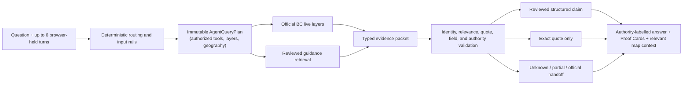

# FireLens BC

**A general conversational assistant with specialized, evidence-bound B.C.
wildfire capability.** FireLens combines ordinary chat, official incident
records, reviewed preparedness guidance, explicit uncertainty, and map context
when it is useful. A language model may propose ordinary background language
or wording from an application-owned evidence packet; it is never the authority
for what FireLens publishes as current fact, which tools run, or which
geography and source layers a request may use.


_Deterministic local demonstration data, not a current wildfire or evacuation report. Screenshot captured from deterministic local Playwright fixtures for this V1.6.2 candidate (`docs/assets/firelens-v1-6-overview.jpg`), not from the public site._

> **Project status:** this repository describes the local V1.6.2 engineering candidate.
> Qualification belongs to an exact commit/tree and its attached CI
> evidence—not to this README. This working candidate has not been exact-Git qualified, deployed, or release-qualified. The existing
> [public site](https://firelens-bc.vercel.app) must not be assumed to match the
> current checkout until preview, release and production gates identify the
> same artifact.

## What FireLens does

One interface handles three kinds of questions without silently mixing their
standards of evidence.

| Question type | FireLens uses | What the answer shows |
| --- | --- | --- |
| Current BC wildfire conditions | Official BC Wildfire Service and EmergencyInfoBC records | Source and retrieval times, record status, map geometry, and freshness |
| Stable preparedness guidance | A governed local corpus and human-reviewed typed claims | Exact source wording, publication kind, and claim-level Proof Cards |
| Ordinary or related conversation | Clearly labelled general background | Useful chat answer, never presented as reviewed or current evidence |

Try questions such as:

- “Are there active wildfire records near Kelowna?”
- “What is the difference between an evacuation alert and an order?”
- “What belongs in a grab-and-go bag for pets?”
- “What does an out-of-control wildfire status mean?”

| FireLens can | FireLens cannot |
| --- | --- |
| Display integrated official incidents, perimeters, and fire-related evacuation records | Replace emergency alerts, local authorities, 911, or official evacuation instructions |
| Explain reviewed preparedness material with visible support | Decide whether you personally are safe, should evacuate, or need medical care |
| Ask for a coarse BC place when a live lookup needs one | Treat an empty result, failed layer, or stale cache as an all-clear |
| Hand unsupported current questions to the appropriate official source | Browse the open web or invent a value for a source FireLens does not integrate |

### Broad interpretation, narrow authority

FireLens aims to understand a question before deciding what it can establish.
An ordinary question can receive labelled general background; a smoke or
preparedness question can use reviewed guidance; a B.C. current-record question
can trigger the bounded official layers. The same generosity does **not** turn
model knowledge into an official source.

Safety-sensitive is not out of scope. For example, “Should I evacuate?” is
relevant, but FireLens does not make that personal decision. It asks for the
smallest useful input for an official check or hands the person to the issuing
authority. See the [Product Constitution](docs/quality/FIRELENS_PRODUCT_CONSTITUTION.md)
and [V1.6.2 evaluation framework](docs/quality/V1_6_2_EVALUATION_FRAMEWORK.md).

## Why this is not “just a chatbot”

Fluent prose is not evidence. FireLens separates language generation from
publication authority:

1. **Official records own current facts.** The application—not the model—owns
   source adapters, timestamps, geometry, distance calculations, freshness, and
   record identity.
2. **Reviewed claims own high-risk guidance.** Action-critical and quantitative
   statements compile from a hash-bound typed inventory. Unreviewed extraction
   cannot become a reviewed FireLens claim.
3. **Every quotation is rechecked.** Evidence IDs, chunk IDs, document revisions,
   exact spans, and approved wording must still agree at publication time.
4. **Failure is visible.** Missing support becomes quote-only wording, a partial
   answer, an explicit unknown, an official handoff, or abstention—not confident
   filler.
5. **Trust is projected per item.** Reviewed claims, official live records,
   extraction-only quotations, background explanations, and unknowns retain
   different labels even when they appear in one answer.
6. **Evidence is tied to code identity.** Candidate reports bind the exact Git
   commit and tree, datasets, corpus, vector index, package locks, workflow, and
   zero-cost execution boundary.
7. **The request plan owns retrieval scope.** Before a provider sees a request,
   an immutable `AgentQueryPlan` fixes the permitted tools, source layers,
   geography, and any reviewed-guidance subrequest. A provider cannot widen that
   scope or repeat a tool call.

The governing principle is simple:

> **Models propose language. Source contracts, deterministic validation, and
> authorized human decisions determine what may be published.**

## What V1.6 and the local V1.6.2 candidate add

- A **26-record, hash-bound typed-claim inventory** for deterministic high-risk
  publication with zero generation.
- A complete disposition ledger for **all 36 raw claim candidates**: review-ready,
  duplicate, not claim-bearing, or needing source repair.
- Human decisions for 20 prepared proposals and the edited SPRINKLER wording,
  while nine extraction defects remain deferred and non-compilable.
- Atomic quote and document-revision binding, approved-surface hashing, cache
  invalidation, and fail-closed EvidencePacket identity validation.
- Requested-aspect relevance so unrelated facts cannot become supported merely
  because they share a larger source chunk.
- Explicit `structured_reviewed`, `official_quote_only`, live, background, and
  unknown presentation throughout the API-derived UI.
- An **adaptive, answer-first workspace**: multi-record live responses open
  deterministic Summary/Map/Records analysis; named-fire, nearby, or single-
  record responses keep the answer primary and offer map context when spatial
  evidence or map intent makes it useful; preparedness questions remain
  conversational with exact quotations.
- A restrained **Civic Intelligence Desk** presentation: a forest answer rail,
  warm-paper analytical canvas, mono data labels, accessible current-snapshot
  ranking, and mobile stacking without inventing historical trends.
- Human-readable service failures that state when no wildfire status was shown
  or inferred, preserve retry semantics, and link directly to the official map.
- Empty-map behavior that states uncertainty and never turns “no returned records”
  into a safety determination.
- Numeric kilometre ownership and rejection of model-invented unit conversions.
- A typed **intent automaton** that owns request shape before the query plan
  authorizes tools, layers, or geography.
- An immutable **AgentQueryPlan** that is the sole authorization for each
  request's tools, live layers, and geography; model tool requests outside that
  plan are rejected.
- A hash-bound **50-question user-experience catalog**, including misleading and
  adversarial prompts, with deterministic end-to-end fixtures.
- Candidate-evidence v2 for exact-head CI qualification, security evidence, SBOM,
  provenance, and explicit limitations.
- Higher-recall scope handling for ordinary chat, wildfire guidance, natural
  place wording, and safety-sensitive requests without broadening factual
  authority.
- Exact locality normalization, deterministic closest-record selection, and
  selected-record follow-up binding rather than an unrelated nearby substitute.
- Deterministic aggregate summaries for multi-record questions, concurrent
  mixed-lane prefetch, and a compact answer-first presentation that keeps maps
  on demand when they add value.
- Quote-only atomicity: an exact but interleaved multi-stage evacuation-table
  extraction is omitted rather than repackaged as an answer.
- A hash-bound ProductBench v2 development contract and a Constitution-led
  evaluation framework for reproducing, fixing, and re-falsifying user journeys.

These are implementation properties, not a declaration that the system is
deployed, independently certified, or appropriate for emergency decision-making.

## Adaptive views

The workspace chooses one presentation shell from the routed response, rather
than forcing every answer into the same chat layout.

| Response | What you see |
| --- | --- |
| General knowledge or reviewed guidance | Focused Chat view with optional quote/source disclosure; no map |
| Multi-record live response | Analysis workspace with Summary / Map / Records; Summary opens first |
| Named incident, nearby, or closest-fire live response | Spatial answer/record rail with map context when useful |
| Mixed live and guidance | Chat summary plus only the necessary analysis or map context, with authority labels |
| Unknown, error, or clarification | Compact Chat state with one primary next action |

Live or mixed responses offer map context only when a location, renderable
geometry, or map wording supports it. A literal map request can open the map
first; otherwise evidence remains the default analytical surface. Missing,
stale, partial, or empty official layers stay visible and never imply an
all-clear.

The typed intent automaton owns request shape (clauses, time, layers, national
scope, guidance, and place *candidates*) before `AgentQueryPlan` authorizes any
tool. Downstream modules project those fields; they do not re-parse the question
with a second phrase grammar.

## How an answer becomes publishable



Live distance, size, count, and comparison answers use application-owned analysis.
High-risk structured guidance is rendered deterministically. Eligible lower-risk
packets may use one bounded generation only after deterministic validation; that
generation may write from the packet but cannot request new tools, layers, or
geography.

## Quick start

FireLens supports Python 3.12–3.14 and uses locked Python and npm dependencies.
The setup target also installs the local Chromium build required by Playwright.

```bash
make setup
make verify
```

`make verify` is the complete zero-cost local engineering check: secret scanning,
generated OpenAPI drift, linting, types, backend and frontend tests, production
build, Sites packaging, and desktop/mobile Playwright flows.

To run the application with provider-backed Ask routes:

```bash
cp .env.example .env
# Add a rotated OPENROUTER_API_KEY only to the ignored .env file.
make run
```

Open [http://127.0.0.1:8000](http://127.0.0.1:8000). The FastAPI service hosts
the built React client and `/api/v1` from one origin.

If governed artifacts are absent:

```bash
.venv/bin/firelens bootstrap-corpus
.venv/bin/firelens build-index
.venv/bin/firelens doctor
```

Never edit a manifest merely to force readiness. A changed source must go through
the review and rebuild path.

## API and response contract

`POST /api/v1/ask` accepts a question, up to six bounded prior turns, and an
optional coarse location:

```json
{
  "question": "What about pets?",
  "history": [
    {"role": "user", "content": "What belongs in a grab-and-go bag?"},
    {"role": "assistant", "content": "The reviewed guide lists household supplies."}
  ],
  "location": null
}
```

| Mode | Meaning |
| --- | --- |
| `capability` | Deterministic explanation of supported questions |
| `grounded` | All published guidance is directly supported |
| `partial` | Supported material is returned and missing aspects are named |
| `conflict` | Reviewed sources disagree and FireLens does not choose a winner |
| `live` | Current integrated official records |
| `mixed` | Separately labelled live, reviewed, background, or handoff sections |
| `background` | Low-risk explanation not presented as reviewed support |
| `scope_redirect` | Unsupported current source or official-service handoff |
| `requires_input` | A coarse BC place is required for the live lookup |
| `abstention` | A personalized safety, medical, manipulation, or validation boundary |

Other public routes include liveness/readiness health checks and the official map
endpoint. See the generated [OpenAPI document](docs/openapi.v1.json) and current
[V1.6 architecture](docs/ARCHITECTURE_V1_6.md) for the complete contract.

## Verification and evidence

Useful zero-cost commands:

```bash
.venv/bin/python scripts/v1_6_structured_publication_eval.py \
  --output /tmp/firelens-structured-eval.json
.venv/bin/python scripts/run_hard_probe.py --mode offline \
  --expectation-profile rc2.2 --output /tmp/firelens-hard-probe.json
.venv/bin/python scripts/run_productbench.py --mode offline \
  --output /tmp/firelens-productbench-offline.json
.venv/bin/python -m pytest -q \
  tests/test_v1_6_user_end_questions.py \
  tests/test_v1_6_user_end_questions_end_to_end.py
```

The permanent hard probe is public regression data, not a sealed holdout. The
active RC2.2 profile preserves the historical dataset and `86/105` floor, copies
frozen RC2.1, and migrates only A09/A10 to two-sided structured coverage. The
historical, RC2, and RC2.1 profiles remain unchanged.
Candidate evidence rejects stale Git identities, changed materials, unexplained
paired regressions, provider credentials, provider cost, and incomplete artifacts.

ProductBench v2 snapshot-binds the current unsealed raw journey catalog and its
derived v2 executable contract to a public development manifest; it does not
claim a pre-v2 immutable source or historical anchor. Its 31
`offline_fake` cases run through the real in-process API/runtime, using only a
network-free official-record fixture and FakeProvider, with a fixed `$0`
ceiling and a per-case response hash/tool trace. The remaining 19 live journeys
are an opt-in provider run: `make productbench-provider
MAX_COST_USD=<positive-ceiling>`. It requires a provider-enforced key cap before
the run and receipt-backed returned costs for every provider call. A command's
output belongs to the candidate that ran it;
neither tier is a sealed or release-qualification result.

Automated checks establish structural behavior, source identity, exact quotation,
typed-field preservation, presentation state, and deterministic routing. They do
**not** establish universal semantic completeness, participant comprehension,
manual assistive-technology quality, deployed identity, or release approval.

## Repository map

```text
src/firelens/       Backend, agent loop, retrieval, publication, and evaluation
apps/web/           React/Vite answer workspace, proof UX, and on-demand map
data/               Governed corpus, vectors, typed claims, and evaluation catalogs
tests/              Backend, architecture, safety, browser, and qualification tests
docs/adr/           Immutable architecture decisions
docs/releases/      Current release gates and operating runbooks
docs/quality/       Product contracts and V1.6.2 evaluation framework
docs/reports/       Commit-bound current and historical evidence
```

Start here:

- **Employers and reviewers:** this README, then the
  [V1.6 architecture](docs/ARCHITECTURE_V1_6.md) and
  [current runbook](docs/releases/V1_6_RUNBOOK.md). For a short, evidence-honest
  technical walkthrough, read the [climate decision intelligence case study](docs/portfolio/CLIMATE_DECISION_INTELLIGENCE_CASE_STUDY.md) and use the
  [fixture-backed demo script](docs/portfolio/DEMO_SCRIPT.md). A frozen candidate can be
  challenged with the [GPT-5.6 Pro defect-first examination prompt](docs/audit/V1_6_GPT_5_6_PRO_FINAL_EXAMINATION_PROMPT.md).
- **Offline reviewers:** when GitHub or checkout access is blocked, use the
  [sanitized evidence-bundle examination prompt](docs/audit/V1_6_GPT_5_6_PRO_OFFLINE_BUNDLE_EXAMINATION_PROMPT.md); it treats missing evidence as unknown rather than inventing it.
- **Researchers:** the [50-question catalog](docs/reports/V1_6_USER_END_QUESTIONS_50.md),
  [structured-publication report](docs/reports/V1_6_STRUCTURED_PUBLICATION_HARDEN_1_REPORT.md),
  [ProductBench v2 protocol](docs/protocols/PRODUCTBENCH_V2.md), and [ADRs](docs/adr/).
- **Contributors:** `make verify`, the generated
  [OpenAPI contract](docs/openapi.v1.json), and the
  [GitHub update standard](docs/protocols/V1_6_GITHUB_UPDATE_STANDARD.md).
- **Historical context:** the [V1.1 technical report](docs/reports/FIRELENS_V1_1_TECHNICAL_REPORT.md)
  and archival [technical handbook](docs/TECHNICAL_HANDBOOK.md).

## Privacy and limits

- Default traces do not persist a question, answer, browser-held history,
  coordinates, evidence text, or a deterministic query hash. They retain only
  allowlisted categorical diagnostics and bounded numeric observations.
- A local developer may explicitly set `FIRELENS_TRACE_CONTENT=true` to retain
  the raw question for debugging. Preview and production configuration reject
  that option; it is not a deployment privacy certification.
- Live location is optional, coarse, rounded, request-scoped, and rejected when it
  resembles an exact address.
- Embedding and generation require OpenRouter zero-data-retention eligibility,
  `data_collection=deny`, and disabled provider fallbacks. Reranking retains a
  documented third-party retention risk; this is not a privacy certification.
- The in-process request guard is not a distributed production firewall.
- Empty, unavailable, stale, or partial official layers are limitations—not evidence
  that an area is safe.

Paid H4/H8 evaluation, preview qualification, firewall verification, rollback proof,
participant comprehension, manual VoiceOver review, deployment, and release GO remain
separate human-authorized gates. The exact requirements and artifact rules are in the
[V1.6 candidate runbook](docs/releases/V1_6_RUNBOOK.md).
