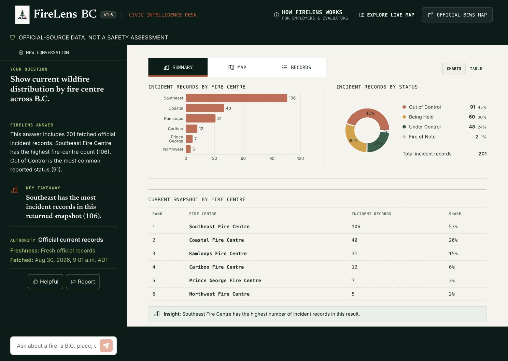
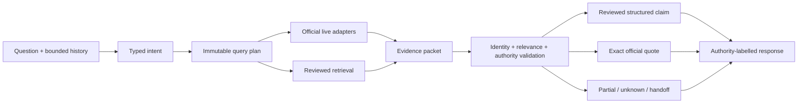

# FireLens BC

**A general conversational assistant with specialized, evidence-bound B.C.
wildfire capability.** FireLens combines useful chat, official incident records,
reviewed preparedness guidance, and deterministic analysis without presenting
model output as official evidence.



_Deterministic fixture data—not a current wildfire or evacuation report. The
screenshot demonstrates the V1.6.2 interface, not current conditions._

> **Project status:** V1.6.2 engineering candidate. Qualification and deployment claims belong to commit-bound CI and runtime evidence; this README does not confer release authority or turn a fluent model answer into proof.

## What FireLens does

One interface supports three evidence lanes and keeps them visibly separate.

| Lane | Source | What the user sees |
| --- | --- | --- |
| Current conditions | Integrated BC Wildfire Service and EmergencyInfoBC records | Record identity, source/fetch times, freshness, map context, and unavailable layers |
| Stable guidance | Governed corpus and human-reviewed typed claims | Reviewed wording, exact quotations, and claim-level Proof Cards |
| General conversation | Clearly labelled model background | A useful answer that is never styled as reviewed or current evidence |

Try:

- “Show current wildfire distribution by fire centre across B.C.”
- “What is the difference between an evacuation alert and an order?”
- “What belongs in a grab-and-go bag?”

| FireLens can | FireLens cannot |
| --- | --- |
| Display integrated incidents, perimeters, and fire-related evacuation records | Replace emergency alerts, local authorities, 911, or official evacuation instructions |
| Explain reviewed guidance with visible support | Decide whether a person is safe, should evacuate, or needs medical care |
| Calculate bounded counts, rankings, and geodesic distances from returned records | Treat an empty, unavailable, or stale layer as an all-clear |
| Answer ordinary questions as labelled background | Turn model knowledge into an official or reviewed fact |

### Broad interpretation, narrow authority

FireLens first tries to understand the task, then decides what it can establish.
An ordinary question can receive general background; a preparedness question can
use reviewed guidance; a current B.C. question can trigger bounded official
layers. The model does not gain authority merely because it recognizes a topic.

Safety-sensitive is not out of scope. “Should I evacuate?” is relevant, but
FireLens cannot make that personal decision. It can check integrated official
records when the required place is available and direct the user to the issuing
authority. See the [Product Constitution](docs/quality/FIRELENS_PRODUCT_CONSTITUTION.md)
and [V1.6.2 evaluation framework](docs/quality/V1_6_2_EVALUATION_FRAMEWORK.md).

## Why this is not “just a chatbot”

Fluent prose is not evidence. FireLens separates language generation from
publication authority:

1. **The application owns current facts.** Adapters and deterministic code own
   record identity, timestamps, geometry, counts, and distance calculations.
2. **Reviewed records own high-risk guidance.** A 26-record, hash-bound
   typed-claim inventory enables deterministic high-risk publication.
3. **Exact quotations are rechecked.** Evidence, document revision, source span,
   review state, and approved wording must still agree when an answer is built.
4. **The request plan owns retrieval scope.** An immutable plan fixes permitted
   tools, layers, and geography before a provider can participate.
5. **Failure stays visible.** Missing support becomes Exact quote only, partial,
   unknown, an official handoff, or abstention—not confident filler.
6. **Trust is per item.** Live facts, reviewed claims, extraction-only wording,
   background, and unknowns retain different presentation states.

> **Models propose language. Source contracts, deterministic validation, and
> authorized human decisions determine what may be published.**

## What V1.6 and the local V1.6.2 candidate add

- Authority-bound reviewed claims and a disposition ledger for all 36 raw
  candidates; unresolved source repairs remain non-compilable.
- Fail-closed EvidencePacket identity, quote containment, document/span hashes,
  approved-surface preservation, and cache invalidation.
- Requested-aspect relevance so unrelated same-chunk material cannot appear as
  support.
- Typed intent and an immutable query plan that own tools, live layers,
  geography, and multi-turn selected-record identity.
- Deterministic provincial/regional analysis and closest-record answers without
  provider-written live facts.
- A Civic Intelligence Desk interface that adapts between Chat, Analysis, and
  Spatial layouts instead of showing a map for every answer.
- Per-item publication presentation for reviewed claims, official quotations,
  live records, general background, partial results, and unknowns.
- Empty-result, unavailable-layer, unit-conversion, prompt-injection, and
  quote-negation rails.
- A hash-bound 50-question UX catalog, deterministic ProductBench tier, hard
  probe, structured-publication evaluation, and candidate-evidence workflow.

These are implementation properties—not certification, emergency advice, or a
claim that every official source is continuously available.

## Adaptive views

| Response | Presentation |
| --- | --- |
| General knowledge or reviewed guidance | Focused Chat with optional source disclosure; no map |
| Multi-record live question | Analysis with Summary / Map / Records; Summary opens first |
| Named, nearby, or closest incident | Spatial answer/record rail with useful map context |
| Mixed live and guidance | Concise chat plus only the necessary analytical or spatial context |
| Unknown, error, or clarification | Compact state with one primary next action |

The Analysis view computes snapshot-only counts, fire-centre rankings, status
distribution, and one bounded insight from records already returned in the
answer. It does not invent history, trends, or province-wide totals from a
partial result set.

## How an answer becomes publishable



Eligible lower-risk packets may use one bounded generation after validation.
Structured high-risk publication and official live analysis use deterministic
rendering; a provider cannot request new tools or widen geography.

## Quick start

FireLens supports Python 3.12–3.14 and uses locked Python and npm dependencies.

```bash
make setup
make verify
```

`make verify` runs secret scanning, generated-contract checks, linting, type
checking, backend/frontend tests, production build, Sites packaging, and
desktop/mobile Playwright journeys without provider cost.

To run provider-backed conversational routes:

```bash
cp .env.example .env
# Add OPENROUTER_API_KEY only to the ignored .env file.
make run
```

Open [http://127.0.0.1:8000](http://127.0.0.1:8000). The FastAPI service hosts
the React client and `/api/v1` on one origin. Optional corpus recovery commands
are documented in the [runbook](docs/releases/V1_6_RUNBOOK.md); never rewrite a
manifest merely to make readiness pass.

## API contract

`POST /api/v1/ask` accepts a question, up to six bounded browser-held turns, and
an optional coarse location:

```json
{
  "question": "What about pets?",
  "history": [{"role": "user", "content": "What belongs in a grab-and-go bag?"}],
  "location": null
}
```

Responses distinguish capability, grounded, partial, conflict, live, mixed,
background, scope redirect, required input, and abstention modes. The generated
[OpenAPI document](docs/openapi.v1.json) and [V1.6 architecture](docs/ARCHITECTURE_V1_6.md)
are the contract authorities.

## Verification and evidence

```bash
.venv/bin/python scripts/v1_6_structured_publication_eval.py \
  --output /tmp/firelens-structured-eval.json
.venv/bin/python scripts/run_hard_probe.py --mode offline \
  --expectation-profile rc2.2 --output /tmp/firelens-hard-probe.json
.venv/bin/python scripts/run_productbench.py --mode offline \
  --output /tmp/firelens-productbench-offline.json
```

The permanent hard probe is public regression data, not a sealed holdout. Its
RC2.2 profile preserves the 86/105 floor. ProductBench’s 31-case offline tier
uses fixtures and a fake provider at $0; its optional provider tier is unsealed
development evidence, not release qualification.

Automated checks establish identity, structure, exact quotation, typed-field
preservation, routing, and presentation behavior. They do not establish
universal semantic completeness, participant comprehension, deployed identity,
or release approval. Exact results belong to the commit/tree and attached CI
artifacts that produced them.

## Architecture and repository map

```text
src/firelens/   Backend, planning, retrieval, publication, and evaluation
apps/web/       React/Vite adaptive workspace, Proof Cards, analysis, and map
data/           Governed corpus, vectors, typed claims, and evaluation catalogs
tests/          Backend, safety, architecture, browser, and qualification tests
docs/           ADRs, protocols, reports, runbooks, and portfolio walkthroughs
```

Recommended entry points:

- **Employers:** [case study](docs/portfolio/CLIMATE_DECISION_INTELLIGENCE_CASE_STUDY.md),
  [demo script](docs/portfolio/DEMO_SCRIPT.md), then this README.
- **Researchers:** [architecture](docs/ARCHITECTURE_V1_6.md),
  [ProductBench protocol](docs/protocols/PRODUCTBENCH_V2.md), and [ADRs](docs/adr/).
- **Contributors:** `make verify`, [OpenAPI](docs/openapi.v1.json), and the
  [runbook](docs/releases/V1_6_RUNBOOK.md).

## Privacy and limits

- Default traces omit question, answer, raw history, coordinates, evidence text,
  and deterministic query hashes.
- Live location is optional, coarse, rounded, request-scoped, and rejected when
  it resembles an exact address.
- Preview and production configuration reject content-retaining trace mode.
- Provider-backed embedding/generation require OpenRouter zero-data-retention
  eligibility and disabled fallbacks; this is not a privacy certification.
- The in-process request guard is not a distributed production firewall.
- Empty, stale, partial, or unavailable layers are limitations—not safety facts.

Paid/sealed evaluation, participant comprehension, manual assistive-technology
review, preview qualification, firewall and rollback proof, deployment, and
release GO remain separate, human-authorized gates.
