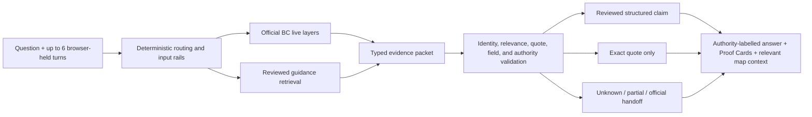

# FireLens BC

**An answer-first, evidence-bound wildfire assistant for British Columbia.**
FireLens combines official incident records, reviewed preparedness guidance,
explicit uncertainty, and map context when it is useful. A language model may
choose tools and propose wording; it is never the authority for what FireLens
publishes as fact.


_Deterministic local demonstration data, not a current wildfire or evacuation report._

> **Project status:** the V1.6 RC2 hardening and qualification campaign is
> integrated in this engineering candidate; the public package and API identity remains `1.6.0-rc.1` until a separately authorized version change.
> Local or CI success is not deployment or release proof, and the existing
> [public site](https://firelens-bc.vercel.app) must not be assumed to match this checkout.

## What FireLens does

One interface handles three kinds of questions without silently mixing their
standards of evidence.

| Question type | FireLens uses | What the answer shows |
| --- | --- | --- |
| Current BC wildfire conditions | Official BC Wildfire Service and EmergencyInfoBC records | Source and retrieval times, record status, map geometry, and freshness |
| Stable preparedness guidance | A governed local corpus and human-reviewed typed claims | Exact source wording, publication kind, and claim-level Proof Cards |
| Related low-risk explanation | Clearly labelled general background | No reviewed-corpus or live-source status |

Try questions such as:

- “Are there active wildfire records near Kelowna?”
- “What is the difference between an evacuation alert and an order?”
- “What belongs in a grab-and-go bag for pets?”
- “What does an out-of-control wildfire status mean?”

| FireLens can | FireLens cannot |
| --- | --- |
| Display integrated official incidents, perimeters, and fire-related evacuation records | Replace emergency alerts, local authorities, 911, or official evacuation instructions |
| Explain reviewed preparedness material with visible support | Decide whether you personally are safe, should evacuate, or need medical care |
| Ask for a coarse BC place when a live lookup needs one | Treat an empty result, failed layer, or stale cache as an all-clear |
| Hand unsupported current questions to the appropriate official source | Browse the open web or invent a value for a source FireLens does not integrate |

## Why this is not “just a chatbot”

Fluent prose is not evidence. FireLens separates language generation from
publication authority:

1. **Official records own current facts.** The application—not the model—owns
   source adapters, timestamps, geometry, distance calculations, freshness, and
   record identity.
2. **Reviewed claims own high-risk guidance.** Action-critical and quantitative
   statements compile from a hash-bound typed inventory. Unreviewed extraction
   cannot become a reviewed FireLens claim.
3. **Every quotation is rechecked.** Evidence IDs, chunk IDs, document revisions,
   exact spans, and approved wording must still agree at publication time.
4. **Failure is visible.** Missing support becomes quote-only wording, a partial
   answer, an explicit unknown, an official handoff, or abstention—not confident
   filler.
5. **Trust is projected per item.** Reviewed claims, official live records,
   extraction-only quotations, background explanations, and unknowns retain
   different labels even when they appear in one answer.
6. **Evidence is tied to code identity.** Candidate reports bind the exact Git
   commit and tree, datasets, corpus, vector index, package locks, workflow, and
   zero-cost execution boundary.

The governing principle is simple:

> **Models propose language. Source contracts, deterministic validation, and
> authorized human decisions determine what may be published.**

## What V1.6 adds

- A **26-record, hash-bound typed-claim inventory** for deterministic high-risk
  publication with zero generation.
- A complete disposition ledger for **all 36 raw claim candidates**: review-ready,
  duplicate, not claim-bearing, or needing source repair.
- Human decisions for 20 prepared proposals and the edited SPRINKLER wording,
  while nine extraction defects remain deferred and non-compilable.
- Atomic quote and document-revision binding, approved-surface hashing, cache
  invalidation, and fail-closed EvidencePacket identity validation.
- Requested-aspect relevance so unrelated facts cannot become supported merely
  because they share a larger source chunk.
- Explicit `structured_reviewed`, `official_quote_only`, live, background, and
  unknown presentation throughout the API-derived UI.
- Empty-map behavior that states uncertainty and never turns “no returned records”
  into a safety determination.
- Numeric kilometre ownership and rejection of model-invented unit conversions.
- A hash-bound **50-question user-experience catalog**, including misleading and
  adversarial prompts, with deterministic end-to-end fixtures.
- Candidate-evidence v2 for exact-head CI qualification, security evidence, SBOM,
  provenance, and explicit limitations.

These are implementation properties, not a declaration that the system is
deployed, independently certified, or appropriate for emergency decision-making.

## How an answer becomes publishable



Live distance, size, count, and comparison answers use application-owned analysis.
High-risk structured guidance is rendered deterministically. Eligible lower-risk
packets may use one bounded generation only after deterministic validation.

## Run it locally

FireLens supports Python 3.12–3.14 and uses locked Python and npm dependencies.

```bash
make setup
make verify
```

`make verify` is the complete zero-cost local engineering check: secret scanning,
generated OpenAPI drift, linting, types, backend and frontend tests, production
build, Sites packaging, and desktop/mobile Playwright flows.

To run the application with provider-backed Ask routes:

```bash
cp .env.example .env
# Add a rotated OPENROUTER_API_KEY only to the ignored .env file.
make run
```

Open [http://127.0.0.1:8000](http://127.0.0.1:8000). The FastAPI service hosts
the built React client and `/api/v1` from one origin.

If governed artifacts are absent:

```bash
.venv/bin/firelens bootstrap-corpus
.venv/bin/firelens build-index
.venv/bin/firelens doctor
```

Never edit a manifest merely to force readiness. A changed source must go through
the review and rebuild path.

## API and response contract

`POST /api/v1/ask` accepts a question, up to six bounded prior turns, and an
optional coarse location:

```json
{
  "question": "What about pets?",
  "history": [
    {"role": "user", "content": "What belongs in a grab-and-go bag?"},
    {"role": "assistant", "content": "The reviewed guide lists household supplies."}
  ],
  "location": null
}
```

| Mode | Meaning |
| --- | --- |
| `capability` | Deterministic explanation of supported questions |
| `grounded` | All published guidance is directly supported |
| `partial` | Supported material is returned and missing aspects are named |
| `conflict` | Reviewed sources disagree and FireLens does not choose a winner |
| `live` | Current integrated official records |
| `mixed` | Separately labelled live, reviewed, background, or handoff sections |
| `background` | Low-risk explanation not presented as reviewed support |
| `scope_redirect` | Unsupported current source or official-service handoff |
| `requires_input` | A coarse BC place is required for the live lookup |
| `abstention` | A personalized safety, medical, manipulation, or validation boundary |

Other public routes include liveness/readiness health checks and the official map
endpoint. See the generated [OpenAPI document](docs/openapi.v1.json) and current
[V1.6 architecture](docs/ARCHITECTURE_V1_6.md) for the complete contract.

## Verification and evidence

Useful zero-cost commands:

```bash
.venv/bin/python scripts/v1_6_structured_publication_eval.py \
  --output /tmp/firelens-structured-eval.json
.venv/bin/python scripts/run_hard_probe.py --mode offline \
  --expectation-profile rc2 --output /tmp/firelens-hard-probe.json
.venv/bin/python -m pytest -q \
  tests/test_v1_6_user_end_questions.py \
  tests/test_v1_6_user_end_questions_end_to_end.py
```

The permanent hard probe is public regression data, not a sealed holdout. The RC2
profile preserves the historical dataset and `86/105` floor while adding stricter
semantic requirements for the ten deliberately safer response-mode migrations.
Candidate evidence rejects stale Git identities, changed materials, unexplained
paired regressions, provider credentials, provider cost, and incomplete artifacts.

Automated checks establish structural behavior, source identity, exact quotation,
typed-field preservation, presentation state, and deterministic routing. They do
**not** establish universal semantic completeness, participant comprehension,
manual assistive-technology quality, deployed identity, or release approval.

## Repository map

```text
src/firelens/       Backend, agent loop, retrieval, publication, and evaluation
apps/web/           React/Vite answer workspace, proof UX, and on-demand map
data/               Governed corpus, vectors, typed claims, and evaluation catalogs
tests/              Backend, architecture, safety, browser, and qualification tests
docs/adr/           Immutable architecture decisions
docs/releases/      Current release gates and operating runbooks
docs/reports/       Commit-bound current and historical evidence
```

Start here:

- **Employers and reviewers:** this README, then the
  [V1.6 architecture](docs/ARCHITECTURE_V1_6.md) and
  [current runbook](docs/releases/V1_6_RUNBOOK.md).
- **Researchers:** the [50-question catalog](docs/reports/V1_6_USER_END_QUESTIONS_50.md),
  [structured-publication report](docs/reports/V1_6_STRUCTURED_PUBLICATION_HARDEN_1_REPORT.md),
  and [ADRs](docs/adr/).
- **Contributors:** `make verify`, the generated
  [OpenAPI contract](docs/openapi.v1.json), and the
  [GitHub update standard](docs/protocols/V1_6_GITHUB_UPDATE_STANDARD.md).
- **Historical context:** the [V1.1 technical report](docs/reports/FIRELENS_V1_1_TECHNICAL_REPORT.md)
  and archival [technical handbook](docs/TECHNICAL_HANDBOOK.md).

## Privacy and limits

- FireLens does not persist raw questions, answers, browser-held history, precise
  locations, or deterministic query hashes.
- Live location is optional, coarse, rounded, request-scoped, and rejected when it
  resembles an exact address.
- Embedding and generation require OpenRouter zero-data-retention eligibility,
  `data_collection=deny`, and disabled provider fallbacks. Reranking retains a
  documented third-party retention risk; this is not a privacy certification.
- The in-process request guard is not a distributed production firewall.
- Empty, unavailable, stale, or partial official layers are limitations—not evidence
  that an area is safe.

Paid H4/H8 evaluation, preview qualification, firewall verification, rollback proof,
participant comprehension, manual VoiceOver review, deployment, and release GO remain
separate human-authorized gates. The exact requirements and artifact rules are in the
[V1.6 candidate runbook](docs/releases/V1_6_RUNBOOK.md).
