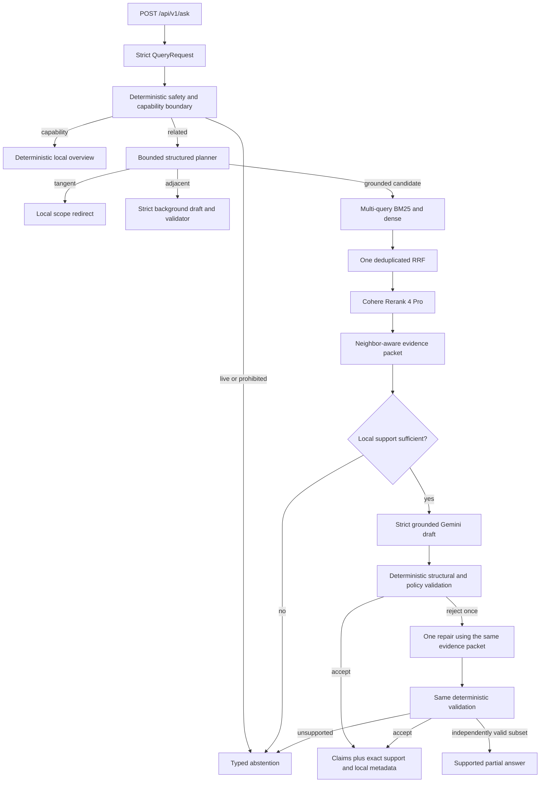

# FireLens BC Technical Handbook

Date: 2026-07-29 (America/Vancouver)

Status: authoritative V1.5 release-candidate architecture; qualification evidence is separate

Product state: `engineering-complete, semantic acceptance pending`

Release state: **not release-qualified**

This handbook describes the code that runs now. Architecture proposals that
predate V1.1 are historical context; ADRs in `docs/adr/` record why the current
design was chosen.

## 1. Product contract

FireLens BC is a local, single-user conversational assistant over a reviewed,
versioned collection of stable British Columbia wildfire-preparedness guidance.
It should help a user discover the collection before they know what documents
exist, answer supported questions with inspectable evidence, explain adjacent
low-risk concepts with an unmistakable background label, and preserve enough
bounded history to resolve a follow-up.

FireLens is not a current incident monitor, emergency-warning system,
evacuation-route selector, property-specific risk assessor, prediction system,
or personalized medical/safety decision-maker. Questions requiring those
capabilities stop at the deterministic boundary before any paid provider call.

V1.1 deliberately excluded public hosting, accounts, long-term memory, maps,
live wildfire/weather feeds, agents, graph RAG, a vector database, streaming,
automatic answer repair, model fallback, and fine-tuning. V1.5 adds bounded
official incident, perimeter, and evacuation queries, a restrained map, and the
single same-evidence repair defined by ADR 0009. It still excludes accounts,
long-term memory, agents, GraphRAG promotion, model fallback, and fine-tuning.

### 1.1 Evidence modes are part of the public truth contract

| Response mode | Meaning | Provider work | Citation rule |
|---|---|---|---|
| `capability` | Local overview of FireLens topics and example questions | none | no evidence claim |
| `grounded` | Stable guidance directly supported by the reviewed corpus | plan, embed, rerank, generate | every claim requires exact local support |
| `partial` | Only the supported portion of a requested grounded or live answer | bounded work for the available portion | every static claim requires exact local support; gaps are explicit |
| `background` | Related, low-risk explanation not asserted as corpus-backed | plan, retrieval stages, background generation | corpus evidence is forbidden |
| `live` | Current records returned from supported official BC data layers | official data fetch only | authority, source URL, update time, and retrieval time are required |
| `mixed` | Visibly separated official live records and stable corpus guidance | official data plus grounded static path | live provenance and static exact support remain separate |
| `scope_redirect` | Request is genuinely tangent | planner only | no evidence claim |
| `abstention` | Unsafe, unsupported, unavailable, or invalid request/result | often none; may follow a failed stage | material claims and evidence are forbidden |

The system never blends grounded and general-background claims in one response.
This is simpler to inspect and prevents a nearby retrieval result from being
misrepresented as proof of an adjacent scientific explanation.

## 2. End-to-end request sequence



`src/firelens/answering/service.py` owns routing and retrieval orchestration.
`src/firelens/answering/grounded.py` owns bounded generation, repair, claim
salvage, deterministic validation, and public citation construction. Both are
ordinary Python: each branch is visible, stage observations are typed, and no
framework callback graph hides control flow.

### 2.1 Layer ownership

| Layer | Primary code | Responsibility | Must not decide |
|---|---|---|---|
| Configuration | `config.py` | paths, models, limits, experimental retrieval defaults | answer content |
| Contracts | `contracts.py` | legal state shapes between stages and over HTTP | semantic correctness |
| Deterministic boundary | `answering/intent.py` | live/prohibited/capability checks, conservative deictic safety | grounded relevance |
| Live answer coordination | `live_answering.py` | supported layers, location requirements, outage semantics, static/live separation, mixed and partial composition | HTTP status codes or serialization |
| Planner | `answering/planner.py` plus provider | relation and up to three standalone retrieval queries | safety override or answer text |
| Retrieval | `retrieval/` | lexical/dense search, RRF, reranker mapping | public citations |
| Evidence | `answering/context.py` | same-parent expansion, quote candidates, local support decision | model-generated metadata |
| Generation | `answering/generate.py` | isolated background and grounded prompts/schemas | final acceptance |
| Validation | `answering/validate.py` | exact IDs/quotes, structure, limitations, policy bounds | full semantic entailment |
| Orchestration | `answering/service.py` | execute the one visible state machine | silent fallback |
| Provider boundary | `providers/` | OpenRouter wire formats, retry/error normalization | product policy |
| Interfaces | `api.py`, `cli.py` | HTTP/CLI status mapping and lifecycle | retrieval logic |
| Evaluation | benchmark/experiment modules | stage metrics, costs, review packets | owner semantic approval |
| Frontend | `prototype/firelens-rag-ui/` | explicit user states and source inspection | evidence construction |

## 3. Corpus and provenance

The governed input is `data/sources/source_registry.yaml`. Eight sources are
approved as stable guidance and produce 180 canonical chunk records. Generated
raw bytes, corpus JSONL, vectors, traces, and benchmark output remain untracked;
the registry, hash-pinned repair rules, benchmark definitions, and documentation
are tracked.

Each canonical chunk preserves:

- source and parent-record IDs;
- publisher, title, canonical URL, and locator;
- page or section context;
- authority and temporal class;
- source document SHA-256;
- deterministic chunk index and text.

`firelens bootstrap-corpus` downloads only registered sources, verifies expected
hashes, applies reviewed hash-pinned repairs, and atomically writes the combined
corpus and manifest. Changed upstream bytes fail with a source-review
requirement. `firesmart_begins_at_home` page 10 has one visually reviewed repair
for an interleaved multi-column text layer.

The corpus audit in `data/evaluation/corpus_quality_v1.json` records topic,
authority, temporal-class, freshness/hash coverage, likely table/layout pages,
and extraction flags. A layout flag is a review candidate, not proof of an
extraction defect.

Current governed artifacts:

| Artifact | State |
|---|---|
| Corpus version | `firelens_static_corpus.v1` |
| Approved sources | 8 |
| Canonical chunks | 180 |
| Corpus JSONL SHA-256 | `a6a26b22c45b1a17e286f38fb2af45b5d4baaf70f6c4c729243668b1355caa2f` |
| Corpus manifest SHA-256 | `ddeabeedc13778c1247d57be2c1e97d6e1cb311e672fa8e21d5f401e7f2821b3` |

## 4. Contracts and public API

Pydantic models use `extra="forbid"`; unknown fields are rejected rather than
ignored. A V1.1 request contains a normalized question of at most 2,000
characters and zero to six normalized conversation turns:

```json
{
  "question": "Why does that matter?",
  "history": [
    {"role": "user", "content": "What belongs in a grab-and-go bag?"},
    {"role": "assistant", "content": "The reviewed guide lists household supplies."}
  ]
}
```

History is context, not authority. The deterministic router consults prior text
only for a narrow deictic current question such as “What about right now?” or a
high-risk antecedent such as “Should I do that?” This avoids an old live request
poisoning a later self-contained stable-guidance question.

An accepted grounded response contains `PublicClaim` records with unique
`(evidence_id, exact_quote)` support pairs. A background claim has
`general_background` status and is structurally forbidden from carrying
support. Publisher, URL, locator, temporal class, primary passage, and context
are copied from the local evidence packet after validation; the model cannot
provide them.

### 4.1 Routes

- `POST /api/v1/ask`: public conversational result.
- `GET /api/v1/health/live`: process liveness only.
- `GET /api/v1/health/ready`: corpus, vector index, and provider configuration.
- `POST /api/v1/search`: development-only plan/ranking/evidence inspection.
- `GET /api/v1/debug/chunks/{chunk_id}`: development-only canonical chunk view.

Debug routes require `FIRELENS_DEBUG=true`. Expected abstentions are HTTP 200;
invalid requests 400; malformed upstream responses 502; required provider
unavailability 503; unexpected failures 500. Error envelopes contain a trace
ID, safe error kind, retryability, and user-safe message.

`docs/openapi.v1.json` is the tracked contract snapshot. `make openapi` exports
it and regenerates `prototype/firelens-rag-ui/src/api-schema.d.ts`; verification
therefore catches backend/frontend drift.

## 5. Routing and bounded planning

`answering/intent.py` runs before any paid work. Regular expressions and narrow
history resolution conservatively identify:

- live/current/predictive wildfire questions;
- personalized evacuation or safety decisions;
- personalized medical advice;
- attempts to manipulate evidence or policy boundaries;
- local capability/discovery questions.

Everything else begins as `related`; this is deliberately permissive so the
assistant does not reject a question merely because the wording is not a corpus
heading. The structured planner then returns exactly one relation:

- `grounded_candidate`: likely direct corpus support;
- `adjacent`: wildfire/preparedness background without calibrated direct
  support;
- `tangent`: genuinely unrelated.

Non-tangent plans contain one to three normalized, deduplicated standalone
retrieval queries. The planner schema prevents it from returning an answer,
source metadata, claims, or policy decisions. A planner failure is a typed
unavailable result; it does not fall back to ad hoc keyword routing.

## 6. Retrieval and contextual indexing

### 6.1 Current algorithm

For every planned retrieval query:

1. BM25 returns 20 chunks.
2. the query is embedded and normalized cosine search returns 20 chunks;
3. every BM25 and dense ranking contributes to one deduplicated RRF;
4. RRF keeps 20 chunks using `score(d) = Σ 1 / (60 + rank)`;
5. Rerank 4 Pro receives the fused 20 and returns five.

Repeated chunk IDs accumulate contributions but remain one candidate. Stable
ties break by chunk ID. Per-query stage rankings and matched-query positions
remain visible in `/api/v1/search` and traces.

### 6.2 Retrieval text versus citation text

V1.1 selected `metadata_context_v1`. Indexing and reranking see deterministic
text containing publisher, document title, optional section, locator, temporal
class, and the original passage. The canonical `chunk.text` remains unchanged
and is the only text eligible for exact quotation.

This separation is an important invariant:

```text
retrieval text = metadata context + canonical passage
citation text  = canonical passage only
```

The development-only A/B/C experiment compared raw V1 questions, planned
queries over original text, and the same planned queries over contextual text.
It used eight grounded development cases, saved each planner decision once,
opened no holdout, did not generate answers, and built candidate C under an
isolated experiment directory. Candidate C improved Recall@5 from 87.5% to
100%, so the main index was explicitly rebuilt with that versioned strategy.

### 6.3 Index integrity

The dense index is a normalized NumPy matrix plus an ordered chunk-ID manifest.
The manifest records corpus version/hash, model, dimensions, retrieval-text
strategy, chunk order, and matrix hash. Startup rejects a mismatch rather than
serving a mixed corpus/index state. Document embeddings use a content-hash
cache; query embeddings use a bounded in-memory LRU cache of 256 entries.

Index builds use an exclusive lock and atomic replacement. Current index:

| Field | Value |
|---|---|
| Shape | 180 × 1,536 |
| Embedding model | `openai/text-embedding-3-small` |
| Text strategy | `metadata_context_v1` |
| Matrix SHA-256 | `68d6fe79c19c2f50068a2b50d373781f56517c05dfff22ec76228770e1d74b03` |
| Manifest SHA-256 | `3024914bb9a263e5e2a3c8c5204e9bd8a63e073b5a7a41d02e52bbee585dbfc0` |

## 7. Evidence reconstruction and support

For each reranked primary chunk, `answering/context.py` may attach the previous
and next chunks only when they share `parent_record_id`. Overlapping selections
merge into one span. Primary text remains separate from surrounding context;
neighbors provide definitions or conditions but are not silently presented as
the cited passage.

The packet is capped at five spans and 8,000 combined context characters. It
contains bounded exact quote candidates with packet-specific IDs such as
`E1Q1`. Generation may select only those quote IDs. The service then maps them
back to public evidence IDs and exact strings.

Local support logic abstains if retrieval is incomplete, no approved evidence
exists, a temporal class is wrong, a required authority class is unavailable,
or no direct support can fit. No reranker-score threshold is used: relevance
scores are not assumed calibrated without development and sealed-holdout
evidence.

## 8. Generation, wire compatibility, and validation

Configured paid models are:

- planning and generation: `google/gemini-3.5-flash-lite`, temperature 0;
- embeddings: `openai/text-embedding-3-small`;
- reranking: `cohere/rerank-4-pro`.

Grounded generation sees the original question, normalized question, product
boundary, evidence packet, allowed quote IDs, required limitations, and strict
JSON Schema. Background generation uses a different prompt and type with no
evidence fields. Retrieved material and conversation text are explicitly marked
as untrusted data.

### 8.1 Operation-owned draft families

Grounded and background are already distinct provider methods with different
prompts, schemas, and local result types. Their strict wire schemas therefore
omit the redundant `answer_type` field instead of asking the model to select a
family it does not control. After every model-supplied field passes the matching
Pydantic contract, the provider method constructs the corresponding local typed
draft. A model-supplied discriminator—including aliases such as `factual`—is an
unexpected field and fails closed as an invalid provider response. No provider
content is rewritten or repaired.

### 8.2 What deterministic validation proves

The validator checks:

- correct draft family and allowed answer type;
- every grounded claim carries allowed quote IDs;
- every quote ID exists in the current packet;
- every selected quote occurs exactly in its primary passage;
- background claims carry no evidence;
- required limitations are present exactly;
- static evidence does not imply current status;
- prohibited language, injection artifacts, duplicates, and bounds are absent.

Validation failure becomes a typed abstention. There is no invisible
regeneration. These checks prove structural traceability and policy conformance;
they do not prove that a claim is semantically entailed by its quotation or that
all concepts required by a benchmark label were stated.

## 9. OpenRouter boundary and reliability

One shared `httpx.AsyncClient` belongs to application lifespan and closes
gracefully. Requests are non-streaming, provider concurrency is capped at four,
supported parameters are required, data-collecting routes are denied, and
fallback is disabled. `FIRELENS_REQUIRE_ZDR=true` makes ZDR a fail-closed
requirement.

Timeouts, 429 responses, and transient 5xx failures receive at most two retries
after the first attempt, against the exact same requested model. Authentication,
credit, policy, schema, and malformed-response failures are never retried.
Returned model identity is checked. Normalized usage, attempts, latency, and
model identity are observable; API keys and authorization headers are never
logged.

An earlier benchmark repeat observed one rate limit that remained
after all three bounded attempts. That explicit failure reduced run-level
metrics rather than triggering a hidden provider or algorithm substitution. The
final retained rerun completed cleanly. The difference is real provider
variability and is discussed in Sections 11 and 16.

## 10. Benchmark system

### 10.1 V1.1 conversation benchmark

`data/evaluation/benchmark_v1_1_conversation.yaml` is a strict 50-case suite:

- 30 development, 10 sealed holdout, 10 red-team;
- 10 capability, 10 contextual follow-up, 10 adjacent background, 10 tangent,
  and 10 mixed-adversarial cases.

Each case declares the expected route, planner relation, status, response mode,
evidence status, provider stages, required concepts, forbidden claims, required
limitations, and owner-review state. Dataset SHA-256 is
`922ab1a5e61866bff7f113b59f82d10c0b7a165f83584979d3cce83763ad70d9`;
sealed-holdout SHA-256 is
`a76deab5553a9549ce81a888d3ad7d722cf2625e21e938d7d13cbbdcbf98e53e`.

The offline fake-provider run tests stage wiring, invariants, paid-call
boundaries, and deterministic repeatability. Its lexical/dense/rerank scores are
not estimates of live model quality.

### 10.2 Preserved V1 benchmark

`data/evaluation/benchmark_v1.yaml` remains a 100-case compatibility and safety
suite: 60 development, 20 sealed holdout, and 20 safety/red-team. It predates
the capability/background/tangent contract and therefore labels many ordinary
questions according to the old corpus-only behavior. It remains useful for
safety, citation, provider, and retrieval regression evidence, but its overall
route/status scores are not V1.1 product-mode accuracy.

### 10.3 Metric interpretation

- Recall@20 asks whether any acceptable source survives a retrieval stage.
- Recall@5 asks whether any acceptable source survives the five reranked
  candidates used by the evidence builder.
- MRR@5 rewards putting the first acceptable source earlier.
- nDCG@5 rewards high placement of all acceptable sources.
- route/status/mode accuracy compare public control states with labels.
- citation/quote validity checks IDs and exact strings, not entailment.
- provider failure rate counts typed failed cases; a completed report may still
  contain an error result.
- p50/p95 are run-specific local wall-clock observations, not an SLA.
- reported cost is the sum of response-level OpenRouter usage metadata, not a
  billing-account audit.

## 11. Measured results

### 11.1 Engineering verification

The final offline verification checkpoint passed:

- 99 Python tests, with 3 paid smoke tests skipped and 22 Python subtests;
- Ruff and formatting checks;
- mypy across 43 source files;
- 11 frontend unit/accessibility tests;
- production frontend build;
- 4 Sites packaging tests;
- 12 Playwright flows (six scenarios in desktop and mobile viewport projects).

### 11.2 V1.1 offline

All 50 cases completed. Route, status, response mode, capability, deterministic
safety, planner relation, tangent, adjacent background, follow-up resolution,
evidence-status separation, required limitations, and paid-call boundary were
all 100%. BM25, fused, and fake reranker Recall were 100% with the selected
index; this validates offline structure only.

### 11.3 Contextual A/B/C and retained configuration

| Candidate | Question/index text | Recall@5 | MRR@5 |
|---|---|---:|---:|
| A | raw question + original passage | 87.5% | 58.75% |
| B | saved planned queries + original passage | 87.5% | 79.17% |
| C | saved planned queries + metadata context | **100%** | **81.25%** |

The experiment cost $0.062848, recorded no provider error, opened no holdout,
and left the governed original index unchanged. Candidate C was then selected
and the main index rebuilt explicitly.

The separate locked V1 sweep tested 50 answerable development cases. Current
20/20, RRF 60, top-5 achieved 96% Recall@5, 86.17% MRR@5, and 85.12% nDCG@5.
No challenger cleared the locked two-point improvement rule, so the simpler
current settings remain. Total four-candidate sweep cost was $0.544867.

### 11.4 Live V1.1 result and variability

| Observation | Automated control metrics | Rerank | Latency | Cost | Evidence status |
|---|---|---|---|---:|---|
| Final retained run | route, status, mode, capability, safety, planner, follow-up, tangent, adjacent, evidence status, limitations, and paid boundary all 100%; zero failures/leaks | Recall@5 100%, MRR@5 78.33%, nDCG@5 80.07% | p50 0.606 s, p95 2.572 s | $0.075479 | authoritative saved artifact, SHA-256 `362cd644443d5ce05fcfc8e8ebf28eb2fe154667e717aae9fad5d3f8cd9bbc8a` |
| Immediately prior repeat | one of 50 cases hit a transient 429 after three attempts | downstream run metrics reduced | p95 3.017 s | $0.071621 | observed and overwritten by the final rerun |

The correct interpretation is that the final controlled run passed its
automated V1.1 gates while one adjacent repeat demonstrated real upstream
variability and fail-closed behavior. The failed repeat is not averaged into the
final metric and must not be erased from the limitations discussion.

### 11.5 Canary and legacy compatibility

The 30-call canary produced 30 structurally accepted results with no status or
reason-code variance, p95 2.565 seconds, and $0.125976 cost.

The full legacy V1 run completed 100 cases with safety route/status at 100%,
citation IDs and exact quotes at 100%, overall route 85%, status 76%, one
provider error, p95 2.924 seconds, and $0.284289 cost. Reranker Recall@5 was
92.42%, below the V1 release gate of 95%. Old corpus-only labels conflict with
intentional V1.1 capability/background/tangent answers, explaining much of the
route/status delta; they do not explain or waive the retrieval miss.

### 11.6 What the benchmark still does not prove

No automated run has authoritative semantic scores for claim-to-evidence
entailment, required-concept completeness, or unsupported verified claims. The
review packets expose every claim beside local quotes so a human can decide.
Until owner review is recorded, the product remains semantic-acceptance pending.

## 12. Frontend architecture

The existing Source Lens React/Vite design is connected to `/api/v1/ask`. Its
view state is explicit: idle, loading, answer, abstention, provider unavailable,
or unexpected error. V1.1 adds bounded conversation context, a clear-history
control, capability suggestions, and visible badges for grounded, background,
scope, and current-information boundaries.

Grounded claims are interactive and open publisher, locator, canonical link,
evidence ID, exact highlighted quote, and surrounding passage. Background
claims are deliberately not evidence controls. Only a retryable provider error
exposes “Retry this question.” The permanent official-current-information link
remains visible.

FastAPI serves the production build and API from one origin. Vite proxies
`/api` during development, so CORS configuration is unnecessary for V1.1.
Automated browser evidence covers the six primary flows at desktop and mobile
viewports. A local server was launched for this RC, but the in-app browser
remained attached to a stale session after documented recovery; therefore no
new manual visual inspection is claimed. The earlier handbook statement that a
manual browser reproduction had passed is preserved only as historical V1
evidence, not promoted to this RC.

## 13. Security, privacy, persistence, and observability

- `.env`, raw source bytes, corpus output, embedding caches, vector artifacts,
  traces, reports, frontend builds, and browser artifacts are Git-ignored.
- `make verify` begins with a tracked-file secret scan.
- Every response receives a restrictive content policy and standard browser
  security headers; API responses are marked `no-store`.
- Debug search and chunk routes do not exist unless debug mode is explicitly
  enabled, and a production-import test keeps experiment modules out of startup.
- Question text is absent from traces by default; a SHA-256 is stored instead.
- `FIRELENS_TRACE_CONTENT=true` is an explicit local debugging opt-in.
- Trace retention is the lower of 250 files or 50 MiB.
- Trace, cache, matrix, manifest, corpus, and benchmark writes use atomic
  temporary-file replacement.
- Index builds fail fast on a concurrent writer.
- Every request receives a trace ID, including unexpected HTTP 500 responses.
- Normal operational logs contain only trace ID, route, response mode, latency,
  provider-stage names, and an error category. Questions, locations,
  coordinates, evidence text, and secrets are outside the logging interface.
- Any credential pasted into a conversation must be considered exposed and
  rotated; repository state does not prove account-side rotation.

## 14. Setup, launch, debugging, and recovery

### 14.1 First setup and launch

```bash
make setup
cp .env.example .env
# Add a rotated OPENROUTER_API_KEY to .env.
.venv/bin/firelens bootstrap-corpus  # only if governed artifacts are absent
.venv/bin/firelens build-index       # only if index is absent or deliberately rebuilt
.venv/bin/firelens doctor
make run
```

Open [http://127.0.0.1:8000](http://127.0.0.1:8000). Stop with `Ctrl-C` in the
serving terminal.

### 14.2 Verification and evaluation

```bash
make verify
make benchmark
make benchmark-v1-1-paid
make benchmark-contextual
make benchmark-retrieval
make canary
make live-smoke
```

Paid commands are opt-in and cost-capped where appropriate. `make benchmark`
is offline/zero-cost; fake-provider retrieval values must not be reported as
live semantic quality.

### 14.3 Recovery rules

1. **Changed source:** run `bootstrap-corpus`; inspect the new bytes and update
   a registry hash only after explicit source approval.
2. **Corpus/index mismatch:** rebuild the corpus, then the index. Never hand-edit
   a manifest to make readiness green.
3. **Provider failure:** use the typed kind, attempts, and trace ID. Do not change
   model or retrieval algorithm invisibly.
4. **Invalid draft:** inspect the first validation, the ADR 0009 repair, and the
   second validation. Never add another repair, new retrieval, or provider
   fallback to rescue the answer.
5. **OpenAPI drift:** run `make openapi`, inspect the generated diff, then verify
   backend and frontend together.
6. **Stale local browser:** stop old servers, confirm port 8000 ownership, launch
   `make run`, and reconnect. Do not claim visual verification from a stale tab.

## 15. Code-reading guide

Read in this order to understand the system without framework indirection:

1. `src/firelens/contracts.py` — the vocabulary and legal states.
2. `src/firelens/config.py` — model IDs, paths, bounds, and experimental defaults.
3. `src/firelens/answering/intent.py` — zero-call boundary and capability route.
4. `src/firelens/answering/planner.py` — planner prompt and schema.
5. `src/firelens/retrieval/text.py` — versioned retrieval-only text.
6. `src/firelens/retrieval/pipeline.py` — per-query stages and one RRF.
7. `src/firelens/retrieval/hybrid.py` — the deterministic fusion formula.
8. `src/firelens/answering/context.py` — evidence spans and quote candidates.
9. `src/firelens/answering/generate.py` — isolated draft families.
10. `src/firelens/answering/validate.py` — fail-closed deterministic checks.
11. `src/firelens/answering/service.py` — the complete request state machine.
12. `src/firelens/providers/openrouter.py` — wire protocol, retry, usage, and
    operation-owned draft typing.
13. `src/firelens/benchmark.py` — V1 and V1.1 execution/metrics/review packets.
14. `src/firelens/contextual_retrieval_experiment.py` and
    `retrieval_experiment.py` — isolated measured tuning.
15. `src/firelens/api.py`, `runtime.py`, and `cli.py` — process surfaces and
    lifecycle.
16. `prototype/firelens-rag-ui/src/App.tsx` and `api.ts` — UI state and typed
    network boundary.

## 16. Current status and next release gate

The architecture, bounded conversation contract, contextual index, backend,
frontend, reliability controls, offline tests, browser automation, and measured
evaluation runners are implemented. This is engineering-complete in the sense
that the designed vertical slice exists and its deterministic checks pass.

It is not release-qualified for three independent reasons:

1. the owner has not approved semantic claim support and required-concept
   completeness;
2. the preserved V1 compatibility benchmark still has 92.42% reranker Recall@5
   against its 95% release gate.
3. manual in-app visual inspection of this RC was blocked by stale browser
   handles; the 12 automated Playwright flows pass but are not a manual review.

The exact next action is to complete every owner checkbox for all 20 legacy V1
red-team cases plus the preselected 10 ordinary cases in
`output/benchmark/v1_semantic_review.md`, and separately review all 10 V1.1
red-team cases plus every accepted grounded/background claim in
`output/benchmark/v1_1_conversation_live_review.md`. For each claim, record
whether the quote entails it, required concepts are present, forbidden claims
are absent, and limitations are correct. Any rejected case becomes a labelled
development item; sealed holdout cases must not be tuned question-by-question.

## 17. Historical V1 checkpoint

V1 was single-turn and corpus-only. It introduced the governed corpus,
BM25/dense/RRF/rerank pipeline, evidence spans, strict generation/validation,
versioned API, reliability layer, Source Lens integration, 100-case benchmark,
retrieval sweep, and canary. Its recorded final candidate had 69 Python tests,
81.82% Recall@5 on the then-current complete live run, and a manual local browser
reproduction. Those numbers describe that historical checkpoint only. V1.1
supersedes its product contract and test counts while preserving its evidence
ledger for auditability.

## Glossary

- **Adjacent:** related low-risk material not currently treated as directly
  supported by the approved corpus.
- **Evidence span:** a primary chunk plus bounded same-parent neighbors.
- **General background:** explicitly unverified model output with no corpus
  citation.
- **Grounded claim:** a public claim with at least one exact local support pair.
- **Quote candidate:** an exact bounded primary-passage substring selectable by
  a packet-specific ID.
- **RRF:** reciprocal-rank fusion across multiple ordered retrieval lists.
- **Scope redirect:** a local answer that guides a tangent user back to product
  capabilities without pretending to answer the tangent request.
- **Sealed holdout:** cases whose per-question results must not be used for
  tuning.
- **Structural validation:** deterministic evidence/policy checks, not semantic
  entailment review.
- **Typed abstention:** an expected non-answer with an explicit reason code.
