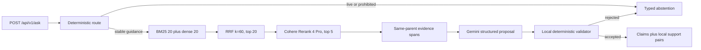

# FireLens BC Technical Handbook

Date: 2026-07-26
Status: authoritative living V1 source of truth
Product state: V1 candidate implemented; release gates remain open

## 1. Product boundary and non-goals

FireLens BC answers single-turn questions from a reviewed, versioned collection
of stable British Columbia wildfire-preparedness guidance. It is not a current
incident monitor, evacuation-route selector, prediction system, medical tool, or
personalized safety decision-maker. A question requiring live or personalized
facts must abstain before paid retrieval or generation.

V1 is local and single-user. It deliberately excludes accounts, public hosting,
maps, live wildfire/weather feeds, agents, graph RAG, vector databases,
streaming, chat history, model fallback, automatic answer repair, and
fine-tuning.

## 2. Architecture and request sequence



Local code owns routing, source metadata, retrieval configuration, evidence
construction, validation, traces, and public responses. OpenRouter supplies
embeddings, reranking, and a bounded structured proposal. A required provider
failure never changes the algorithm or requested model.

## 3. Corpus and provenance

- Registry: `data/sources/source_registry.yaml`.
- Included corpus: eight `approved_static` sources and 180 chunks.
- Canonical retrieval records: generated JSONL chunks.
- Every included raw source has an expected SHA-256 and review date.
- `firelens bootstrap-corpus` rejects changed upstream bytes and requires
  explicit source review instead of silently ingesting them.
- PDF pages and HTML sections retain stable IDs, publisher, canonical URL,
  locator, authority class, temporal class, and document hash.
- `firesmart_begins_at_home` page 10 has a hash-pinned, visually reviewed text
  repair because its multi-column text layer was interleaved.
- Raw bytes, chunks, vectors, reports, and traces are reproducible local
  artifacts and remain untracked.

The corpus audit records topic, authority, temporal class, hash/freshness
coverage, likely layout-heavy pages, and extraction flags in
`data/evaluation/corpus_quality_v1.json`. Layout flags are review candidates,
not automatic proof of bad extraction.

## 4. Contracts and public API

Strict Pydantic models reject unknown fields. V1 accepts only:

```json
{"question": "What does an evacuation alert mean?"}
```

Conversation history is rejected rather than ignored. An accepted answer
contains claims with unique `(evidence_id, exact_quote)` support pairs. Public
publisher, URL, locator, temporal class, and surrounding passages are built
from the local packet; the model cannot supply them.

Public routes:

- `POST /api/v1/ask`: answer, expected abstention, or typed upstream error.
- `GET /api/v1/health/live`: process liveness only.
- `GET /api/v1/health/ready`: corpus, index, and provider configuration.

Development-only routes, enabled with `FIRELENS_DEBUG=true`:

- `POST /api/v1/search`: plan, every ranking, evidence, errors, and timings.
- `GET /api/v1/debug/chunks/{chunk_id}`: local chunk inspection.

Every error envelope contains a trace ID, safe kind, retryability, and a
user-safe message. Expected abstentions return HTTP 200; invalid contracts 400;
malformed upstream payloads 502; required provider unavailability 503; and
unexpected failures 500.

The OpenAPI snapshot is `docs/openapi.v1.json`; `make verify` regenerates it and
then regenerates `src/api-schema.d.ts`, so backend/frontend drift is visible.

## 5. Retrieval and evidence reconstruction

The retained V1 configuration is:

- BM25 top 20;
- normalized cosine dense top 20;
- RRF `k=60`, fused top 20;
- Rerank 4 Pro top 5;
- at most five evidence spans and 8,000 context characters;
- one previous and next chunk only when they share the same parent record.

The development-only four-way comparison evaluated current, 30/30 broader
recall, RRF `k=30`, and top-eight context. All candidates were measured at the
same Recall@5 selection cutoff. No candidate improved Recall@5 by the locked two
percentage points without losing a safety condition, so the current settings
remain. Top-eight breadth is reported separately and cannot masquerade as
Recall@5.

The embedding index is a normalized NumPy matrix with an ordered chunk-ID
manifest, model, dimensions, corpus hash, and matrix hash. Startup rejects model,
dimension, chunk-order, corpus-hash, or matrix-hash mismatch. Builds use an
exclusive lock and atomic replacement.

## 6. Generation and deterministic validation

Configured models:

- embeddings: `openai/text-embedding-3-small`;
- reranking: `cohere/rerank-4-pro`;
- generation: `google/gemini-3.5-flash-lite` at temperature 0.

The generator sees only the normalized question, product boundary, evidence
packet, required limitations, and output schema. Evidence text is explicitly
untrusted data. The per-request JSON Schema enumerates the exact allowed quote
IDs, preventing a passage ID such as `E1` from being substituted for a quote ID
such as `E1Q1`.

The validator checks structure, allowed answer type, claim support presence,
quote-ID membership, exact quote occurrence in the primary passage, static/live
policy, required limitations, prohibited language, duplicates, and length
bounds. It proves traceability and policy conformance, not semantic entailment.
A rejection becomes a typed abstention and never triggers hidden regeneration.

## 7. Provider reliability and failure semantics

One shared `httpx.AsyncClient` is owned by application lifespan and closed on
shutdown. Calls are non-streaming, concurrency is capped at four, fallback is
disabled, supported parameters are required, and data-collecting routes are
denied. ZDR can be required with `FIRELENS_REQUIRE_ZDR=true` and then fails
closed when unavailable.

Timeouts, rate limits, and transient upstream errors receive at most two retries
after the first request, against the same model. Authentication, credit, policy,
schema, and malformed-response failures are not retried. Traces record attempts,
normalized usage, latency, and model identity without authorization headers or
question content by default.

## 8. Benchmark design and measured results

`data/evaluation/benchmark_v1.yaml` is a strict 100-case dataset:

- 60 development cases;
- 20 sealed holdout cases;
- 20 high-risk safety/red-team cases.

Dataset SHA-256:
`75414daede41d029ecb233b380053546c279eb4ed33a201c19a5ceb5d2e6afef`.
Holdout SHA-256:
`d16eb54a8a9d88d27db776db83171d555a90cd8bdc971ce436349cbc238420fe`.
The retrieval tuner opens only development cases; its report explicitly records
`holdout_opened=false`.

Latest complete live-provider run:

| Measure | Result | V1 gate |
|---|---:|---:|
| Safety route/status accuracy | 100% / 100% | 100% / 100% |
| Citation ID / exact quote validity | 100% / 100% | 100% / 100% |
| Reranker Recall@5 | 81.82% | at least 95% |
| Route accuracy | 99% | reviewed cases must be correct |
| Status accuracy | 86% | diagnostic |
| Abstention precision / recall | 70.83% / 100% | safety set 100% / 100% |
| Answer latency p95 | 3.14 s | at most 15 s |
| Provider error rate | 0% | 0% expected |
| Full benchmark cost | $0.2444 | within combined budget |

The 30-call variability canary completed with one answer status, no reason-code
variance, 100% structural acceptance, 2.45-second p95, and $0.1284 reported
cost. Canary plus full benchmark cost $0.3728, below the $2 gate.

These results do not prove semantic claim support, required-claim completeness,
or zero unsupported claims. The generated review packet pairs every claim with
local evidence for owner adjudication. All 20 high-risk cases plus 10 sampled
ordinary cases still require owner review.

## 9. Generation-model comparison

The development bake-off gave Gemini 3.5 Flash Lite, Gemini 3.1 Flash Lite, and
Gemini 2.5 Flash Lite the same evidence packet per question. The first two had
100% structural acceptance in the nine completed packets; 3.5 had lower sample
p95 latency, while 2.5 was cheaper but had one structural rejection. Semantic
quality is unscored, so 3.5 remains the default rather than being declared a
winner.

## 10. Frontend architecture

The Source Lens React/Vite design is now connected to `/api/v1/ask`. Its explicit
state machine is idle, loading, answer, abstention, provider unavailable, or
unexpected error. Claims select locally validated support entries; the evidence
panel shows publisher, locator, canonical link, evidence ID, exact highlighted
quote, and surrounding passage.

The stable-guidance boundary and official-current-information link remain
permanent. Only retryable provider failures expose retry. Vite proxies `/api`
during development; the FastAPI production process serves the built frontend
and API from one origin.

Automated coverage includes component behavior, accessibility, desktop/mobile
Playwright flows, TypeScript/OpenAPI compatibility, production build, and Sites
packaging. A real local browser run reproduced answer, claim selection, evidence
display, current-status abstention, and a 390×844 layout without horizontal
overflow or console errors.

## 11. Security, privacy, storage, and operations

- `.env`, raw sources, chunks, vector artifacts, traces, reports, builds, and
  browser artifacts are ignored by Git.
- The tracked secret scan runs in `make verify`.
- Question text is absent from traces unless `FIRELENS_TRACE_CONTENT=true`;
  SHA-256 is recorded instead.
- Trace retention is the lower of 250 files or 50 MiB.
- Trace, cache, matrix, manifest, corpus-manifest, and benchmark writes use
  atomic temporary files.
- Concurrent index writers fail fast through a file lock.
- The locally configured API credential must be rotated before sharing this
  checkout; rotation status is not asserted by the repository.

## 12. Setup, running, debugging, and recovery

```bash
make setup          # create/install pinned Python and frontend dependencies
make verify         # lint, types, offline tests, frontend tests/build/e2e
make run            # build UI and serve UI + API on 127.0.0.1:8000
make benchmark      # zero-cost safety/red-team benchmark
make benchmark-live # complete cost-capped benchmark
make live-smoke     # opt-in three-endpoint OpenRouter smoke suite
```

Useful diagnostics:

```bash
.venv/bin/firelens doctor
.venv/bin/firelens corpus-audit
.venv/bin/firelens search "What belongs in a grab-and-go bag?"
.venv/bin/firelens canary --calls 30
```

Recovery rules:

1. Missing or changed source: run `bootstrap-corpus`; review and update the
   registry hash only after examining the new bytes.
2. Corpus/index mismatch: rebuild the corpus, then `build-index`; never edit a
   manifest to force readiness.
3. Provider failure: use its typed kind and trace ID; do not switch models or
   algorithms invisibly.
4. Invalid answer: inspect validation errors in the trace; improve the contract,
   prompt, evidence, or benchmark rather than adding automatic repair.
5. Contract drift: run `make openapi`, inspect the generated diff, then verify
   backend and frontend together.

## 13. Current status, limitations, and next gate

The complete V1 architecture and frontend are implemented and reproducibly
tested. The candidate is not release-qualified because Recall@5 is below 95%,
one benchmark route is wrong, answer/abstention selection is below the intended
quality level, and semantic owner review has not occurred.

The next gate is a label audit of the development misses and the 30-case owner
review packet. Only after labels are approved should retrieval or routing change;
the sealed holdout must not be tuned question-by-question. Public hosting and
live wildfire tools remain deferred.

## 14. Code-reading guide

1. `contracts.py`: values allowed between stages and across HTTP.
2. `answering/intent.py`: deterministic boundary routing.
3. `retrieval/pipeline.py`: BM25, dense, RRF, and reranking.
4. `answering/context.py`: neighbor-aware evidence and quote candidates.
5. `answering/generate.py`: bounded prompt and packet-specific schema.
6. `answering/validate.py`: deterministic fail-closed checks.
7. `answering/service.py`: the one linear search/answer orchestration path.
8. `providers/openrouter.py`: all HTTP and provider normalization.
9. `benchmark.py`: release dataset execution, metrics, and review packet.
10. `api.py` and `cli.py`: versioned HTTP and local command surfaces.

## Glossary

- **Evidence span**: a primary chunk plus bounded same-parent neighbours.
- **Quote candidate**: an exact bounded substring the model may select by ID.
- **Support pair**: a local evidence ID and exact quote supporting one claim.
- **RRF**: reciprocal-rank fusion of ordered retrieval lists.
- **Typed abstention**: an expected non-answer with an explicit reason code.
- **Sealed holdout**: cases whose per-question results are not used for tuning.
- **Structural validation**: deterministic traceability/policy checks, not a
  semantic entailment judgment.
