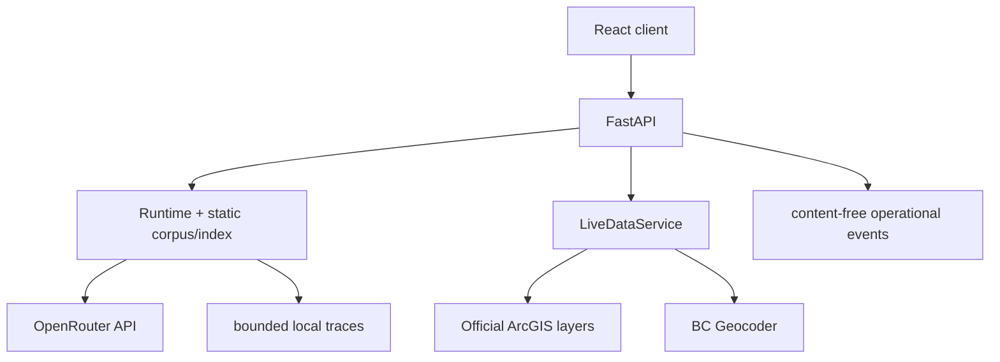

# 03 — Runtime Topology

## Composition root

[`api/factory.py`](../../src/firelens/api/factory.py) constructs `FastAPI`, installs anonymous request bounds and exception handlers, then installs health/feedback, live, Ask, and frontend routes. Its lifespan loads [`Runtime`](../../src/firelens/runtime.py), applies a bound candidate if configured, and owns cleanup of runtime/provider/live clients.

In a configured production environment, startup requires an `OpenRouterProvider` and a successful required-model ZDR preflight. On 2026-09-04, the named public baseline at deployment `dpl_Ffh3orbdgQj8p7fdqwGmwZPuLYMh`, build `40c4c970bf33192ce6a543a6b8dcf5b4799036bd`, returned ready. That observation does not establish endpoint receipts, semantic quality, or equivalence to the local candidate.

## Environments

| Environment | Configuration behavior | Evidence status |
| --- | --- | --- |
| local | Default; provider key may be absent; content traces can be explicitly enabled | Engineering only |
| preview | Rejects content trace persistence | Requires separate origin/identity verification |
| production | Rejects content traces; requires embedding/generation ZDR, data collection deny, no fallback, and preflight | Named baseline identity/readiness observed; candidate and full product qualification remain blocked |

The raw readiness response had SHA-256 `62ef05309dd2a65c5a06d0c7dbe96a8b109733414c58a75892ea63b89510e7f1` and reported release `1.6.4`, corpus `firelens_static_corpus.v1` with 179 chunks, and models `openai/text-embedding-3-small`, `cohere/rerank-4-pro`, and `openai/gpt-5.6-luna`. It did not expose a corpus hash, so the local base corpus/vector hashes must not be attributed to production. The served OpenAPI document had SHA-256 `df598029b423c7fbafa84be4e9086c9d1a7b5777abb9685e7d29d9762e38eff7`. These are **OBSERVED-PRODUCTION** identity/readiness facts, not a deployed-candidate gate or release decision.

## Readiness

`GET /api/v1/health/live` proves only that the process responds. `GET /api/v1/health/ready` reports corpus/index/provider/privacy/candidate identity and returns HTTP 503 when `Runtime.health()` is not ready. Readiness does not prove semantic quality, upstream freshness, user task success, or release approval.
