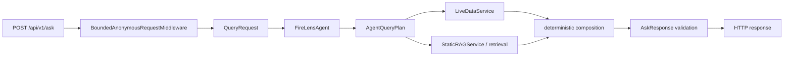

# FireLens Technical Architecture Book

Status: current-checkout engineering reference, not release approval.
The original Sol inspection was built from `ae975132` on 2026-09-04; it remains
historical. Current runtime `37de779` has accepted external backend scope and a
verified preview. The earlier `b887cb4` synthetic UI matrix remains separately
identified historical evidence. The System Card records both scopes.
The [System Card](../system-card/FIRELENS_SYSTEM_CARD.md) owns full application,
evaluator and external-evidence identities; documentation successors do not
turn earlier observations into new runs.

FireLens is an evidence-bound wildfire information application for British Columbia. A model may interpret or explain within a deterministic plan; application code owns official records, geography, evidence authority, publication, and the final public contract.

This diagram is a verified abstraction of the public Ask path. Details and branches are in [Request lifecycle](04-request-lifecycle.md).

## How to read evidence

| Label | Meaning |
| --- | --- |
| **CURRENT-BASE** | Directly verified in the named committed base. |
| **CURRENT-CANDIDATE-LOCAL** | Present or executed at the exact local branch `HEAD`; no deployment or release authority. |
| **LOCAL-FAKE** | Executed with deterministic provider/live doubles; no live-provider or deployment claim. |
| **OBSERVED-PRODUCTION** | Read-only evidence bound to the named deployed build; not candidate equivalence or product qualification. |
| **HISTORICAL** | Bound to an older commit, tree, deployment, or campaign. |
| **UNPROVEN** | Claimed or designed, but not established for the current candidate. |
| **BLOCKED** | A required external, paid, sealed, human, preview, or production gate has not been run. |

Code and executable contracts outrank prose. Generated maps and this book help navigation; neither can qualify a release. See [Current state](../firelens-current-state/README.md), the [System Card](../system-card/FIRELENS_SYSTEM_CARD.md), and the [documentation audit ledger](../firelens-current-state/DOCUMENTATION_AUDIT_LEDGER.md).

## Chapters

0. [Preface](00-preface.md)
1. [Product contract](01-product-contract.md)
2. [System overview](02-system-overview.md)
3. [Runtime topology](03-runtime-topology.md)
4. [Request lifecycle](04-request-lifecycle.md)
5. [Understanding and planning](05-understanding-and-planning.md)
6. [Official live data](06-official-live-data.md)
7. [RAG and evidence](07-rag-and-evidence.md)
8. [Publication and verification](08-publication-and-verification.md)
9. [Safety and authority](09-safety-and-authority.md)
10. [Conversation and state](10-conversation-and-state.md)
11. [Frontend and UI](11-frontend-and-ui.md)
12. [Evaluation system](12-evaluation-system.md)
13. [Observability](13-observability.md)
14. [Performance and cost](14-performance-and-cost.md)
15. [Security and privacy](15-security-and-privacy.md)
16. [Failure modes](16-failure-modes.md)
17. [Testing and release](17-testing-and-release.md)
18. [Maintenance and simplification](18-maintenance-and-simplification.md)
19. [Known limitations](19-known-limitations.md)

## Appendices

- [Module map](appendices/module-map.md)
- [API contracts](appendices/api-contracts.md)
- [Data contracts](appendices/data-contracts.md)
- [Evaluation catalog](appendices/evaluation-catalog.md)
- [Glossary](appendices/glossary.md)
- [ADR index](appendices/adr-index.md)
