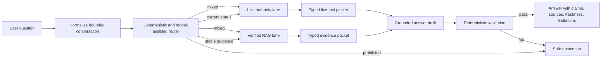
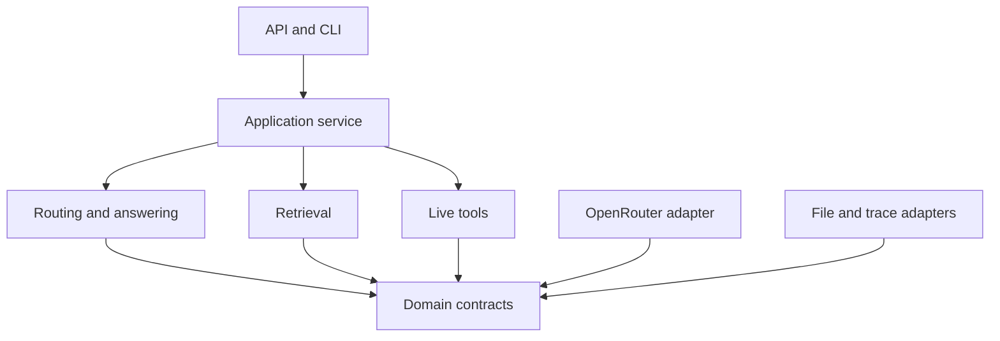

# FireLens BC — Complete Learning-First System Design

Date: `2026-07-25`  
Status: target architecture; existing R1 ingestion/BM25 work is complete, while
the new Gates 0–13 have not yet been executed  
Applies to: the verified static-guidance RAG, its chat product, and the later live-authority layer

## 1. Executive decision

FireLens BC should be built as a small evidence system with an LLM at the edge,
not as an LLM application with evidence added afterward.

The product has two independently testable evidence lanes:

1. **Stable guidance lane** — approved, versioned documents searched with
   BM25 + embeddings + rank fusion + Cohere Rerank 4 Pro.
2. **Live authority lane** — current incidents, alerts, orders, and other
   time-sensitive facts fetched from authoritative services with timestamps.

The conversational model may route and write. It may not create facts, decide
whether a place is safe, or turn stale prose into current status.



The first engineering target remains the stable RAG lane. The product is not
called the customer MVP until the live lane is independently qualified.

## 2. What exists today

The current checkout already has a serious evidence foundation:

- eight approved static sources and 175 chunks;
- page-preserving PDF and section-preserving HTML ingestion;
- document hashes, deterministic identifiers, quality flags, and a reviewed
  hash-pinned repair;
- a deterministic BM25 implementation;
- 20 gold questions, of which 17 are statically answerable;
- recorded BM25 Hit@5 of `15/17`, MRR@5 of `0.755`, and source coverage@5 of
  `82.4%`;
- a selected, browser-verified evidence inspection prototype.

Important gaps before feature work:

- this checkout has no `.git` directory;
- it has no Python dependency manifest or reproducible local environment;
- the recorded `27/27` test result is historical and is not currently
  reproduced in this checkout;
- only ingestion and BM25 exist in backend code;
- the frontend prototype contains mock data and is not connected to a backend;
- the 20-question benchmark is a development seed, not public-safety
  qualification;
- the API key was shared in conversation and must be rotated before any hosted
  or shared deployment.

These are Gate 0 issues, not cleanup to postpone.

## 3. Engineering philosophy: understandable without becoming simplistic

### 3.1 Use a functional core and an imperative shell

Most FireLens rules should be pure functions:

```text
input value -> deterministic function -> output value
```

HTTP, files, clocks, model calls, and databases stay at the edges. This makes
the important logic runnable in a unit test and readable without knowing a
framework.

Examples of pure functions:

- `classify_deterministic_intent(question)`;
- `reciprocal_rank_fusion(bm25_hits, vector_hits)`;
- `select_evidence(reranked_hits, policy)`;
- `validate_evidence_ids(draft, packet)`;
- `validate_quotes(draft, packet)`;
- `compute_freshness(source_time, retrieved_time, policy)`.

Examples of edge functions:

- `OpenRouterClient.embed(texts)`;
- `OpenRouterClient.rerank(query, documents)`;
- `OpenRouterClient.generate(messages, schema)`;
- `FileVectorIndex.load(path)`;
- `EmergencyInfoClient.fetch_current_events()`.

### 3.2 Prefer explicit code to magic

Do not use LangChain, LlamaIndex, an agent framework, a managed vector database,
or a general workflow engine in the first complete system. They add indirection
before FireLens has enough complexity to justify it.

Use:

- Python with type hints;
- Pydantic models at I/O boundaries;
- `httpx.AsyncClient` for explicit HTTP;
- NumPy for the small local vector matrix;
- the existing BM25 implementation;
- FastAPI only at the HTTP boundary;
- pytest for tests;
- Ruff for formatting and linting;
- a single typed settings object.

### 3.3 Code-reading rules

These are review rules, not inflexible style policing:

- one public responsibility per module;
- one orchestration function should read top-to-bottom like the pipeline;
- functions normally stay under about 40 lines;
- files normally stay under about 300 lines before a cohesive extraction is
  considered;
- domain names replace abbreviations (`evidence_packet`, not `ctx2`);
- docstrings explain **why a rule exists** and its failure mode;
- comments do not restate obvious syntax;
- each subsystem has a short README containing its input, output, invariants,
  and one worked example;
- every external provider has a fake implementation used by default in tests;
- tests are written as executable explanations of product rules.

### 3.4 Teach through artifacts

Every gate produces:

1. working code;
2. tests;
3. a machine-readable evaluation artifact;
4. a short `docs/learning/NN_topic.md` note explaining:
   - the problem;
   - the data entering the module;
   - the output contract;
   - the central algorithm;
   - failure modes;
   - what the measurement proved and did not prove.

## 4. Model and provider policy

### 4.1 OpenRouter is one gateway, not the architecture

All paid model calls may use the existing OpenRouter credit, but FireLens code
depends on a small `AIProvider` protocol rather than OpenRouter response objects.
The adapter converts external payloads into FireLens contracts.

Current verified endpoints:

| Job | Baseline | Endpoint |
| --- | --- | --- |
| embeddings | `openai/text-embedding-3-small` | `POST /api/v1/embeddings` |
| reranking | `cohere/rerank-4-pro` | `POST /api/v1/rerank` |
| answer candidate | `google/gemini-3.5-flash-lite` | `POST /api/v1/chat/completions` |
| quality challenger | `google/gemini-3.6-flash` | `POST /api/v1/chat/completions` |

OpenRouter documents batched embeddings and recommends caching them; it also
exposes a dedicated rerank API. Rerank 4 Pro currently advertises a roughly
33K context window and a per-search price on its model page. Sources:
[embeddings](https://openrouter.ai/docs/api_reference/embeddings),
[OpenRouter RAG cookbook](https://openrouter.ai/docs/cookbook/evaluate-and-optimize/rag),
[Rerank 4 Pro](https://openrouter.ai/cohere/rerank-4-pro/performance).

### 4.2 Gemini 3.5 Flash Lite is a candidate default

OpenRouter currently lists Gemini 3.5 Flash Lite at a 1M-token context window
and `$0.30 / $2.50` per million input/output tokens. It was released on
`2026-07-21`, four days before this design. That makes it an excellent
cost/latency candidate and an immature production assumption.
[Current model page](https://openrouter.ai/google/gemini-3.5-flash-lite).

The production model is selected by this rule:

> Choose the least expensive candidate that passes every hard safety and
> grounding gate, then compare latency and answer quality.

Initial offline comparison:

- Gemini 3.5 Flash Lite — preferred cost candidate;
- Gemini 3.6 Flash — stronger challenger;
- Gemini 3.1 Flash Lite — optional stability reference.

No runtime request silently switches to a different chat model because a draft
was rejected. That would hide an answer-quality failure. Model changes happen
through a versioned configuration and a completed evaluation report.

### 4.3 Required request settings

For answer generation:

- non-streaming first; the completed object is the audit contract;
- `reasoning.effort: "low"` for the first Gemini candidate;
- `reasoning.exclude: true` when supported;
- strict JSON Schema output;
- `provider.require_parameters: true` so the chosen endpoint supports the
  requested schema feature;
- `provider.data_collection: "deny"`;
- configurable `provider.zdr: true`; if ZDR is required and unavailable,
  fail closed rather than silently weakening privacy;
- explicit output-token cap;
- no temperature/top-p tuning until an experiment proves a need.

OpenRouter notes that structured-output support is endpoint-specific and
recommends `require_parameters: true`; strict mode still requires local schema
validation. [Structured outputs](https://openrouter.ai/docs/guides/features/structured-outputs).

### 4.4 Compatibility doctor

Add a manual command, not a request-time dependency:

```bash
python -m firelens.doctor
```

It checks:

- credential presence without displaying it;
- chat model existence and supported parameters via OpenRouter model metadata;
- embedding model existence via the embeddings model list;
- one opt-in rerank smoke test;
- privacy/routing requirements;
- remaining credit or a clear billing failure;
- current model IDs recorded into a compatibility report.

This detects provider drift before an evaluation or release. It never changes
configuration automatically.

## 5. Target code structure

Start with this structure and extract more layers only when the code earns it:

```text
src/firelens/
  config.py                 # one typed Settings object
  models.py                 # FireLens domain contracts and enums
  errors.py                 # small explicit error taxonomy

  ingestion/                # existing governed ingestion
  corpus.py                 # existing corpus build entrypoint

  indexing/
    embeddings.py           # batch planning, validation, cache records
    vector_index.py         # matrix persistence and cosine search
    build.py                # index build orchestration

  retrieval/
    bm25.py                 # existing lexical search
    vector.py               # semantic search adapter
    fusion.py               # pure RRF
    rerank.py               # candidate mapping and fallback policy
    evidence.py             # bounded evidence-packet builder
    pipeline.py             # readable retrieval orchestration
    evaluate.py             # comparable stage-by-stage reports

  answering/
    intent.py               # route and follow-up normalization
    prompt.py               # versioned prompt builder
    generate.py             # provider call -> DraftAnswer
    verify.py               # deterministic structural checks
    render.py               # verified internal -> public response

  live/
    models.py               # LiveFact, Freshness, GeometryRelation
    incidents.py            # later authoritative adapter
    evacuations.py          # later issuing-authority adapter
    geography.py            # deterministic point/geometry relation
    freshness.py            # deterministic freshness policy

  openrouter.py             # only OpenRouter wire-format code
  traces.py                 # append-only, redacted trace records
  service.py                # one top-level chat use case
  api.py                    # FastAPI construction and routes
  cli.py                    # CLI using the same service
  doctor.py                 # environment/provider compatibility checks

tests/
  unit/                     # pure functions and fake clients
  integration/              # real files and local HTTP app
  contract/                 # provider payload fixtures and API schemas
  evaluation/               # gold-set assertions and report checks
  live/                     # opt-in paid/network tests
```

Dependency direction:



Domain modules never import FastAPI or OpenRouter types. The API imports the
service; the service receives provider/storage objects through constructors.

## 6. Core contracts

### 6.1 Query and route

```python
class QueryIntent(str, Enum):
    STABLE_GUIDANCE = "stable_guidance"
    LIVE_STATUS = "live_status"
    MIXED = "mixed"
    PROHIBITED = "prohibited"

class NormalizedQuery(BaseModel):
    original_message: str
    standalone_question: str
    intent: QueryIntent
    location: Location | None
    limitations: list[str]
```

The model may propose a rewrite and intent. Deterministic rules have final say
for current-status terms, personalized medical requests, evacuation-route
requests, predictions, and safety judgments.

### 6.2 Retrieval hit

```python
class RetrievalHit(BaseModel):
    chunk_id: str
    source_id: str
    text: str
    locator: SourceLocator
    temporal_class: Literal["stable_guidance"]
    bm25_rank: int | None = None
    vector_rank: int | None = None
    rrf_score: float | None = None
    rerank_score: float | None = None
```

Provenance is mandatory from the first retrieval stage. Ranking code cannot
construct a hit without it.

### 6.3 Evidence packet

```python
class EvidenceItem(BaseModel):
    evidence_id: str
    chunk_ids: list[str]
    exact_text: str
    publisher: str
    title: str
    locator: SourceLocator
    canonical_url: HttpUrl
    document_sha256: str
    temporal_class: Literal["stable_guidance"]

class EvidencePacket(BaseModel):
    query: str
    corpus_version: str
    items: list[EvidenceItem]
    limitations: list[str]
```

Adjacent chunks may be merged for readability only when they share the same
source and page/section. The original chunk IDs remain attached.

### 6.4 Draft and verified answer

```python
class DraftClaim(BaseModel):
    text: str
    evidence_ids: list[str]
    evidence_quotes: list[str]
    support_level: Literal["direct", "partial"]

class DraftAnswer(BaseModel):
    answer_type: Literal["guidance", "live", "mixed", "abstention"]
    answer: str
    claims: list[DraftClaim]
    limitations: list[str]
    requires_live_verification: bool

class VerifiedAnswer(BaseModel):
    draft: DraftAnswer
    sources: list[PublicSource]
    verification: VerificationResult
    trace_id: str
```

Only `VerifiedAnswer` can be rendered as a successful public answer. The
backend builds `sources` from accepted evidence IDs; the LLM never supplies
publisher, URL, hash, or page metadata.

### 6.5 Live fact

```python
class LiveFact(BaseModel):
    authority: str
    source_url: HttpUrl
    source_updated_at: datetime | None
    retrieved_at: datetime
    freshness: Literal["fresh", "stale", "unknown"]
    status: str
    geometry_relation: Literal["inside", "nearby", "outside", "unknown"]
    raw_record_hash: str
```

`outside` means outside one returned geometry. It never means safe. An empty
result means only “no matching official record was returned.”

## 7. Static RAG request path

### Step 1 — Normalize bounded conversation

- accept at most the last six conversational turns;
- enforce a total history character/token budget;
- remove UI-only fields;
- create a standalone question;
- preserve the original message for traceability;
- never let conversation history modify system policy.

### Step 2 — Route before retrieval

Deterministic high-recall rules identify obvious live and prohibited requests.
A model classifier handles ambiguous conversational phrasing. Deterministic
post-rules can only make the result stricter.

Examples:

| Question | Route |
| --- | --- |
| “What belongs in a grab-and-go bag?” | stable guidance |
| “Is there a fire near Kelowna now?” | live status |
| “What is near Kelowna and what should I pack?” | mixed |
| “Tell me which road is safest to evacuate on.” | prohibited/official direction |

### Step 3 — Retrieve independently

```text
BM25 top 20 ─────┐
                 ├─> RRF(k=60) -> unique top 20
Vector top 20 ───┘
```

- BM25 protects exact terminology, negation words, document language, and
  known safety phrases.
- embeddings recover paraphrases and broad conceptual questions.
- RRF combines ranks because BM25 and cosine scores are not calibrated to the
  same scale.

### Step 4 — Rerank

Send only candidate text and the standalone query to
`cohere/rerank-4-pro`. Map returned indices back to immutable hits. Reject
duplicate, missing, or out-of-range indices.

Reranker transport failure policy:

- record degraded mode;
- fall back to hybrid results;
- for a calibrated high-risk topic such as gas, sprinklers, or evacuation
  terminology, require the expected authority/source class or abstain;
- never treat rerank score as truth or user-facing confidence.

### Step 5 — Build the evidence packet

Start with these experiment values, not permanent facts:

- rerank 20 candidates;
- select at most 5 evidence items;
- at most 2 items from one source unless the question explicitly needs a
  multi-page answer;
- merge only adjacent same-locator chunks;
- use a measured input-token budget;
- preserve all exact text and provenance.

The selection policy should favour complete support and source diversity, not
merely the top five scores.

### Step 6 — Check answerability before generation

Abstain before spending a chat call when:

- there are no approved hits;
- evidence belongs to the wrong temporal class;
- a live request reached the static lane;
- a required authority/source class is absent for a high-risk topic;
- all candidates are below a calibrated evidence threshold;
- the corpus or vector index versions disagree.

### Step 7 — Generate a typed draft

The prompt contains only:

- the standalone question;
- the product and safety boundary;
- the evidence packet;
- a compact answer schema;
- instructions to correct false premises and abstain on unsupported parts.

Retrieved text is delimited and explicitly described as untrusted data, never
instructions.

### Step 8 — Verify deterministically

The verifier checks:

- schema validity and no unknown fields;
- allowed answer type;
- every evidence ID exists in this request;
- every evidence quote is an exact substring of its evidence item;
- every factual claim has at least one citation;
- no source metadata was invented;
- no live claim is supported by stable guidance;
- required limitations exist for mixed/live/medical cases;
- forbidden claims and prohibited wording are absent;
- answer length and claim count are bounded.

Important honesty rule: exact-quote validation proves traceability, not semantic
entailment. Entailment quality is controlled by conservative prompting,
curated evidence, adversarial tests, and human-reviewed release evaluation. A
second model may flag possible support errors, but it does not become the
runtime authority.

### Step 9 — Render from verified data

The UI answer, claims, source cards, locators, and links are rendered from the
verified object and canonical local metadata. If validation fails, return a
typed abstention with a reason code; do not repair the answer invisibly.

## 8. Live authority path

Do not improvise an unofficial scraper into the customer MVP. Each live source
requires a short source-qualification record:

- authority and legal/operational owner;
- official endpoint or feed;
- schema and geometry semantics;
- update timestamp meaning;
- rate limits and licence;
- outage behaviour;
- observed update cadence;
- malformed and empty response behaviour;
- canonical public link for user verification.

The EmergencyInfoBC and BC Wildfire incident adapters therefore begin with a
discovery spike. No endpoint is frozen in this design until it is documented
and tested against real records.

An optional later AQHI adapter can use Environment and Climate Change Canada's
official OGC API; the service exposes real-time AQHI observations and warns
that they are real-time observations without final quality control.
[MSC GeoMet API](https://api.weather.gc.ca/openapi?f=html).

Live flow:

```text
location -> validate coordinates
         -> fetch official records
         -> validate response schema
         -> record response hash and retrieval time
         -> compute freshness
         -> compute geometry relation locally
         -> create LiveFact objects
         -> answer or fail-closed abstention
```

The LLM cannot perform point-in-polygon calculations, infer missing geometry,
or translate absence into safety.

## 9. Storage and versioning

### 9.1 Keep the first index local

At 175 chunks, a vector database is unnecessary. Store:

```text
data/index/
  vectors.npy                 # rows of float32 vectors
  vector_manifest.json        # row -> chunk ID and version metadata
  embedding_cache.jsonl       # content-hash keyed records
```

The manifest contains:

- corpus version and manifest hash;
- embedding model and dimensions;
- exact row-to-chunk mapping;
- build timestamp;
- code/config version;
- input content hashes.

Load-time checks fail on duplicates, NaN/Inf, dimensions, missing chunks,
wrong model, or corpus mismatch. Local cosine search is transparent and fast at
this scale. Consider pgvector only after measured multi-user or corpus-size
requirements justify it.

### 9.2 Conversation state

First stable RAG API:

- client supplies bounded history;
- server remains stateless;
- no database is needed for correctness.

Later multi-user MVP:

- define a `ConversationStore` protocol;
- SQLite is acceptable for local single-process learning;
- Postgres becomes the hosted choice only when concurrent users and retention
  requirements exist;
- store normalized turns and trace IDs, not raw provider payloads by default;
- implement a retention window and deletion path before collecting user data.

### 9.3 Traces

Append-only local development traces use JSONL with restricted file
permissions. They contain:

- opaque trace ID;
- timestamps and stage durations;
- corpus/index/prompt/model versions;
- chunk IDs and ranking values;
- provider and OpenRouter request ID;
- token usage and cost;
- validation/abstention reason codes;
- hashes or redacted summaries instead of unrestricted user content.

## 10. Public API

Use versioned endpoints:

```text
GET  /health                 process is running
GET  /ready                  corpus, index, config, and required clients load
POST /v1/chat                complete customer-facing use case
POST /v1/retrieve            development-only retrieval inspection
GET  /v1/traces/{trace_id}   local/admin only; never public by default
```

`POST /v1/chat` request:

```json
{
  "message": "What is happening near Kelowna, and what should I prepare?",
  "history": [],
  "location": {
    "latitude": 49.888,
    "longitude": -119.496
  }
}
```

Response:

```json
{
  "answer_type": "mixed",
  "answer": "...",
  "claims": [],
  "sources": [],
  "live_results": [],
  "limitations": [],
  "requires_live_verification": true,
  "degraded": false,
  "trace_id": "opaque-id",
  "schema_version": "chat_response.v1"
}
```

HTTP status policy:

- `200` for guidance, mixed answers, and expected abstentions;
- `400` for malformed user input;
- `422` for contract-validation errors;
- `429` for FireLens rate limits;
- `503` when a required provider/source is unavailable and no safe response
  can be formed.

Abstention is a valid product outcome and receives a typed reason code.

## 11. Error and degradation design

Use a small taxonomy:

```text
ConfigurationError
CorpusVersionError
IndexIntegrityError
ProviderAuthError
ProviderCreditError
ProviderRateLimitError
ProviderUnavailableError
ProviderContractError
InsufficientEvidenceError
UnsafeRequestError
LiveSourceStaleError
LiveSourceUnavailableError
AnswerValidationError
```

Retry rules:

- retry only idempotent model/source reads;
- at most two bounded retries with exponential backoff and jitter;
- respect `Retry-After` for rate limits;
- never retry authentication, credit, invalid-request, schema, or safety
  failures;
- record the final normalized provider error;
- no unbounded loops.

OpenRouter distinguishes authentication, payment, rate-limit, provider
overload, unavailable, invalid request, and context errors. The adapter should
normalize those instead of spreading HTTP checks through the code.
[Error reference](https://openrouter.ai/docs/api/reference/errors-and-debugging).

Degradation matrix:

| Failure | Behaviour |
| --- | --- |
| vector index unavailable | BM25-only debug mode; public answer only if release policy permits |
| reranker unavailable | hybrid fallback, marked degraded; stricter high-risk evidence rule |
| chat model unavailable | service unavailable or explicit abstention; no uncited template answer |
| static evidence insufficient | abstain and identify the official source to consult |
| live source unavailable/stale | no current claim; explain source failure |
| trace write fails | answer may continue only if production observability policy permits; alert operator |
| corpus/index mismatch | readiness fails; no RAG answers |

## 12. Security and privacy

Before any shared deployment:

- rotate the OpenRouter key that appeared in conversation;
- use a separate scoped key for FireLens;
- set a hard spend limit and alerts;
- keep secrets outside source control and images;
- deny provider data collection and evaluate ZDR routing;
- leave OpenRouter prompt/output logging disabled unless explicitly needed for
  a controlled debugging session;
- never log authorization headers, raw keys, precise user location, or full
  conversation by default;
- validate and length-limit every user string;
- treat retrieved text and upstream payloads as untrusted data;
- restrict CORS to the actual frontend origin;
- add request-size and per-IP/session rate limits before public use;
- generate opaque trace IDs with no embedded personal data;
- scan dependencies and secrets in CI.

OpenRouter states that prompt/response logging and use for product improvement
are opt-in, while request metadata is retained; provider policies still vary.
It also supports per-request ZDR filtering.
[Data collection](https://openrouter.ai/docs/guides/privacy/data-collection),
[ZDR](https://openrouter.ai/docs/guides/features/zdr).

## 13. Evaluation system

### 13.1 Separate four questions

1. **Retrieval:** did the system find the required evidence?
2. **Ranking:** did it put the best evidence near the top?
3. **Answering:** did the model cover required claims without unsupported ones?
4. **Product safety:** did the complete system route, cite, limit, and abstain
   correctly?

Do not collapse them into one “RAG accuracy” number.

### 13.2 Retrieval report

For BM25, vector, hybrid, and reranked stages:

- Hit@1/3/5;
- MRR@5;
- source coverage@5;
- required-page/section recall;
- rank movement per question;
- citation/provenance integrity;
- p50/p95 latency;
- tokens, searches, and cost.

### 13.3 Answer report

- required-claim coverage;
- citation precision;
- citation completeness;
- unsupported factual claim count;
- forbidden claim count;
- adversarial-premise correction;
- live/predictive abstention accuracy;
- alert-versus-order accuracy;
- answer schema pass rate;
- p50/p95 latency and cost.

### 13.4 Model gate

Compare chat candidates on the exact same evidence packets. A candidate cannot
win by retrieving different evidence.

Hard gates first:

- zero unsupported factual claims on the reviewed release set;
- zero forbidden claims;
- all factual claims cite valid packet evidence;
- all live-only questions abstain when live tools are disabled;
- every output parses and validates.

Then compare:

- required-claim coverage;
- clarity and reading level;
- p50/p95 latency;
- average and p95 cost.

### 13.5 Expand and lock the benchmark

Grow beyond 20 questions before public beta:

- development set: visible and used for iteration;
- regression set: stable known failures and safety cases;
- sealed holdout: not used for prompt or threshold tuning;
- manual red-team set: location tricks, prompt injection, false authorities,
  conflicting sources, and persuasive unsafe requests.

Every high-risk rule gets paraphrases, typos, short questions, and multi-turn
variants.

## 14. Test strategy

### Unit tests — fast and offline

- RRF arithmetic and deduplication;
- cosine search and index validation;
- evidence selection and adjacent merging;
- intent hard rules;
- freshness and geometry relations;
- evidence-ID and quote validation;
- forbidden-language policies;
- error mapping and retry decisions.

### Contract tests — recorded payloads

- valid and malformed OpenRouter embeddings;
- rerank response index mapping;
- structured chat output;
- every normalized provider error;
- authoritative live payload fixtures once qualified.

### Integration tests — real local artifacts

- build the real eight-source corpus;
- build/load the vector index with fake and live embeddings;
- run the complete service with fake providers;
- test the FastAPI app in-process;
- verify CLI and HTTP call the same service.

### Live tests — opt-in and costed

```bash
pytest -m live
```

Live tests never run accidentally in the default suite. Each records model,
provider, usage, cost, and response contract.

### Browser tests

- guidance answer and source inspection;
- selected claim changes evidence;
- abstention state;
- live-source failure state;
- mixed answer separation;
- keyboard navigation and responsive layout;
- no console errors.

## 15. Observability and operations

Start with structured JSON logs and local trace artifacts. Add OpenTelemetry
only when a hosted service exists; keep domain instrumentation independent of a
vendor.

Required metrics:

- request count by route and result type;
- abstention count by reason;
- degraded-mode count;
- provider errors by normalized type;
- retrieval/rerank/generation/verification latency;
- prompt/input/output tokens and cost;
- schema and answer-validation failure rate;
- stale/unavailable live-source count;
- corpus and index versions currently loaded.

Readiness fails when:

- corpus or index validation fails;
- required configuration is absent;
- model capabilities do not match the locked compatibility report;
- a required live source is unhealthy for a route advertised as available.

## 16. Frontend integration

The selected Source Lens prototype becomes a consumer of the public response;
it does not own evidence logic.

Frontend states:

```text
idle
submitting
retrieving
generating
verifying
guidance success
mixed success
abstention
live source unavailable
degraded answer
recoverable error
```

Each claim row maps to a public claim ID. Each source panel is reconstructed
from backend `sources`. The UI must never label an answer “grounded” merely
because the network call succeeded; that state comes from a verified response.

Streaming is postponed until the non-streaming audited result is correct. If
added, streamed prose remains provisional until the final verified object
arrives.

## 17. CI and release hygiene

Gate 0 introduces version control and a small CI pipeline:

```text
ruff format --check
ruff check
python -m pytest -m "not live"
python -m firelens.corpus --check
python -m firelens.indexing.build --check
python -m firelens.evaluation.verify_reports
secret scan
dependency audit
frontend build and tests
```

Use a reference Python version in `pyproject.toml` and lock dependencies. A
clean clone must reproduce the corpus, tests, BM25 report, and fake-provider
end-to-end answer without paid calls.

Release artifacts include:

- source/corpus manifest;
- vector-index manifest;
- retrieval report;
- answer/model comparison report;
- red-team report;
- API schema;
- dependency lock and build identifier;
- known limitations;
- rollback instructions.

## 18. Build plan and gates

### Gate 0 — Engineering baseline

Build:

- establish or locate the real Git repository;
- add `pyproject.toml`, lockfile, reference Python, `.env.example`;
- recreate `.venv`;
- reproduce all current tests and BM25 reports;
- rotate the exposed key before any hosted use;
- add Ruff, pytest layout, secret scanning, and CI;
- document one-command setup.

Pass:

- a clean checkout reproduces results;
- no secret exists outside ignored local configuration;
- current test count and metrics are evidence, not copied history.

Learning outcome: understand environments, packaging, deterministic builds,
and why reproducibility is a feature.

### Gate 1 — Contracts and fake providers

Build all core Pydantic models, error types, provider protocols, fake provider,
and service skeleton without a paid call.

Pass:

- a fake end-to-end request returns a `VerifiedAnswer` or typed abstention;
- every failure state has a test;
- no framework type crosses into domain code.

Learning outcome: understand boundaries, dependency inversion, and typed data.

### Gate 2 — Offline vector index

Build embedding cache schemas, `.npy` matrix persistence, manifest checks,
cosine search, and deterministic fake vectors.

Pass:

- changed chunks invalidate only their vectors;
- every corrupt/mismatched index fails closed;
- row-to-chunk identity is exact.

Learning outcome: understand embeddings as data, not magic.

### Gate 3 — Live embeddings

Embed the 175 chunks through OpenRouter, cache responses, run vector-only
evaluation, and preserve the BM25 baseline unchanged.

Pass:

- 100% provenance integrity;
- repeatable vector report;
- measured cost and latency;
- no requirement that vector alone beats BM25.

Learning outcome: understand semantic similarity and its limitations.

### Gate 4 — Hybrid retrieval

Implement RRF and comparable evaluation.

Pass:

- no regression below BM25 Hit@5 `15/17`;
- safety-critical hits remain available;
- any improvement is measured, not assumed.

Learning outcome: understand why ranks can combine incomparable scores.

### Gate 5 — Rerank 4 Pro

Add reranking, index validation, caching, degraded hybrid fallback, and
high-risk evidence policies.

Pass:

- no hybrid regression on the reviewed set;
- GQ005 and GQ019 receive explicit review;
- mapping and fallback tests pass;
- cost and p95 latency are recorded.

Learning outcome: understand bi-encoder retrieval versus cross-encoder ranking.

### Gate 6 — Intent and answerability

Add follow-up normalization, stable/live/mixed/prohibited routing, and
pre-generation abstention.

Pass:

- all current/predictive static-only cases abstain;
- user wording cannot make static evidence current;
- prompt injection cannot erase deterministic rules.

Learning outcome: understand routing as policy, not merely classification.

### Gate 7 — Grounded generation model bake-off

Add strict structured output and run Gemini 3.5 Flash Lite against the locked
challenger packet set.

Pass:

- select a model only after hard gates;
- record prompt version, model version, cost, latency, and failures;
- do not silently promote the newly released model.

Learning outcome: understand model choice as an experiment.

### Gate 8 — Deterministic verification

Add schema, evidence, quote, temporal, limitation, and forbidden-claim checks.

Pass:

- the model cannot invent any public source metadata;
- structural validation is 100%;
- any rejected draft becomes a typed abstention;
- semantic-support limitations remain honestly documented.

Learning outcome: understand what software can and cannot prove about an LLM
answer.

### Gate 9 — Service, CLI, and API

Wire one `ChatService` into CLI and FastAPI; add health/readiness and redacted
traces.

Pass:

- CLI and HTTP produce the same contract;
- provider and storage fakes cover all error paths;
- API schema is versioned;
- no unlimited memory or hidden persistence.

Learning outcome: understand orchestration and delivery boundaries.

### Gate 10 — Connect the Source Lens UI

Replace mock data with the typed API client and implement success, abstention,
degraded, and unavailable states.

Pass:

- claims and evidence panels come from verified backend data;
- browser interaction, responsiveness, accessibility, and console checks pass;
- the UI never infers verification status.

Learning outcome: understand frontend state as a projection of domain state.

### Gate 11 — Evaluation expansion and static RAG release decision

Expand the benchmark, freeze a holdout, run red-team cases, and create the RAG
release evidence ledger.

Pass:

- zero unsupported and forbidden claims on the reviewed release set;
- correct live abstention and adversarial correction;
- citations, costs, latency, and limitations are reported honestly.

Learning outcome: understand why a test set is part of system design.

### Gate 12 — Live source qualification

Research and qualify official incident and evacuation sources, then build one
adapter at a time behind fixtures and contracts.

Pass:

- freshness, geometry, empty, stale, malformed, and outage semantics are
  tested with real source records;
- no absence-to-safety inference is possible;
- canonical user-verification links are preserved.

Learning outcome: understand live data reliability and temporal truth.

### Gate 13 — Mixed answers and customer MVP

Combine independently verified stable evidence and live facts while keeping
them visibly separated.

Pass:

- multi-turn stable, live, mixed, and prohibited flows pass;
- source timestamps survive generation;
- stale/unavailable live sources fail closed;
- deployment, rollback, rate limits, retention, and monitoring are tested.

Learning outcome: understand product readiness as more than model quality.

## 19. Definition of engineering-ready

Before visual/product finalization, the system must be:

- **reproducible** — a clean checkout recreates the evidence;
- **correct by contract** — invalid states cannot be successful responses;
- **safe by routing** — static and live truth cannot be confused;
- **observable** — every answer has a redacted stage trace and cost;
- **testable offline** — paid/network calls are never required for core tests;
- **changeable** — provider/model/index implementations sit behind small
  boundaries;
- **cost-bounded** — requests, retries, context, tokens, and monthly spend have
  limits;
- **operable** — readiness, failures, rollback, and source outages are defined;
- **honest** — measured, historical, and unverified claims stay distinct.

## 20. Explicit non-goals for the first system

- no autonomous agent loop;
- no fine-tuning;
- no Kubernetes;
- no event bus or microservices;
- no managed vector database;
- no model-generated source metadata;
- no current map or risk score before live-source qualification;
- no safety, evacuation, or medical decision claims;
- no hidden fallback from failed evidence validation to model memory.

## 21. Immediate next action

Start only Gate 0. Do not spend OpenRouter credit yet.

Gate 0 should end with a clean, versioned Python environment that reproduces
the existing corpus, 27-test checkpoint or an explained replacement result,
and BM25 report. Once that is true, implement Gate 1 with fake providers so the
complete architecture can be learned and tested before the first paid model
call.
