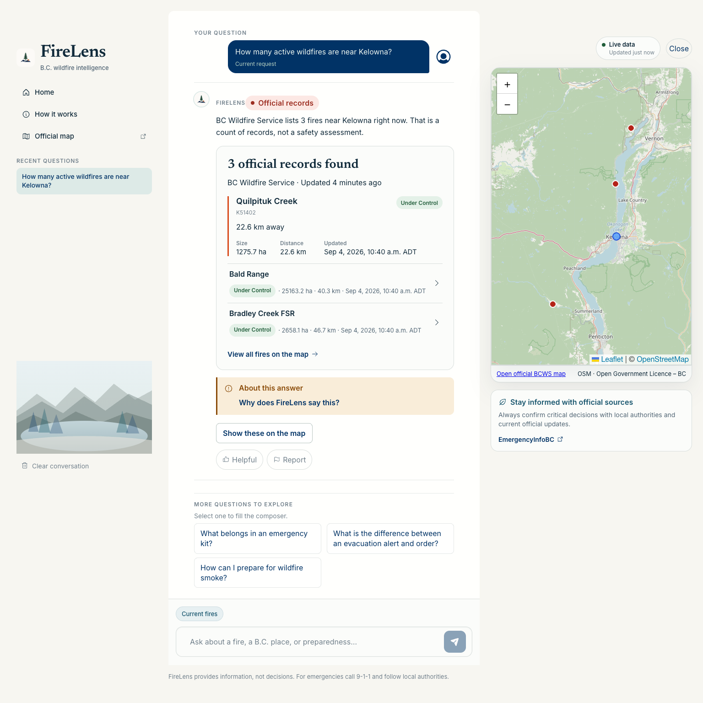
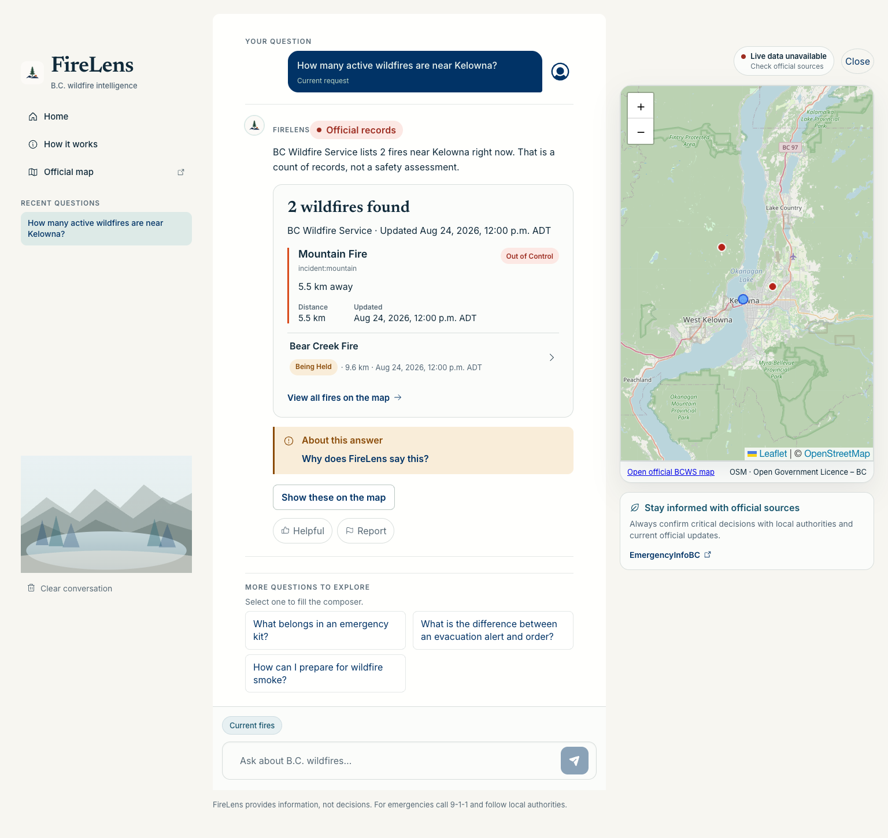
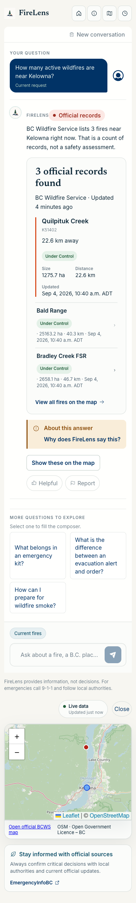
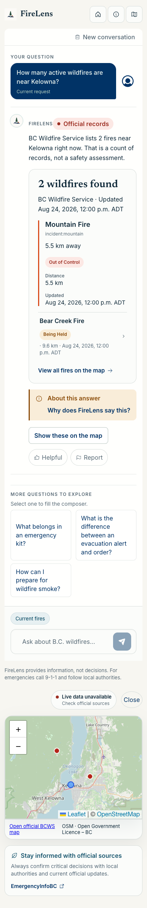

# FireLens evaluation-driven UI audit

Date: 2026-09-04  
Production build observed: `40c4c970bf33192ce6a543a6b8dcf5b4799036bd`  
Production deployment: `dpl_Ffh3orbdgQj8p7fdqwGmwZPuLYMh`  
Candidate base: `ae975132c5d65800c1e960c7b6e0c46844959dfe`  
Candidate state: exact branch `HEAD` on `codex/firelens-eval-driven-upgrade`;
resolve with `git rev-parse HEAD` and match the final local evidence envelope

## Verdict

The candidate improves first-screen ordering, record semantics, mobile header
density, and mechanically detectable accessibility. It is suitable for local
review, but not qualified for preview or production: the screenshots use a
deterministic fixture backend, the full EvalLab core gate is red, and no exact
candidate deployment exists. Product Design review preserved the existing
Pacific navy/ocean/forest/mist language rather than introducing a new visual
system.

## Evidence boundary

- Production was inspected through the public deployment with real readiness
  and live routes. Current counts are observations, not durable benchmark data.
- Candidate screenshots were captured from `http://127.0.0.1:8766` with
  deterministic incident fixtures. They prove presentation behavior only.
- Automated accessibility checks used axe 4.12.1. They do not replace keyboard,
  screen-reader, or human accessibility review.
- The existing 640px and 683px browser cases are narrow-viewport proxies for
  200% zoom. A native browser zoom run was not completed, so no stronger claim
  is made.
- No AI aesthetic judge was used. Human product judgment remains outstanding.

## Baseline findings

| Priority | Surface | Observed failure | First divergence |
| --- | --- | --- | --- |
| P1 | Live answer | A response could say three fires while its headline said six official records because incident and perimeter rows were counted as separate fires. | Frontend interpretation of backend-owned record identity |
| P1 | Live failure semantics | A malformed typed row could leave the affected official layer appearing partially usable. | Live adapter normalization boundary |
| P1 | Location authority | An instruction preamble such as “Output only YES or NO:” could be parsed as a place and authorize live tools. | Understanding/place binding |
| P2 | Mobile idle | Status and map chrome appeared before the core question, delaying task comprehension. | Responsive layout ordering |
| P2 | Mobile header | Four 44px actions wrapped at narrow widths. | Responsive navigation density |
| P2 | Accessibility | Production idle at 1024×768 had two axe violations: six low-contrast nodes and one item outside a landmark. | Color token and page semantics |
| P2 | Accessibility | Generic containers carried ARIA labels without a semantic role in feedback, suggestions, and evidence context. | Component semantics |
| P2 | Input clarity | The long composer placeholder clipped on mobile. | Responsive copy |
| P2 | Mixed guidance | A Kamloops-plus-packing probe selected pet-specific guidance for a general kit request. | Retrieval/evidence relevance; retained for review, not papered over in UI |

## Candidate changes

- Counts distinct wildfire identities using typed `kind` and
  `incident_number`; paired incident/perimeter records no longer inflate the
  wildfire headline. A separate line preserves the official-row breakdown.
- Calls evacuation-only results “official evacuation records” instead of
  wildfires.
- Moves the mobile question/answer workspace before readiness and map chrome.
- Keeps Home, explanation, and official-map actions on one mobile row; removes
  the redundant mobile recent-question drawer while retaining desktop history.
- Shortens starter labels and the composer placeholder without changing the
  full submitted starter questions.
- Replaces duplicated handwritten API unions with generated OpenAPI types and
  rejects the unsupported `location_mode: optional` value at the browser
  boundary.
- Raises the muted text token from `#72818c` to `#586a76`; its measured contrast
  against the light sea-glass surface is 4.547:1.
- Adds region/group roles to labelled controls, promotes the current question
  to the page `h1`, and changes the disclaimer to a footer landmark.

## Visual comparison

| Production baseline | Local candidate |
| --- | --- |
|  |  |
|  |  |

The two live screenshots use different data authorities: production uses its
current official integrations; the candidate uses deterministic fixtures. The
comparison is valid for layout and labels, not for incident counts, freshness,
latency, or live-source correctness.

## Validation results

| Check | Result | Scope |
| --- | --- | --- |
| Vitest | PASS — 21 files, 183 tests | Candidate components and browser state |
| TypeScript | PASS | Candidate source |
| Vite production build | PASS | Local candidate bundle |
| Focused Playwright | PASS — 2/2 final label rerun | Desktop/mobile neutral record label regression |
| Full Playwright final run | PASS — 41 passed, 1 expected mobile skip | Local deterministic fixture across desktop/mobile projects |
| Candidate axe idle, 1024×768 | PASS — 0 violations, 0 incomplete | Local deterministic fixture |
| Candidate axe idle, 390×844 | PASS — 0 violations, 0 incomplete | Local deterministic fixture |
| Candidate axe live, 1536×1024 | 0 violations, 1 incomplete | Eight map/overlap nodes require manual contrast review; no automated violation |
| Production axe idle, 1024×768 | FAIL — 2 violations | Six contrast nodes plus one missing landmark |
| Candidate browser errors/console | No errors observed | Idle fixture inspection |
| Responsive regression | PASS | 320px heading precedes status; three header controls share one row; no horizontal overflow |

The full browser suite is part of the final settled-tree `make verify`; its
local result does not replace preview or production browser qualification.

## Performance and bundle observations

These are build/browser observations, not fleet performance:

| Measure | Production/baseline | Candidate | Interpretation |
| --- | ---: | ---: | --- |
| Main JS | 546.86 kB (159.64 kB gzip) | 546.18 kB (159.78 kB gzip) | Raw −0.68 kB, gzip +0.14 kB; still above Vite's 500 kB warning |
| Main CSS | 79.46 kB (14.62 kB gzip) | 79.64 kB (14.67 kB gzip) | Small accessibility/responsive increase |
| Production idle TTFB/FCP/CLS | 22.6 ms / 88 ms / 0.03 | — | One browser observation, not a latency SLO |
| Local candidate idle TTFB/FCP/CLS | — | 2 ms / 32 ms / 0.03 | Loopback-only; not comparable to production network latency |

The map and analytical chart chunks remain lazily loaded. No provider-call,
token, or real-user latency reduction is claimed from this UI pass.

## Remaining product risks

1. Run the complete Product Reality Gate on an exact deployed candidate.
2. Perform native 200% zoom, keyboard, and assistive-technology review.
3. Human-review the live record wording and the mobile first five seconds.
4. Resolve the mixed-guidance retrieval relevance case at its retrieval/evidence
   owner rather than adding UI copy.
5. Investigate the main JavaScript chunk with measured route-level performance;
   do not split it solely to silence a build warning.
6. Recheck map vendor attribution and overlapping controls manually for color
   contrast.

## Release decision

UI direction: improved locally.  
Preview qualification: not run.  
Production qualification: not run.  
Release authority: withheld.
