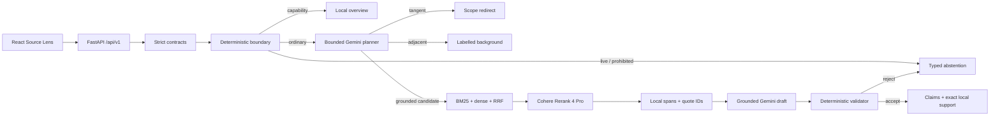
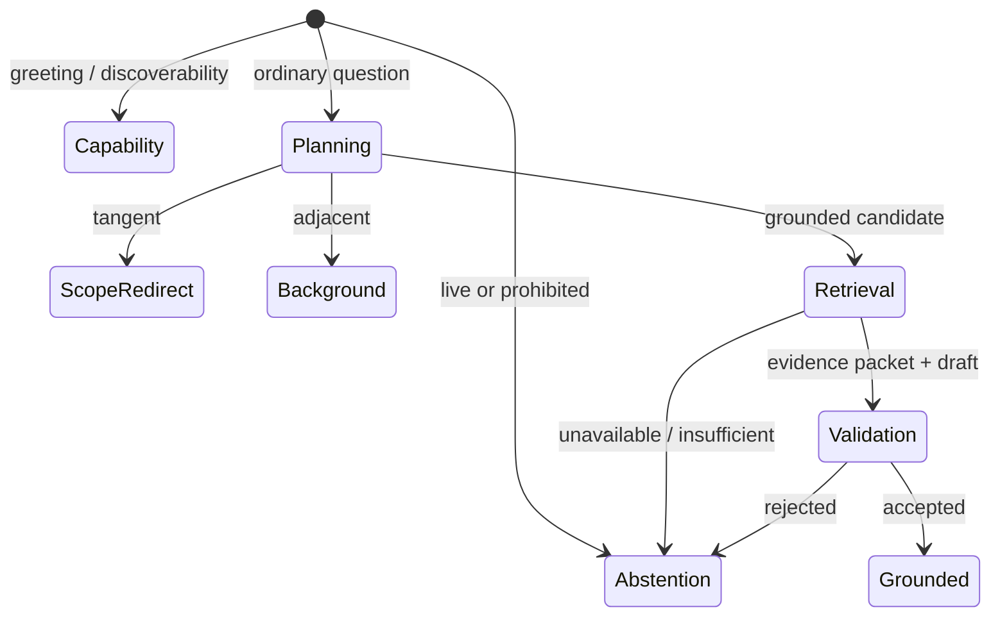
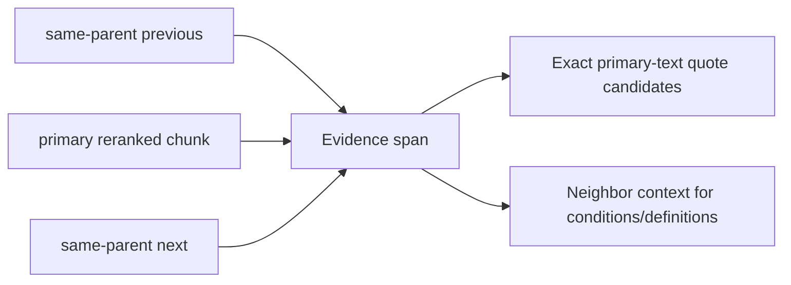
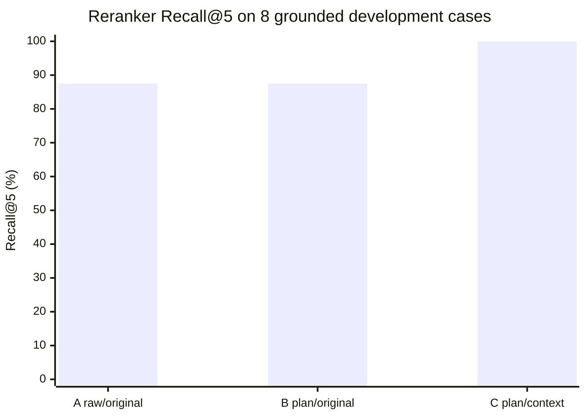
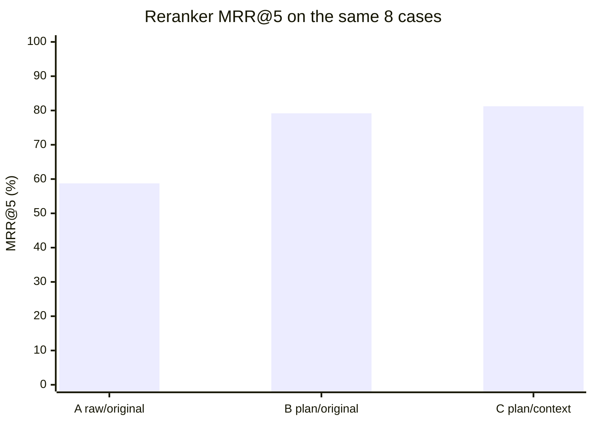
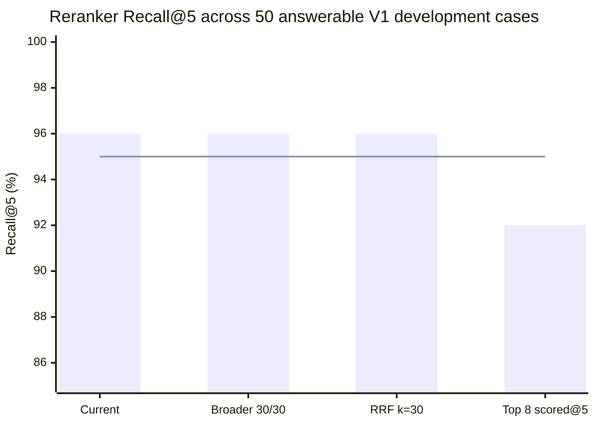
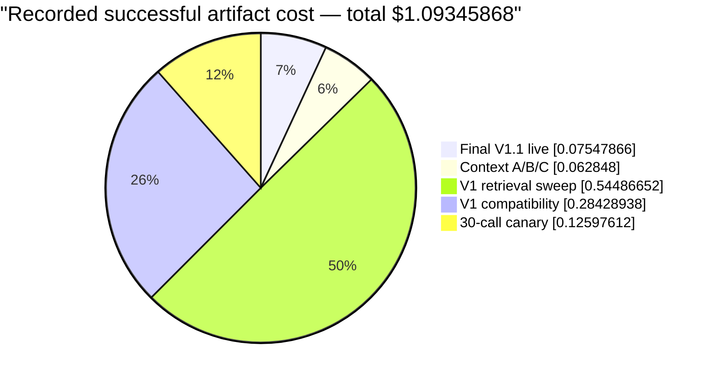
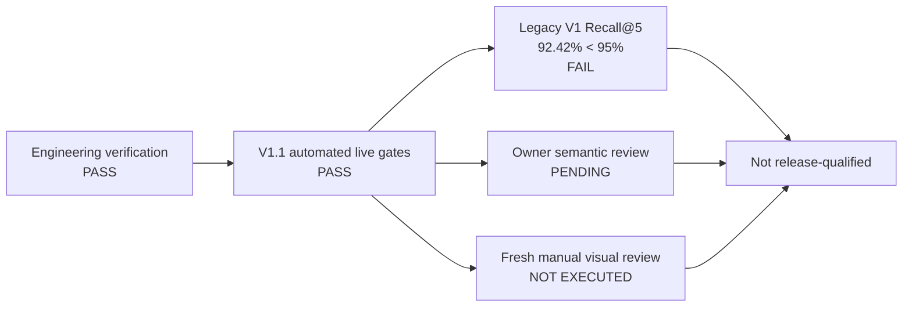
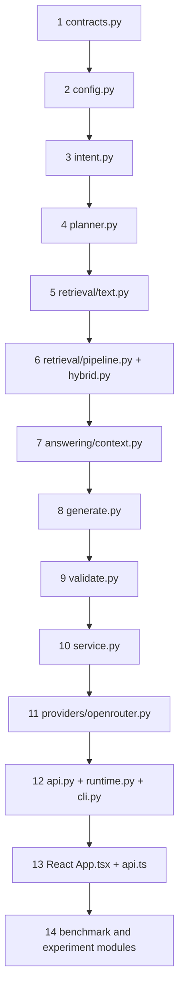

# FireLens BC V1.1 RC — Technical Architecture and Evaluation Report

Date: 2026-07-26 (America/Vancouver)
Audience: project owner, engineers, reviewers, and future maintainers
Release label: `engineering-complete, semantic acceptance pending`

## Technical summary

FireLens BC V1.1 is a complete local conversational RAG vertical slice with an
unusually clear evidence boundary: deterministic code decides safety and final
acceptance; provider models propose plans, rankings, and typed drafts. It can
orient a user who does not know the corpus, resolve bounded follow-ups, provide
exactly cited stable guidance, label adjacent background without false
citations, and redirect truly tangent requests. It cannot report current fires,
predict conditions, choose evacuation routes, or make personalized safety or
medical decisions.

The final retained 50-case live V1.1 run completed cleanly. Every automated
route, status, mode, capability, safety, planner, follow-up, tangent, adjacent,
evidence-status, limitation, and paid-call-boundary metric was 100%. All
retrieval-stage recall metrics were 100%; reranker MRR@5 was 78.33% and nDCG@5
80.07%. Local latency was 0.606 seconds p50 and 2.572 seconds p95, with 52,157
provider tokens and $0.07547866 reported cost.

This does **not** make the product release-qualified. Automated validation proves
structure, exact quote identity, and policy conformance—not semantic entailment.
Owner review is still pending, the preserved 100-case V1 compatibility run has
92.42% reranker Recall@5 against its 95% gate, and a fresh manual in-app visual
inspection was blocked by stale browser handles. An earlier live
repeat also hit one transient 429 after all three bounded attempts, so the clean
final run must not be mistaken for guaranteed provider availability.

## 1. Key findings

1. **The architecture works end to end.** The backend, provider boundary,
   governed corpus/index, deterministic evidence validator, versioned API,
   Source Lens frontend, offline tests, browser automation, and benchmark
   runners all execute together.
2. **Conversation breadth improved without erasing evidence labels.** Capability,
   grounded, background, scope-redirect, and abstention are separate public
   states. A background answer is structurally unable to carry a corpus citation.
3. **Measured context improved retrieval.** On the same eight grounded
   development cases, metadata-context indexing increased reranker Recall@5
   from 87.5% to 100% and MRR@5 from 58.75% to 81.25%.
4. **The simple retrieval configuration remains best.** A locked 50-case V1
   development sweep retained BM25 20, dense 20, RRF 60, rerank 5 at 96%
   Recall@5 and 86.17% MRR@5; no broader setting cleared the improvement rule.
5. **Fail-closed behavior is observable.** A preceding repeat exposed a 429 as
   one typed failure after three same-model attempts. It did not silently change
   models, algorithms, or answer from memory.
6. **The remaining risk is semantic and operational, not missing architecture.**
   The most valuable next work is owner adjudication, retrieval-miss analysis,
   repeated live reliability measurement, and a fresh manual visual review—not
   another framework migration or feature expansion.

## 2. System at a glance



The principal design decision is ownership: the model can propose, but local
code owns every security- or evidence-relevant fact in the public response.

## 3. Public conversation contract

### 3.1 Request

`POST /api/v1/ask` accepts one question and up to six bounded prior turns:

```json
{
  "question": "Why does that matter?",
  "history": [
    {"role": "user", "content": "What belongs in a grab-and-go bag?"},
    {"role": "assistant", "content": "The reviewed guide lists household supplies."}
  ]
}
```

All models reject unknown fields. Questions and turns are whitespace-normalized,
non-blank, and bounded to 2,000 characters. History is context, never an
instruction channel that can override policy.

### 3.2 Response state machine



| Mode | User promise | Evidence contract |
|---|---|---|
| `capability` | shows topics and examples | deterministic, no paid call, no evidence claim |
| `grounded` | answers reviewed stable guidance | each claim has exact local quote support |
| `background` | explains a related low-risk concept | visible “not verified” limitation; evidence forbidden |
| `scope_redirect` | declines a genuinely tangent task | suggests relevant FireLens questions |
| `abstention` | refuses unsafe, live, unsupported, or invalid work | no factual evidence claims |

That separation addresses the original “law/document-only chatbot” problem
without pretending that every useful conversation turn is RAG-verified.

## 4. Layer-by-layer code breakdown

### 4.1 Configuration — `src/firelens/config.py`

`FireLensConfig` centralizes paths, model identities, safety limits, retrieval
parameters, concurrency, retry count, trace retention, and feature flags. It is
frozen and rejects unknown fields. The important current defaults are:

```python
embedding_model = "openai/text-embedding-3-small"
rerank_model = "cohere/rerank-4-pro"
generation_model = "google/gemini-3.5-flash-lite"
retrieval_text_strategy = "metadata_context_v1"
bm25_top_k, vector_top_k, fused_top_k = 20, 20, 20
rerank_top_k, rrf_k = 5, 60
neighbor_window, max_evidence_spans, max_context_chars = 1, 5, 8_000
provider_max_attempts, provider_max_concurrency = 3, 4
```

Keeping experimental values here prevents “magic numbers” from drifting across
the retrieval code and makes benchmark configurations reproducible.

### 4.2 Contracts — `src/firelens/contracts.py`

Contracts are the architecture. `QueryPlan`, `RetrievalBundle`, `EvidenceSpan`,
`GroundedDraft`, `BackgroundDraft`, `ValidationReport`, and `AskResponse`
describe every legal stage transition. Two invariants show the intent:

```python
if evidence_status == VERIFIED_CORPUS and not supports:
    raise ValueError("verified corpus claims require support")
if evidence_status == GENERAL_BACKGROUND and supports:
    raise ValueError("general background claims cannot cite corpus evidence")
```

This prevents a UI bug or model payload from silently changing an evidence
label after validation.

### 4.3 Deterministic boundary — `src/firelens/answering/intent.py`

The first route is zero-cost and conservative. It identifies current/predictive
requests, personalized evacuation/safety decisions, personalized medical
advice, policy manipulation, and capability questions before a provider call.
It uses history only for narrow deictic phrases such as “right now?” or “Should
I do that?”; an older live question cannot poison a new self-contained question.

All other requests begin as `related`, which deliberately avoids brittle
topic-keyword rejection. The planner—not a growing pile of hard-coded document
keywords—handles ordinary semantic breadth.

### 4.4 Bounded planner — `src/firelens/answering/planner.py`

The planner receives the question, bounded history, and approved topic
catalogue. A strict schema permits only:

```python
relation: Literal["grounded_candidate", "adjacent", "tangent"]
retrieval_queries: list[str]  # 0 for tangent, otherwise 1..3
explanation: str              # bounded diagnostic, never an answer
```

It may resolve pronouns and decompose a multi-topic question, but it cannot
provide claims, sources, policy decisions, or answer text. A planner error is a
typed unavailable response—there is no unmeasured keyword fallback.

### 4.5 Retrieval text — `src/firelens/retrieval/text.py`

The selected strategy adds deterministic document context only for search:

```text
Publisher: ...
Document: ...
Section: ...
Locator: ...
Temporal class: stable guidance
Passage: <canonical chunk text>
```

The original `chunk.text` never changes. Retrieval may benefit from titles and
sections; exact citations remain limited to the canonical passage. This is a
small, inspectable form of contextual retrieval without model-generated chunk
summaries or a second ingestion-time LLM dependency.

### 4.6 Hybrid retrieval — `src/firelens/retrieval/pipeline.py`

For each planned query, BM25 and dense cosine search each return 20 candidates.
All per-query lists enter one deduplicated Reciprocal Rank Fusion:

\[
RRF(d) = \sum_{r \in rankings(d)} \frac{1}{60 + r}
\]

The top 20 fused chunks are reranked and the best five retained. Duplicate chunk
IDs accumulate rank evidence but remain one record. Query embeddings use a
bounded in-memory cache; document vectors use a content-hash cache.

The retrieval bundle keeps every stage ranking, timing, provider model, attempt,
usage record, and error. `/api/v1/search` exposes it in development mode.

### 4.7 Evidence construction — `src/firelens/answering/context.py`

Each selected primary chunk may attach one previous and next chunk only within
the same parent record. Overlapping spans merge. The packet preserves both
`primary_text` and `context_text`, then emits exact bounded quote candidates such
as `E1Q1` from primary text.



Neighbors improve comprehension but never masquerade as the cited passage.
Packets stop at five spans and 8,000 context characters.

### 4.8 Generation — `src/firelens/answering/generate.py`

Grounded and background generation have separate prompts, schemas, and Python
types. Grounded generation receives only product boundaries, the question,
evidence packet, quote IDs, and required limitations. Background generation has
no evidence field and must include the exact visible background limitation.
Retrieved text and conversation history are explicitly untrusted data.

### 4.9 Deterministic validation — `src/firelens/answering/validate.py`

Validation checks draft family, allowed quote IDs, exact quote occurrence,
support presence, limitation identity, static/live policy, prohibited text,
prompt-injection artifacts, duplicates, and length bounds. A rejection returns
a typed abstention and never triggers a repair call.

It proves this:

```text
claim -> allowed packet quote ID -> exact primary-passage string -> local source metadata
```

It does not prove this:

```text
the quote semantically entails every nuance of the claim
```

That second judgment is intentionally reserved for benchmark labels and human
review rather than hidden behind another model call.

### 4.10 OpenRouter adapter — `src/firelens/providers/openrouter.py`

One adapter owns all HTTP/wire behavior: structured JSON Schema calls,
embeddings, reranking, model-identity checks, usage normalization, retries, ZDR,
and error mapping. It uses one application-lifespan `httpx.AsyncClient` and a
four-request semaphore.

Timeouts, 429s, and transient 5xx responses receive at most two retries after
the first attempt against the same model. Auth, credit, policy, malformed, and
schema failures are not retried. Provider fallback is disabled.

The dedicated grounded and background methods already determine the draft
family. Their strict wire schemas omit the redundant `answer_type`; after all
model-supplied fields validate, the adapter constructs the corresponding local
typed draft. If a model supplies a discriminator anyway—including an alias such
as `factual`—the extra field is rejected. No provider content is rewritten.

### 4.11 Orchestration — `src/firelens/answering/service.py`

`StaticRAGService` is the complete, readable state machine. It routes, plans,
retrieves, builds a packet, chooses background versus grounded generation,
validates, constructs public metadata locally, records a trace, and returns one
typed response. Keeping this explicit makes a LangChain migration unattractive
for V1.1: the current code is small, observable, strongly typed, and its safety
branches are easy to test. A framework could reduce boilerplate but would add
abstraction around the most important logic without removing the need for these
custom contracts and validators.

### 4.12 API/runtime/CLI — `api.py`, `runtime.py`, `cli.py`

FastAPI maps typed outcomes to HTTP status codes and serves the production UI
from the same origin. Runtime startup validates corpus and index compatibility,
constructs one provider/client, and reports readiness. The CLI exposes corpus
bootstrap, index build, doctor, ask, search, benchmark, experiment, canary, and
serve commands using the same core service.

### 4.13 Frontend — `prototype/firelens-rag-ui/`

The React Source Lens view has explicit idle, loading, answer, abstention,
unavailable, and error states. It maintains at most six completed local turns
and lets the user clear them. Grounded claims open exact source evidence;
background claims are visibly labelled and have no evidence interaction.
Transient retry appears only when the backend marks an error retryable.

Generated TypeScript types come from the backend OpenAPI snapshot, so contract
drift fails verification. Vite proxies `/api` in development; FastAPI serves the
built UI in local production.

## 5. Corpus, provenance, and index

The governed corpus contains eight approved stable-guidance sources and 180
chunks. Registry entries pin source hashes and review metadata. Downloaded
bytes, processed chunks, vectors, traces, and benchmark outputs are reproducible
but Git-ignored. One FireSmart multi-column PDF page has a visually reviewed,
hash-pinned text repair.

| Artifact | Current state |
|---|---|
| Corpus version | `firelens_static_corpus.v1` |
| Corpus JSONL | 180 chunks; SHA-256 `a6a26b22...5caa2f` |
| Corpus manifest | SHA-256 `ddeabeed...821b3` |
| Vector matrix | 180 × 1,536; SHA-256 `68d6fe79...74b03` |
| Vector manifest | `metadata_context_v1`; SHA-256 `3024914b...dbfc0` |
| Embedding model | `openai/text-embedding-3-small` |

Startup checks model, dimensions, text strategy, chunk order, corpus identity,
and matrix hash. Builds use an exclusive lock and atomic replacement. A changed
source or mixed index fails readiness rather than serving stale evidence.

## 6. Benchmark methodology

### 6.1 V1.1 conversation suite

The V1.1 dataset contains 50 strict cases: 30 development, 10 sealed holdout,
and 10 red-team. Its five balanced categories are capability, contextual
follow-up, adjacent background, tangent, and mixed adversarial.

Each case records expected route, relation, status, response mode, evidence
status, provider stages, required concepts, forbidden claims, limitations, and
owner-review status. Dataset SHA-256 is `922ab1a5...d70d9`; holdout SHA-256 is
`a76deab5...e53e`.

The offline run uses deterministic providers to test architecture. The paid run
uses the configured OpenRouter models. Offline fake retrieval numbers are never
treated as live quality.

### 6.2 Contextual retrieval experiment

The A/B/C experiment used only eight grounded development cases. It saved one
planner decision per case, reused that plan across B and C, generated no
answers, opened no holdout, and built candidate C in an isolated directory.
This isolates the effect of planning and deterministic metadata context better
than comparing unrelated end-to-end runs.

### 6.3 Locked V1 retrieval sweep

The separate sweep used 50 answerable V1 development cases and four predefined
configurations. It scored all candidates at Recall@5, even the top-eight
candidate. The holdout remained unopened and the current configuration was
retained unless a challenger improved retrieval by at least two points without
breaking a safety condition.

### 6.4 Metrics

| Metric | Interpretation |
|---|---|
| Recall@20 | any acceptable source survives BM25/dense/fusion |
| Recall@5 | any acceptable source reaches the five evidence candidates |
| MRR@5 | how early the first acceptable source appears |
| nDCG@5 | placement quality across all acceptable sources |
| Route/status/mode accuracy | public control-state agreement with labels |
| Exact quote validity | selected string occurs exactly in cited primary passage |
| Traceability failure count | invalid IDs/quotes/structural support |
| Provider failure rate | cases ending in typed upstream error |
| p50/p95 | local wall-clock latency for that run, not an SLA |
| Reported cost | sum of provider response usage, not account billing audit |

## 7. Results and visualizations

### 7.1 Verification result

`make verify` passed secret scan, OpenAPI regeneration, Ruff, formatting, mypy
across 43 source files, 99 Python tests, 22 Python subtests, 11 frontend
unit/accessibility tests, the production build, 4 Sites packaging tests, and 12
Playwright flows. Three explicitly paid smoke tests were skipped.

### 7.2 Contextual retrieval effect





Planning mainly improved rank position (MRR), while contextual retrieval fixed
the remaining top-five miss. Because the cohort is only eight development
questions, this is a selection experiment—not a population estimate.

### 7.3 Locked retrieval sweep



The horizontal line is the 95% V1 release threshold. Current, broader, and
rank-sensitive configurations clear it on the development sweep, but the
current configuration has the best MRR@5 (86.17%) and is simpler/cheaper than
broadening candidate pools. The independent full V1 compatibility run remains
below the threshold at 92.42%.

### 7.4 Final live V1.1 result

| Area | Result |
|---|---:|
| Cases | 50/50 complete |
| Route/status/mode | 100% / 100% / 100% |
| Capability/safety/planner/follow-up | all 100% |
| Tangent/adjacent/evidence/limitations/paid boundary | all 100% |
| Provider failures / background citation leaks | 0 / 0 |
| BM25/vector/fused/rerank Recall | all 100% |
| Rerank MRR@5 / nDCG@5 | 78.33% / 80.07% |
| p50 / p95 | 0.606 s / 2.572 s |
| Tokens / cost | 52,157 / $0.07547866 |

The retained report SHA-256 is
`362cd644443d5ce05fcfc8e8ebf28eb2fe154667e717aae9fad5d3f8cd9bbc8a`.

### 7.5 Successful evidence-command cost



The retrieval sweep accounts for roughly half of the retained evidence cost
because it ran four full ranking configurations over 50 cases. The immediately
prior rate-limited V1.1 repeat reported another $0.07162128 but is excluded from
this successful-artifact subtotal and explicitly recorded as an overwritten
variability observation. Full account/session spend is unknown.

### 7.6 Release-gate status



The release state is the intersection of independent gates. A clean V1.1
automated run is necessary but not sufficient.

## 8. Reliability, security, and privacy

- `.env`, source bytes, corpus output, vectors, traces, benchmark reports, and
  frontend builds are ignored; tracked files are secret-scanned.
- Question content is off in traces by default. Traces retain hashes, stage
  ranks, timings, versions, attempts, models, and validation results.
- Trace retention is capped at 250 files or 50 MiB, whichever is reached first.
- Cache, matrix, manifest, corpus, trace, and report writes use atomic
  replacement; index writers use a lock.
- One shared HTTP client is closed with application lifespan.
- Required-provider errors are typed. Authentication/credit/schema failures are
  not retried; transient errors are bounded to three same-model attempts.
- The model never supplies public source metadata.
- No answer repair, model substitution, retrieval fallback, or memory fallback
  occurs after a failure.

The provider-variability evidence matters: one adjacent run hit a transient 429
after all attempts, while the final rerun was clean. For a local single-user RC,
this is acceptable as an explicit limitation; a public service would need a
longer availability sample and operational SLOs.

## 9. Limitations and robustness interpretation

### 9.1 Automated support is structural, not semantic

Exact quotes can be real but weakly related. The validator proves identity and
policy, not entailment, sufficiency, or completeness. Consequently:

- `unsupported_verified_claim_count` remains unscored, not zero;
- `semantic_correctness_scored` remains false;
- required concepts and forbidden claims still require owner adjudication.

### 9.2 Benchmark size and reuse

The V1.1 suite is deliberately compact at 50 cases. Its 10-case sealed holdout
reduces direct tuning leakage but cannot estimate every conversational form.
The eight-case contextual experiment is adequate for choosing a reversible
local strategy, not for claiming universal improvement.

### 9.3 V1 labels conflict with the V1.1 product contract

The legacy suite expects older corpus-only static/abstention behavior. V1.1
intentionally answers capability questions, labels adjacent background, and
redirects tangents; this depresses legacy route/status scores. It does not
explain away retrieval misses, so the explicit 95% Recall@5 gate still matters.

### 9.4 Browser evidence

All 12 Playwright flows passed across desktop/mobile projects. A real local
server was launched, but the in-app browser remained attached to stale handles
after recovery. This report makes no fresh manual visual-quality claim.

### 9.5 Static corpus boundary

Every source is stable guidance. Even a perfectly retrieved passage cannot
establish whether a fire is active now, what route is safe, how smoke will affect
a specific person, or what action a user should take in an emergency. Those
boundaries must remain visible until explicit live tools are separately designed
and verified.

## 10. Setup and launch

```bash
cd "/Users/thomas/Downloads/firelens-bc 2"
make setup
cp .env.example .env
# Add a rotated OPENROUTER_API_KEY to .env.
.venv/bin/firelens bootstrap-corpus  # if governed artifacts are absent
.venv/bin/firelens build-index       # if the index is absent or deliberately rebuilt
.venv/bin/firelens doctor
make run
```

Open [http://127.0.0.1:8000](http://127.0.0.1:8000). The production local process
serves both frontend and API. Stop it with `Ctrl-C`.

Core verification commands:

```bash
make verify
make benchmark
make benchmark-v1-1-paid
make benchmark-contextual
make benchmark-retrieval
make canary
```

`make benchmark` is zero-cost. Other live commands should remain deliberate and
cost-capped. Never update a source/index hash merely to make readiness pass.

## 11. Code-reading path



This order first teaches the legal states, then the control flow, then the
external surfaces and measurement. The companion explanations in
`docs/learning/` expand routing, RRF, evidence modes, and contextual retrieval.

## 12. Recommended next work

### Release blockers — do first

1. Complete all owner checkboxes for the 20 V1 red-team cases plus the fixed
   10-case ordinary sample in `output/benchmark/v1_semantic_review.md`.
2. Review all 10 V1.1 red-team cases and every accepted grounded/background
   claim in `output/benchmark/v1_1_conversation_live_review.md` for entailment,
   required concepts, forbidden claims, and limitations.
3. Analyze the full V1 retrieval misses as classes. Either restore at least 95%
   Recall@5 on a clean compatibility run or write an explicit reviewed ADR that
   supersedes the old gate with a V1.1-specific equivalent.
4. Run a fresh manual desktop/mobile inspection in a non-stale browser session
   and record screenshots, interactions, console state, and reviewer outcome.

### Reliability and quality — next

5. Run several cost-capped V1.1 repeats at separated times and report completion
   rate with confidence bounds; do not hide 429s behind best-run selection.
6. Turn owner-reviewed rejections into development labels, then change only the
   weakest measured layer: routing, planning, retrieval, prompt, or validator.
7. Expand the benchmark only after current labels are adjudicated. Add natural
   conversation paraphrases and failure clusters rather than synthetic volume.

### Explicitly deferred

Do not add live wildfire/weather/map tools, agents, streaming, public hosting,
accounts, graph RAG, fine-tuning, or a framework migration before the static RC
passes semantic and release review. Those features widen the safety surface and
do not solve the current gate.

## 13. Further questions for the owner

- Should the old V1 95% retrieval gate remain binding after the V1.1 contract
  label audit, or should a new reviewed V1.1 grounded-case gate replace it?
- Which kinds of background explanation are acceptable without corpus support,
  and which should abstain even when low risk?
- What human evidence standard counts as entailment: direct quotation only,
  reasonable paraphrase, or multi-span synthesis?
- After local RC acceptance, is the next goal teaching/inspection quality or
  public operational reliability? Those paths imply different benchmarks.

## 14. Bottom line

FireLens BC V1.1 has the right small-system shape: one readable pipeline,
versioned inputs, strict states, local evidence ownership, bounded provider
calls, visible failures, and measurements at each retrieval stage. The
contextual index measurably improved ranking without contaminating citations,
and the final live V1.1 run passed every automated control gate.

The honest release decision is still **no**. The code is engineering-complete;
semantic acceptance, the legacy retrieval threshold, and a fresh manual visual
review remain open. Completing those reviews will produce more confidence than
adding another abstraction layer or feature.
